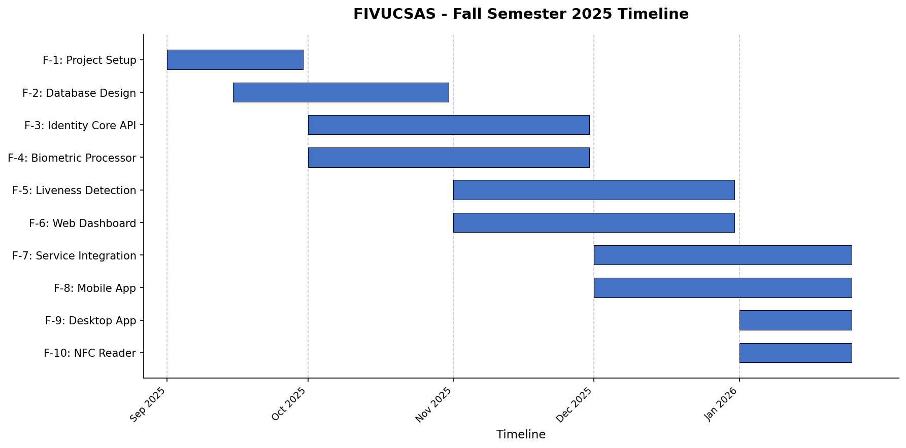
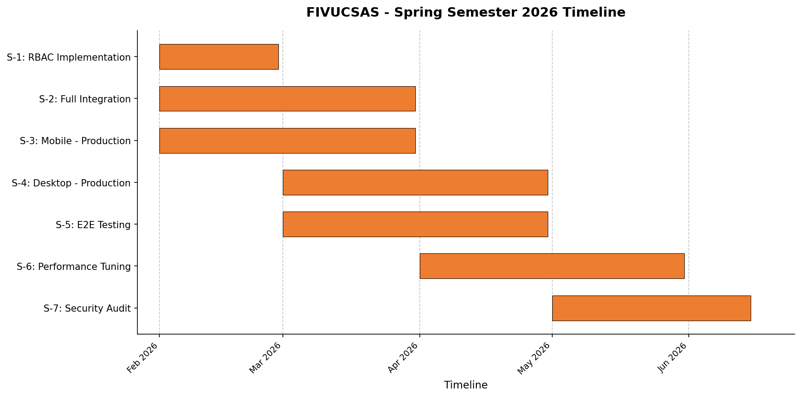

# Face and Identity Verification Using Cloud-Based SaaS Models

**A graduation thesis submitted to the Faculty of Engineering, Marmara University, Computer Engineering Department, in partial fulfillment of the requirements for the degree of Bachelor of Science.**

**Authors:** Ahmet Abdullah Gültekin · Ayşe Gülsüm Eren · Ayşenur Arıcı  
**Supervisor:** Assoc. Prof. Dr. Mustafa Ağaoğlu  
**Year:** 2026


---

# ABSTRACT

Modern identity rests on a brittle foundation: passwords are phished, access cards are cloned, and naive face-recognition systems are defeated by a printed photograph. This thesis presents FIVUCSAS (Face and Identity Verification Using Cloud-based SaaS), a multi-tenant identity-and-access-management platform that unified strong biometric verification, document-grounded identity proofing, and standards-based federated login in a single cloud-native service. Our objective was to close the gap between modern face-recognition research and a deployable, tenant-isolated product that organizations could adopt without building biometrics in-house. We engineered the system as two cooperating microservices that followed a hexagonal architecture. A Spring Boot identity core handled authentication, OAuth 2.0 / OpenID Connect with PKCE, role-based access control, and twelve selectable login factors: ten canonical methods plus passkey and cross-device approve-login. On the biometric path, the browser computed the Facenet512 embedding (ONNX Runtime Web) and sent only the 512-dimensional vector to a FastAPI processor for cosine-distance matching over a pgvector index, quality assessment, and hybrid anti-spoofing; raw face images never left the device. For liveness, we combined a randomized active challenge-response scheme (the Biometric Puzzle, drawing facial and hand-gesture challenges from a 23-challenge library and re-scoring them server-side from landmark geometry) with passive MiniFASNet liveness analysis, while NFC reading performed ICAO 9303 passive authentication of electronic travel documents. We deployed the platform to production behind a Traefik edge alongside PostgreSQL and Redis, and shipped React and Kotlin Multiplatform clients, including a publicly released Android application. We validated the work with approximately 4,863 authored automated tests across five test technologies, spanning the unit, integration, and end-to-end levels, complemented by k6 load scenarios and a separate security battery. The project showed that hybrid liveness, interchangeable recognition models, and rigorous tenant isolation can coexist in one extensible SaaS, with honest limitations (formal presentation-attack certification and additional modalities) framed as future work.

# ACKNOWLEDGEMENTS

We are deeply grateful to our advisor, Assoc. Prof. Dr. Mustafa Ağaoğlu, whose guidance, patience, and insistence on engineering rigor shaped this project from a loose idea into a working production system; his feedback at every milestone kept us honest about what we had truly built. We thank the Computer Engineering Department of the Marmara University Faculty of Engineering for the education, resources, and encouragement that made this work possible. Finally, we thank our families for their unwavering support, understanding, and patience through the long nights and pressing deadlines this thesis demanded; we could not have completed it without them.

---

# 1. INTRODUCTION

## 1.1 Problem Description and Motivation

Authentication has become one of the most frequent security operations in modern digital infrastructure. Users prove their identity dozens of times a day: unlocking phones, signing into e-government portals, authorizing bank transfers, entering office buildings, and passing through transit turnstiles. As digital services proliferated across banking, healthcare, public administration, and smart buildings, the act of proving identity grew from an occasional formality into a continuous, high-stakes requirement. Yet the mechanisms most systems still rely on (passwords, physical access cards, and shallow single-factor biometrics) were designed for an earlier threat model and present well-documented weaknesses against contemporary attack techniques.

The first weakness is the password. Passwords are simultaneously the most ubiquitous and the most fragile credential in use: they are forgotten, reused across services, phished, leaked in bulk, and cracked offline at scale. Verizon's *2024 Data Breach Investigations Report* found that stolen credentials remained the single most common way into a breach, implicated in roughly a third of breaches over the past decade, with the human element involved in a large share of incidents overall [1]. The scale of exposure is widening rather than narrowing: the Identity Theft Resource Center documented a sharp year-over-year rise in data-compromise events, with the number of affected individuals reaching into the hundreds of millions [2]. A credential that can be copied, transmitted, and replayed is, by construction, a credential that an attacker can possess as easily as its legitimate owner.

Physical access tokens fare no better. RFID and proximity cards are the badges that open doors, gates, and elevators in most organizations, and they can be cloned in seconds with inexpensive, readily obtainable readers. A lost or surreptitiously scanned card hands an intruder the same physical privileges as an employee, and unlike a password, a cloned card leaves the original in the victim's pocket, so the compromise often goes unnoticed. The card proves possession of an object, never the presence of a person.

Biometrics promised to close this gap by binding authentication to the human body itself, but naive biometric deployments introduced a new failure mode: **spoofing**. A face-recognition system that merely matches an image against a stored template can be defeated by holding up a printed photograph, replaying a video on a screen, or, at the sophisticated end, presenting a three-dimensional mask. These *presentation attacks* are precisely why **liveness detection** matters: without a reliable way to confirm that a real, living person is physically present at the moment of capture, a face is just another copyable credential. Many fielded systems still treat biometrics as a convenience layer rather than a hardened identity primitive, leaving them exposed to exactly the photo-and-video attacks that liveness detection exists to prevent.

Beyond the weakness of any individual factor lies a deeper, structural problem: **a person's identity is splintered into physical and digital fragments, each held captive by the ecosystem that manages it.** Device-bound biometrics such as Apple Face ID and Android fingerprint unlock are excellent, but they are tethered to a single handset and a single vendor; the identity they assert cannot travel to a turnstile, a kiosk, or a partner organization's service. Physical access control, meanwhile, is typically procured as an isolated installation from a third party and never speaks to the digital identity provider that governs logins. The result is a patchwork in which a person's "office badge identity," "corporate login identity," and "phone-unlock identity" are three unrelated facts about the same human being, each managed by a different system, none aware of the others. This fragmentation multiplies the attack surface, frustrates auditing, and makes coherent, organization-wide trust impossible to reason about.

There is also a market and software-engineering gap that compounds the technical one. The most capable liveness and face-verification engines today fall into two camps, neither of them satisfactory. Some are locked inside proprietary cloud APIs that are opaque, costly, and a source of vendor lock-in and data-residency concern for privacy-sensitive institutions. Others are research-grade models that excel on benchmarks but were never engineered into a complete, multi-tenant, production-ready service. Organizations that want strong biometric authentication as a shared, rentable capability find little that combines open extensibility, robust anti-spoofing, cloud-native scalability, and strict per-tenant data isolation in a single coherent system. The capability they seek amounts to a **Software-as-a-Service (SaaS)** offering that serves many client organizations from one platform, in the **B2B** and **B2B2C** delivery models.

Legacy authentication codebases make the gap worse still. By bundling user management, session handling, audit logging, and verification into monolithic services that violate basic separation-of-concerns principles, they become nearly impossible to extend with new biometric modalities or to integrate cleanly with third parties. The result is software that is hard to secure, hard to audit, and harder still to evolve.

These deficiencies are intertwined: the brittleness of passwords and cards, the spoofability of shallow biometrics, the fragmentation of physical and digital identity, and the absence of an open, multi-tenant biometric platform. Together they defined both the motivation and the worth of this project. The problem was practical as well as academic: it directly affected the security of individuals whose identities were stolen and the operational resilience of the institutions that served them, and it sat squarely at the intersection of cybersecurity, machine learning, distributed systems, and privacy law. That intersection is precisely what made the problem worth solving carefully.

In response, we designed, built, and deployed **FIVUCSAS** (*Face and Identity Verification Using Cloud-based SaaS*), a multi-tenant, cloud-native biometric identity-verification platform. At its core, FIVUCSAS pairs high-accuracy deep-learning face recognition with an active, challenge–response liveness mechanism we call the **Biometric Puzzle**, which asks the user to complete a randomly generated sequence of facial and hand-gesture actions, drawn from a 23-challenge library and re-verified on the server, so that a static photo or a replayed video cannot satisfy the unpredictable, live challenge. The platform was implemented as two backend microservices: an **Identity Core API** that owns authentication, authorization, tenant administration, and security policy, and a **Biometric Processor** that performs the compute-intensive face detection, embedding, similarity search, and anti-spoofing analysis. Faces are stored as high-dimensional embeddings in a vector-enabled relational database and matched by vector similarity, an in-memory cache holds rate-limiting state and short-lived session data, and an edge reverse proxy terminates TLS in front of the services. Around this backend we delivered multiple client surfaces: a React web administration dashboard, a hosted login experience with an embeddable authentication widget and JavaScript SDK (the widget was subsequently demoted to inline step-up MFA, with the hosted redirect flow as the primary integration mode; see Section 4.4.2), and a Kotlin Multiplatform mobile application, all bound together by a multi-tenant data model that isolates each client organization's users and biometric data at the data layer. The exact technology versions and the reasons behind each choice are detailed in Chapters 2 and 3; the remainder of this thesis describes how each of these pieces was specified, designed, implemented, and tested.

This thesis asked whether high-accuracy face verification, robust anti-spoofing, and strict multi-tenant isolation could be engineered into a single, deployable Software-as-a-Service platform; the chapters that follow answer it with a built and operated system.

## 1.2 Main Goal and Objectives of the Project

The main goal of the project was to design, develop, and deliver a working prototype of a **multi-tenant, cloud-native, multi-platform SaaS platform for biometric identity authentication**: a modern, secure, and flexible alternative to traditional password-, card-, and shallow-biometric-based authentication. Rather than treating face recognition as a stand-alone algorithm, the goal was to engineer it into a complete, deployable identity service: one that resists spoofing through active liveness detection, scales across many client organizations under strict tenant isolation, and exposes its capabilities through developer-friendly APIs and ready-to-use client applications.

To realize this goal, we pursued the following concrete, measurable objectives:

- **Build a secure and scalable backend on a microservices architecture.** We separated the platform into an **Identity Core API** for user, tenant, and role management and a dedicated **Biometric Processor API** for computationally intensive biometric operations, following microservices and hexagonal (ports-and-adapters) design principles so that business logic and machine-learning workloads scale and evolve independently.

- **Develop the "Biometric Puzzle" active liveness-detection algorithm.** We implemented an active challenge–response mechanism that requires the user to perform a randomly generated sequence of facial and hand-gesture actions (for example, blinking, smiling, finger counting, and tracing a shape), measured through facial-landmark metrics such as the Eye Aspect Ratio (EAR) and Mouth Aspect Ratio (MAR) and through hand-landmark geometry re-scored on the server, so that presentation attacks using static photos, replayed videos, or masks fail the unpredictable live challenge.

- **Integrate high-accuracy face recognition and verification using proven deep-learning models.** We incorporated **Facenet512** as the face recognition model across two execution paths: a legacy server-side path in which the **DeepFace** library performs MTCNN detection and embedding extraction from an uploaded image, and the production client-side-embedding path in which the browser computes the 512-dimensional L2-normalized Facenet512 embedding via **onnxruntime-web** and uploads only the vector (the raw image never leaves the device). In both paths, 1:1 verification uses cosine similarity and 1:N identification uses a vector-index nearest-neighbor search over the **pgvector** store; the server holds the authoritative accept/reject decision.

- **Deliver multi-platform client applications.** We provided multiple end-user and administrator interfaces: a React web dashboard, a hosted login page with an embeddable widget and JavaScript SDK, and a **Kotlin Multiplatform** mobile application (Android delivered). These interfaces let users enroll their biometric data and authenticate their identity, and let administrators manage their tenants.

- **Design a multi-tenant, fully isolated data model.** We designed the relational and vector data model so that the platform operates as a genuine SaaS offering, with each tenant's users, configuration, and biometric embeddings isolated in the shared **PostgreSQL** schema by a tenant-keyed data model, enforced in the application layer on every query and continuously checked by cross-tenant isolation tests.

The complete platform was publicly released under the MIT license and deployed in production, available for replication, audit, and extension at the URLs listed in Chapter 3. In delivering these objectives, this thesis makes three concrete research contributions:

1. **The Biometric Puzzle**: a randomized, server-verified active liveness scheme drawing on a 23-challenge library across two body channels (fourteen facial challenges and nine hand gestures), with per-step confidence and duration floors, anti-replay timestamp checks, and server-side geometric re-scoring (Section 4.3.1).
2. **A hybrid presentation-attack-detection pipeline** fusing this active channel with a passive layer (MiniFASNet plus classical texture, frequency-domain, moiré, and color analyzers), released as a standalone open-source library with a public in-browser tester so its behavior can be inspected rather than taken on faith (Sections 4.3.2 and 5.8).
3. **A production reference architecture for multi-tenant biometric identity and access management (IAM)**: hexagonal microservices, pgvector embedding search, server-authoritative decisioning over untrusted clients, and tenant isolation guarded by required cross-tenant integration tests, documented end to end and backed by approximately 4,863 authored tests (Chapters 3–5).


---

# 2. DEFINITION OF THE PROJECT

This chapter draws the boundaries of FIVUCSAS (*Face and Identity Verification Using Cloud-based SaaS*) as it was actually built. It states what we set out to deliver and delivered, what we deliberately left out, the constraints and assumptions under which the work proceeded, the measurable factors by which we judged success, the professional and legal considerations that shaped the engineering, and finally the body of academic and industrial work against which the platform must be positioned. Throughout, we report the project in the past tense, because by the time of writing the system was a running, production-deployed platform rather than a proposal on paper.

## 2.1 Scope of the Project

We scoped FIVUCSAS as a working Minimum Viable Product (MVP) of a multi-tenant, cloud-native biometric identity platform: substantial enough to demonstrate every core idea end to end, yet bounded so that a three-person undergraduate team could finish it within two academic semesters. The scope evolved between the Project Specification Document (PSD), the subsequent Analysis and Design Document, and the delivered system: several technology choices made on paper (Flutter clients, FAISS for vector search, Kafka/RabbitMQ message queues, and the design document's NGINX gateway) were replaced during implementation by alternatives that fit the team and the deployment target better. Where this happened, the sections below describe what was actually delivered and note the change.

### 2.1.1 In Scope

The realized scope of the platform covered the following areas.

**Backend services.** We built two cooperating microservices. The *Identity Core API*, implemented in Spring Boot 3.4.7 on Java 21 [3], owned authentication, authorization, tenant administration, role and permission management, OAuth 2.0 / OpenID Connect (OIDC) issuance, auditing, and orchestration of the verification flows. The *Biometric Processor*, implemented in FastAPI on Python 3.12 [4], owned all compute-intensive face analysis: detection, embedding generation, quality assessment, similarity search, and liveness/anti-spoofing. The two services communicated over REST, with the Identity Core API acting as the trusted intermediary so that the authentication decision always remained on the server side rather than in an untrusted browser.

**Client applications.** We delivered a React 18 web administration dashboard [5], a hosted login surface and an embeddable JavaScript authentication widget/SDK, and a native Android application built on Kotlin Multiplatform with Compose Multiplatform [6]. A JVM desktop client (Windows and Linux), sharing the same Kotlin business logic via `expect`/`actual` seams, was also built as a hosted-first OAuth client with an administrative and a kiosk interface; its `.deb` and `.msi` installers were produced by a dedicated CI pipeline on Linux and Windows runners, though public distribution (installer signing and a download page) remained pending at the time of writing. The PSD had named Flutter as the mobile framework; this was abandoned in favor of Kotlin Multiplatform so that mobile and desktop could share one codebase with the team's existing JVM skill set.

**Database architecture.** We persisted all data in a single multi-tenant PostgreSQL 17 database [7] with the pgvector extension [8] storing high-dimensional face and voice embeddings. Tenant isolation followed a shared-database, shared-schema model keyed by a `tenant_id` column, enforced in the application layer by a Hibernate `@Filter` applied to tenant-scoped entities and guarded by cross-tenant isolation tests required by branch protection on backend pull requests (with documented administrator overrides while the integration lane was being repaired, §5.2). The schema was managed with Flyway migrations [9], which by the time of writing had grown to more than eighty versioned migrations.

**Face biometrics.** The platform performed both 1:1 face verification and 1:N face identification. In the current production deployment the browser computes the Facenet512 embedding via onnxruntime-web (a FP16 ONNX model) and uploads only the 512-dimensional L2-normalized vector; the raw face image never leaves the device. The server retains the pgvector cosine match, threshold evaluation, and the accept/reject verdict (decision D2: server-authoritative). The legacy image path, in which MTCNN [10] performs server-side detection and Facenet512 [11] generates the embedding from the uploaded image, remains available under a feature flag but is not the production default. The DeepFace framework [12,13], which provided the server-side detection and embedding pipeline on the legacy path, also powers the anti-spoofing module and optional demographic analysis; it is not the production embedder on the client-side path.

**Liveness detection.** We implemented a hybrid liveness strategy. The active, challenge–response layer, the project's signature "Biometric Puzzle," issued a randomized sequence drawn from a 23-challenge library spanning two body channels: fourteen facial challenges (blink, smile, head turn, and others) scored against MediaPipe FaceLandmarker geometry [14] using Eye Aspect Ratio (EAR) [15] and Mouth Aspect Ratio (MAR) thresholds, and nine hand gestures (finger counting, shape tracing, a palm flip, and others) scored from MediaPipe hand landmarks, with every response re-verified server-side from the raw landmark sequences. The passive layer used a UniFace MiniFASNet ONNX classifier [16] complemented by texture (Local Binary Patterns), frequency-domain, color-consistency, and moiré-pattern analysis to detect presentation artifacts without user interaction.

**Identity-document verification.** Beyond faces, we built three distinct document capabilities that the thesis is careful to keep separate, because they operate on different documents through different mechanisms. First, an in-browser **visual document detection** pipeline (a client-side YOLOv8n model [17], with no optical character recognition wired) classifies a card held to the camera into one of five classes: Turkish national identity card, passport, driver's license, and Marmara University student and academic-staff cards. This is detection and classification only, never a login factor. Second, a **Web NFC** path (the browser `NDEFReader`, available on Chrome for Android only) reads a card's serial or unique identifier for enrollment, not its contents. Third, and most rigorously, the native **Android NFC** client reads the contactless chip of an electronic Machine-Readable Travel Document (eMRTD), an electronic passport or chip-bearing national identity card, following International Civil Aviation Organization (ICAO) Doc 9303 [18], with the server performing the cryptographic passive authentication. A crucial distinction follows from the hardware: a driver's license carries no chip, so it can only be detected visually and can never be NFC-read, while the chip-read path applies solely to chip-bearing travel documents.

**Infrastructure and security.** The entire backend was containerized with Docker and orchestrated by Docker Compose [19,20], fronted in production by a Traefik v3 edge proxy [21] handling TLS termination, routing, security headers, and edge rate limiting. Redis 7.4 [22] provided session caching, a fixed-window rate-limiting layer, and an event bus, complemented by an in-process Bucket4j token-bucket limiter [23] inside the identity service. Security spanned JWT-based stateless authentication [24], Role-Based Access Control (RBAC), BCrypt password hashing [25], OAuth 2.0 / OIDC with Proof Key for Code Exchange (PKCE) [26,27,28], optional WebAuthn/passkeys [29], and rate limiting. The platform was deployed and reachable on the public internet under the `fivucsas.com` family of domains.

The high-level shape of this delivered system is summarized in Figure 2.1.


**Figure 2.1.** High-level system architecture of the delivered platform. Clients reach the system through a Traefik v3.6 edge proxy (TLS, security headers, rate limiting, IP-allowlisted admin surfaces); the Spring Boot Identity Core API is the only publicly routed service, and the FastAPI Biometric Processor is reachable solely over the internal Docker network with an X-API-Key. Both share PostgreSQL 17 with pgvector (HNSW indexes) and Redis 7.4; static client surfaces are served from Hostinger.


### 2.1.2 Out of Scope

To keep the project finishable and focused on its biometric core, we deliberately excluded the following from the delivered MVP.

**Additional biometric modalities as a research focus.** The PSD framed the project around face plus "multi-biometric fusion." In practice we concentrated the research effort on face recognition and liveness detection (the hardest and most novel parts) and treated other modalities pragmatically. Voice verification was implemented as a working secondary factor (Resemblyzer speaker embeddings); fingerprint and hardware-key methods were wired through the platform's authentication framework, though on the web surface fingerprint resolved to the platform/WebAuthn authenticator rather than a custom sensor pipeline. Iris recognition and custom multi-modal score fusion were left as future work, consistent with the extensible hexagonal design that makes adding a modality a localized change.

**Production-grade container orchestration.** We did not deploy on Kubernetes or author Helm charts. Docker Compose proved sufficient to run the full microservice stack in production on a single host and to demonstrate the architecture; Kubernetes was documented as a future scaling path rather than built. (Architectural diagrams for a future Kubernetes, high-availability, and multi-region topology exist in the design documentation but were not deployed.)

**Hardware manufacturing.** The project was strictly software engineering. We did not design or manufacture physical access-control hardware; edge interactions (door controllers, kiosks, Raspberry Pi / Jetson units) were simulated through software interfaces, while keeping the API compatible with such devices.

**Comprehensive billing and payment integration.** We did not implement subscription management or third-party payment gateways such as Stripe. SaaS multi-tenancy was demonstrated through database-level isolation and per-tenant quotas rather than a generic billing engine.

**Native iOS client.** The PSD promised Android *and* iOS mobile apps. iOS was **not delivered**. The shared Kotlin module declared iOS targets and an `iosMain` source set, but it remained stubbed: for example, iOS HMAC for TOTP and the iOS platform services were left as `TODO`/stub implementations. A full iOS application was deferred to a later phase, contingent on Apple Developer Program enrollment, so the cross-platform coverage we claim stops short of iOS.

**Model training.** Training or fine-tuning the deep face-recognition models was out of scope. The platform used pre-trained models, so recognition accuracy was bounded by those models' published performance.

### 2.1.3 Constraints

Several constraints, fixed at the outset, shaped every design decision.

**Technology constraint.** The project was required to use only open-source technologies under permissive licenses, excluding proprietary databases, commercial machine-learning models, and closed frameworks. This constraint was honored throughout: the entire stack (Spring Boot, FastAPI, PostgreSQL/pgvector, Redis, Traefik, DeepFace, MediaPipe, MiniFASNet, Kotlin Multiplatform, React) is open source. It also directly influenced choices such as self-hosting authentication rather than reselling a commercial IAM.

**Infrastructure constraint.** Development was conducted primarily in local Docker Compose environments. VPS/cloud hosting was permitted for demonstration and testing; the delivered system ran on a single Hetzner CX43 virtual server (8 vCPU, 16 GB RAM, 150 GB disk, Ubuntu 24.04). This single-host reality is why CPU-only inference and Docker Compose orchestration, rather than GPU clusters and Kubernetes, defined the operational envelope.

**Hardware constraint.** Liveness and recognition accuracy depend on the client device's camera. We specified a recommended minimum capture resolution (in the 480p–720p range) and optimized all inference for CPU execution, treating GPU acceleration as optional for future scalability. Because the deployment host had no GPU, the production configuration deliberately avoided GPU-only models (RetinaFace, YOLO-family recognition backends, ArcFace) and selected CPU-safe equivalents (MTCNN detection, Facenet512 embeddings, MiniFASNet liveness).

**Data constraint.** No model was trained on collected biometric data; evaluation used publicly available datasets such as Labeled Faces in the Wild (LFW) together with controlled test captures collected with the explicit consent of project members. This bounded the strength of any accuracy claim to what could be measured in a controlled setting.

**Timeline constraint.** The project was bound to the academic calendar (September 2025 – mid-2026), which forced continuous prioritization of the biometric core over auxiliary features and is the reason several "nice to have" items (iOS, billing, Kubernetes) became out-of-scope or future work.

### 2.1.4 Assumptions

The project plan rested on a handful of assumptions, all of which broadly held in practice, though some required mitigation.

- We assumed that stable, mutually compatible versions of the chosen open-source libraries would remain available throughout the project. This largely held, but not for free: the UniFace MiniFASNet dependency had to be pinned to version 3.6.0 after a newer release segfaulted under the hardened (read-only, capability-dropped) production runtime, and the DeepFace detector backend was switched to MTCNN to work around an upstream defect. The assumption held only with active mitigation: stable versions did not simply remain available, but the open-source nature of the stack made both failures diagnosable and containable through version pinning.
- We assumed that the devices used for testing met the minimum hardware requirements for real-time video analysis. Mid-range Android phones and standard laptop webcams proved adequate for the client-side MediaPipe pipeline.
- We assumed the team possessed the fundamental competencies in the selected technologies (Java, Python, Kotlin, Docker) and could acquire additional knowledge as needed. This held, and was reinforced by the decision to drop Flutter, for which the team had less depth, in favor of Kotlin Multiplatform.
- We assumed that biometric processing could be performed acceptably on CPU-only infrastructure. This assumption was central to the deployment model and held for the demonstrated workload, at the cost of excluding GPU-only models from production.

## 2.2 Success Factors

The PSD defined five objectives and, for each, a measurable success factor. Table 2.1 restates each objective, the original Key Performance Indicator (KPI), and the **actual outcome** as delivered. Where a target was a controlled-test or design figure rather than a benchmarked production result, we say so explicitly and do not inflate it.


**Table 2.1.** Project objectives, their target KPIs, and delivered outcomes

| Objective | Target KPI | Delivered outcome |
|---|---|---|
| O1: Secure, scalable backend | All microservices run on Docker; API endpoints pass functional tests; user/tenant CRUD works | **Met.** Both services run in production under Docker Compose behind Traefik; ~1,743 JUnit 5 backend test methods and 980 pytest functions exercise the APIs; user/tenant/role CRUD operates live. |
| O2: "Biometric Puzzle" active liveness | ≥95% legitimate pass; ≥99% rejection of simple photo/video spoofs | **Implemented and operational; evaluation ongoing.** The randomized challenge–response runs client- and server-side; ISO/IEC 30107-3 metrics were instrumented, but the specific 95%/99% figures were *targets*, not independently certified results, and are reported as targets throughout. |
| O3: High-accuracy face recognition | False Accept Rate (FAR) < 1% and False Reject Rate (FRR) < 5% in a controlled test | **Implemented; controlled-test target.** The production verifier is Facenet512 with a cosine-*distance* decision rule (production `VERIFICATION_THRESHOLD = 0.4`, relaxed to 0.55 for embeddings older than two years); FAR/FRR instrumentation exists, but the FAR<1% / FRR<5% figures remain controlled-environment targets, not audited production results. |
| O4: User-friendly mobile app | Stable on Android and iOS; full enroll+auth flow under 1 minute | **Partially met.** A full native **Android** client was delivered and publicly distributed (signed APK releases); **iOS was not delivered** (stubbed targets only). The sub-one-minute enrollment goal was a usability *target* validated informally, not a benchmarked statistic. |
| O5: Isolated multi-tenant data model | Integration tests prove no cross-tenant data access | **Met.** A shared-schema/`tenant_id` model with a Hibernate `@Filter` is guarded by named cross-tenant isolation Testcontainers tests (`CrossTenantIsolationIT`, `TenantSwitcherIsolationIT`, and others) that are *required by branch protection and execution-asserted* when the integration lane runs; documented administrator overrides occurred while the lane was being repaired (§5.2). |


Several observations follow from this table. First, every *architectural and security* objective (O1, O5) was met cleanly and is continuously re-verified by the test suite; these are the strongest claims we make. Second, the *biometric-accuracy* objectives (O2, O3) were fully *implemented*: the algorithms run in production and the ISO/IEC 30107-3 evaluation harness (APCER, BPCER, ACER, EER) exists. Their headline numbers (95%, 99%, FAR<1%, FRR<5%), however, were stated as targets and measured only under controlled conditions. We therefore present them as targets throughout, never as certified benchmark results; the controlled recognition benchmark itself is reported in Section 5.8.3. Third, the *cross-platform* objective (O4) was *partially* achieved: Android shipped publicly (signed APK releases), a JVM desktop client was built and CI-packaged, and iOS did not ship.

Beyond the five formal objectives, the project also met its non-functional success criteria in the sense that the system was actually deployed, healthy, and publicly reachable, with continuous CI gates (unit, integration, security, and isolation tests) protecting every change. The defined performance KPIs (for example, login p95 latency under 300 ms, token refresh under 200 ms, and verification under 500 ms) were encoded as thresholds in a Grafana k6 load-test suite [30] (six scenarios spanning auth, enrollment, verification, multi-tenant, stress, and spike load); these remained engineering targets rather than audited production benchmarks, and we label them as such.

## 2.3 Professional Considerations

### 2.3.1 Methodological Considerations and Engineering Standards

We engineered FIVUCSAS to professional standards rather than as throwaway coursework, and the practices below were used continuously rather than retrofitted at the end.

**Version control and collaboration.** All source lived under Git in a GitHub organization, split into per-service repositories (Identity Core API, Biometric Processor, web-app, client-apps, spoof-detector, a research sandbox, and docs) coordinated, together with the infrastructure configuration, through a parent repository. Work was tracked on a Kanban board on GitHub Projects. Every change flowed through a pull request, and merges to protected branches required peer review; branch protection was enabled on the principal branches so that review and green CI were enforced mechanically for ordinary merges, with administrator overrides available and used in documented cases (§5.2).

**Architecture and design standards.** Each microservice followed Hexagonal Architecture (Ports and Adapters) [31], cleanly separating domain logic from infrastructure adapters, in line with microservices and Domain-Driven Design practice [32,33,34]. The boundary was not merely aspirational: ArchUnit tests *froze* its most security-sensitive rules (for example, forbidding direct use of the JPA `entity.User` outside the persistence layer) so that a violating change failed the build. The design was documented with UML (use-case, class, ER, sequence, activity, and finite-state-machine diagrams), and progress was tracked with Gantt charts across the fall and spring semesters, shown in Figure 2.2 and Figure 2.3.



**Figure 2.2.** Fall-semester project Gantt chart




**Figure 2.3.** Spring-semester project Gantt chart


**Standards conformance.** The work aligned with recognized standards where they applied: RFC 6749 (OAuth 2.0), OpenID Connect Core, RFC 7636 (PKCE), and RFC 7519 (JWT) for the authorization and token layer [24,26,27,28]; ISO/IEC 30107-3 for presentation-attack-detection terminology and metrics [35]; ICAO Doc 9303 for machine-readable travel documents [18]; the OWASP Top 10 [36] as the security reference checklist; and W3C WebAuthn [29] for passkey support.

**Code quality and automation.** Language-specific linting and formatting were enforced: Ruff (lint and format) and mypy for Python, ESLint and TypeScript `tsc --noEmit` for the web app. Continuous-integration pipelines ran on every push and pull request. Identity Core API CI ran both the unit tests (`mvn -T 2C test`) and the heavier Testcontainers integration tests on GitHub-hosted runners, reserving the self-hosted runner on the production host for deploy jobs; the Biometric Processor ran Ruff, mypy, pytest with coverage, and dependency/security scans; the web app ran lint, type-check, Vitest, and a production build; Kotlin clients ran their JVM and Android test sets. Dependabot kept dependencies current (weekly, grouped). The development environment and its CI/CD context are shown in Figure 2.4.


**Figure 2.4.** Continuous integration and deployment pipeline. Every push and pull request runs repository-specific test, build, and security jobs (including a full-history gitleaks secret scan) on GitHub-hosted runners; branch protection requires the checks before merge. Only deployment jobs use the self-hosted runner on the production host, and static sites are synchronized to Hostinger by rsync from a GitHub-hosted runner.


### 2.3.2 Realistic Constraints

We assessed the project against the six realistic-constraint dimensions expected of a professional engineering project.

**Economic.** The exclusive use of open-source technology eliminated all software licensing cost, and the SaaS multi-tenant model was designed for low marginal cost per additional tenant. The production system ran on a single modest VPS, demonstrating that the platform was economically viable to operate at MVP scale. The same multi-tenancy that makes it cheap to run also underpins a future subscription-based commercial model.

**Environmental.** FIVUCSAS's environmental footprint is indirect (the energy its servers and client devices consume), and we reduced it in concrete ways: CPU-only inference (no power-hungry GPUs), passive-by-default liveness that avoids redundant compute, aggressive Redis caching that spares repeated database and model work, and a single-host deployment that consolidated rather than multiplied running infrastructure. As a pure software system it produced no direct material waste.

**Ethical.** Biometric data is among the most sensitive personal data, and we treated it accordingly. Users were informed and gave explicit consent before any biometric processing; the platform exposed data-export and erasure flows; and the design minimized exposure by storing only derived embeddings rather than raw face images where possible. Algorithmic bias was an acknowledged concern: the project relied on pre-trained models whose fairness it did not itself certify, so we treated bias mitigation (diverse evaluation data, fairness monitoring) as an explicit ethical responsibility and a standing limitation of the work.

**Health and safety.** The system carried no physical-safety risk to users. The principal "safety" surface for a biometric system is the safety of the data itself, which we protected with TLS in transit, encryption at rest, strict access control, and a server-side-only authentication decision that prevents a compromised client from forging an identity.

**Sustainability.** The modular microservices architecture, hexagonal boundaries, containerized deployment, versioned Flyway/Alembic migrations, and large automated test suite were all chosen to make the system *maintainable* over its lifetime, which is the technical form of sustainability. New biometric models or auth methods can be swapped in behind ports without disturbing the core, so the platform can evolve as biometric technology and regulation change rather than being rebuilt.

**Social.** Socially, the platform strengthened authentication security and improved user experience by removing reliance on stealable passwords and cloneable cards, while unifying fragmented physical and digital identity. We were equally conscious of the social risk inherent in face technology (surveillance and misuse) and answered it structurally with strict per-tenant data isolation, consent gating, auditability, and access controls designed to prevent the system from becoming a covert surveillance tool.

### 2.3.3 Legal Considerations

Because FIVUCSAS processes biometric data, which is classified as a special category of personal data, legal compliance was a first-order design concern rather than an afterthought.

**Türkiye (KVKK No. 6698).** The platform was designed to comply with the Turkish Personal Data Protection Law (KVKK No. 6698) [37]. We applied its core principles directly: *data minimization* (storing derived embeddings, not raw biometrics, and excluding biometric content from audit logs), *purpose limitation* (biometric data used only for the verification purpose to which the user consented), *explicit consent* before biometric enrollment, *security* of processing (encryption in transit and at rest, RBAC, tenant isolation), and the *right to erasure* via the My-Profile data-export and deletion flows.

**European Union (GDPR).** The same controls satisfied the corresponding obligations under the EU General Data Protection Regulation (GDPR) [38], which treats biometric data used for unique identification as a special category requiring an explicit legal basis. Consent management, the right to be forgotten, data portability (export), and security-by-design were implemented to align with GDPR as well as KVKK, reflecting the cross-border reality of a SaaS platform.

**Open-source licenses.** The technology constraint of using only permissively licensed open-source software was, in part, a *legal* safeguard for future commercialization. Every dependency's license was checked for compatibility, and the predominance of MIT-, Apache-2.0-, and BSD-style licenses across the stack avoids the copyleft obligations that could otherwise complicate a commercial SaaS offering. License and compliance status were tracked as part of the project documentation so that no dependency could quietly impose terms incompatible with the platform's intended use.

## 2.4 Literature Survey and Related Work

A platform like FIVUCSAS sits at the intersection of several mature research areas: identity and access management, deep face recognition, presentation-attack detection, document verification, industrial biometric services, and cloud-native multi-tenant systems. This section reviews each, identifies the limitations of existing approaches, and then states precisely where FIVUCSAS differs.

### 2.4.1 Identity and Access Management (IAM) Systems

Identity and Access Management systems are the foundation of secure digital services, regulating authentication, authorization, and the user lifecycle. The dominant commercial platforms, Okta, Auth0, and Microsoft Entra ID (formerly Azure Active Directory), built mature ecosystems around traditional paradigms: password authentication, one-time-password (OTP) and push-based multi-factor authentication (MFA), and device-bound biometrics such as Apple Face ID and Android fingerprint.

Despite their reach, these platforms share structural limitations. Device-bound biometrics tie identity to specific hardware ecosystems, fragmenting the user experience and limiting portability. Physical-access systems (doors, turnstiles, kiosks) are typically integrated as isolated third-party add-ons, so physical and digital identity domains remain disconnected. Most IAM platforms also treat biometrics as a *supplementary* factor layered on top of passwords rather than as a *core identity primitive*, which limits their resistance to advanced spoofing and replay attacks. The recurring theme in recent literature is the need for IAM systems that unify physical and digital identity under one trust framework, enforce strict tenant isolation in shared environments, and embed advanced biometric verification as a first-class pipeline. This is the open problem our positioning in §2.4.7 returns to; the design response (a biometric-first, cloud-native posture built on the industry-validated hosted-login pattern of Auth0 Universal Login, Okta, and Microsoft Entra) is summarized there alongside the full comparison.

### 2.4.2 Deep Learning-Based Face Recognition

Face recognition was transformed by deep representation learning. Early systems relied on handcrafted features such as Local Binary Patterns and Histograms of Oriented Gradients, which were brittle under variations in pose, illumination, and occlusion. Deep convolutional networks replaced these with end-to-end learned embeddings. DeepFace [39] first approached human-level verification performance, and FaceNet [11] introduced a unified embedding space trained with triplet loss, enabling identity comparison by simple distance metrics. Subsequent margin-based losses sharpened class separation: ArcFace [40] added an additive angular margin and set state-of-the-art results on benchmarks such as LFW, while AdaFace [41] introduced quality-adaptive margins for robustness under low-quality and off-angle captures. Lightweight variants such as MobileFaceNets [42] targeted real-time on-device verification, and one-shot approaches such as Siamese networks [43] addressed learning from few examples. VGG-Face [44] remains a widely cited baseline.

A persistent gap separates these models from deployable systems: most papers optimize *algorithmic* accuracy, while *system-level* concerns such as scalability, latency, multi-tenant isolation, and operational monitoring fall outside their scope. Unified frameworks such as DeepFace by Serengil and Ozpinar [12,13] partly bridge this by standardizing access to multiple recognition models behind a common detection–alignment–embedding–comparison API. FIVUCSAS used that framework on the legacy server-side path and for model evaluation, settling on Facenet512 as its face-recognition model for the balance of accuracy against a manageable 512-dimensional embedding; in the current production deployment that same Facenet512 embedding is computed client-side in the browser (§3.3.3), not through DeepFace on the server. Table 2.2 compares the candidate models.


**Table 2.2.** Comparison of representative deep-learning face-recognition models (embedding dimension, architecture, reported LFW accuracy)

| Model | Embedding dimension | Architecture | Reported LFW accuracy |
|---|---|---|---|
| VGG-Face | 2,622 | VGGNet | 98.95% |
| Facenet512 | 512 | Inception-ResNet | 99.65% |
| ArcFace | 512 | ResNet | 99.82% |
| DeepFace | 4,096 | AlexNet-style | 97.35% |
| OpenFace | 128 | Inception | 92.92% |


*(Reported accuracies are the DeepFace framework's published model benchmarks [12,13], not figures measured in this project.)* The comparison reveals a clear trade-off between embedding dimensionality and accuracy: modern margin-based models such as ArcFace achieve superior accuracy with far smaller embeddings than early high-dimensional architectures, while a very low-dimensional baseline such as OpenFace (128-dim) is cheap to store and search but gives up several accuracy points. Lower dimensionality also shrinks storage and accelerates nearest-neighbor search, which matters in production. Facenet512's 512-dimensional embedding sat at the sweet spot of this trade-off for our workload, well clear of the 4,096-dimensional original DeepFace at one extreme and the accuracy cost of OpenFace's 128 dimensions at the other.

### 2.4.3 Liveness Detection and Anti-Spoofing

Liveness detection has become essential as presentation attacks (printed photos, replayed video, 3-D masks, and increasingly AI-generated deepfakes) have grown more sophisticated. ISO/IEC 30107-3 [35] standardized the presentation-attack-detection (PAD) vocabulary and metrics (APCER, BPCER, ACER) and a three-way taxonomy of approaches. *Passive* methods analyze a single image or stream for spoof artifacts: texture via Local Binary Patterns, frequency-domain analysis for moiré, color-space consistency, and CNN classifiers such as MiniFASNet [16]. They offer a frictionless experience but remain vulnerable to high-quality and generative attacks. *Active* methods issue challenge–response prompts (blink, smile, head turn, gaze), quantified by metrics such as Eye Aspect Ratio [15] and Mouth Aspect Ratio; real-time landmark frameworks such as MediaPipe Face Mesh [14] (468/478 landmarks), together with lightweight detectors such as BlazeFace [45], made on-device active liveness practical. *Hybrid* approaches combine the two for maximal robustness. Recent work also explored anti-spoofing delivered through serverless and SaaS architectures [46].

The literature's recurring weakness is that proposed liveness solutions tend to be *model-centric*: strong classifiers in isolation that are never integrated into a complete, end-to-end authentication workflow. The rise of generative attacks sharpens the need for liveness that is *dynamic, randomized, and context-aware*, which static classifiers cannot provide alone. FIVUCSAS answers this with a hybrid pipeline whose active layer, a *randomized* Biometric Puzzle of EAR/MAR/head-pose and hand-gesture challenge–response with anti-replay timestamp checks and server-side re-scoring, sits over a passive MiniFASNet-plus-texture/frequency/moiré classifier, embedded in a real verification flow rather than offered as a standalone model.

### 2.4.4 Identity Document Verification and Standards

In high-assurance scenarios, biometric authentication is reinforced by identity-document verification: ID-to-selfie matching, optical character recognition, Machine-Readable-Zone (MRZ) parsing, and document layout analysis. Purpose-built document-to-selfie matching models are reported to outperform generic face recognition when comparing an ID photo with a live capture. International standards are central here: ICAO Doc 9303 [18] specifies electronic Machine-Readable Travel Documents (eMRTDs), including facial biometrics stored in NFC-enabled passport chips, and NFC-based reads provide strong cryptographic guarantees widely used in border control and e-government. Commercial systems built on ICAO-compliant NFC pipelines achieve high trust but are typically coupled to specialized hardware and offer little extensibility for broader cloud SaaS deployment. The literature accordingly favors modular, extensible architectures that let document verification coexist with biometric and behavioral modules, a recommendation FIVUCSAS took to heart by building NFC/eMRTD reading and document classification as composable steps in its verification pipeline rather than as a separate, hardware-locked product.

### 2.4.5 Industrial Biometric Solutions

Several industrial platforms offer large-scale face and liveness services. Microsoft Azure Face Liveness and Amazon Rekognition Face Liveness provide highly accurate, standards-compliant biometric APIs with global availability and PAD compliance. However, they are fully proprietary, cloud-dependent, and offer limited transparency, customization, and control over data processing, a serious concern for privacy-sensitive organizations and academic institutions facing regulatory, cost, and vendor lock-in pressures. Regional providers (for example, Sodec Technologies in Türkiye) focus on e-government and banking but typically lack multi-tenant SaaS architecture and advanced *active* liveness. Open-source offerings such as OpenCV-based pipelines [47] enable offline and edge deployment but fall short on modern anti-spoofing robustness and enterprise-grade scalability; NFC-centric ID-verification products achieve high trust but at the cost of hardware coupling. Comparative analysis thus shows that no single existing solution simultaneously delivers open extensibility, hybrid liveness, cloud-native scalability, and unified physical-plus-digital identity management. That unmet combination is the precise vacancy the positioning analysis in §2.4.7 measures FIVUCSAS against.

### 2.4.6 Cloud-Native and Multi-Tenant Architectures

Scaling biometric workloads has pushed the field toward cloud-native principles: microservices [32,33,48], containerization [19], and asynchronous communication. Vector databases such as pgvector [8] and similarity-search libraries such as FAISS [49] make storing and querying high-dimensional embeddings efficient enough for large-scale identification (the index strategy adopted in this project is discussed in §3.3.3). Multi-tenancy adds its own challenges: strict data isolation, tenant-specific configuration, and performance fairness on shared infrastructure. Yet relatively few systems integrate identity management, biometric processing, and liveness detection within a single coherent architecture; most studies tackle one axis (scalability *or* isolation) in isolation. Architectural patterns such as Hexagonal Architecture [31] and Domain-Driven Design [34] are increasingly recommended to decouple business logic from infrastructure and sustain long-term evolution. FIVUCSAS follows this guidance throughout: a hexagonal microservice split, PostgreSQL/pgvector for embedding search, Redis for caching and rate limiting, and application-layer tenant isolation verified by automated tests on every change. It also departs from the literature's typical toolkit in two deliberate ways. Where the PSD anticipated FAISS for vector search and Kafka or RabbitMQ for messaging, the delivered system used pgvector for search (keeping vectors transactionally beside relational data) and Redis as the event bus, which simplified the single-host deployment without sacrificing the architectural separation the patterns call for.

### 2.4.7 Positioning and Differentiation

The surveyed literature exposes a clear gap between state-of-the-art biometric research and deployable, multi-tenant IAM platforms. Existing solutions either focus narrowly on algorithmic innovation without addressing system-level deployment, or offer closed, inflexible commercial services with limited extensibility and transparency. FIVUCSAS occupies the space between them; Table 2.3 positions it against representative solutions.


**Table 2.3.** Positioning of FIVUCSAS against representative IAM and biometric solutions

| Capability | Commercial IAM (Okta/Auth0/Entra) | Cloud biometric APIs (Azure/Rekognition) | Open-source CV pipelines | **FIVUCSAS** |
|---|---|---|---|---|
| Open-source / self-hostable | No | No | Yes | **Yes** |
| Biometrics as a core primitive | Supplementary factor | Yes (service only) | Yes | **Yes (server-side decision)** |
| Active randomized liveness | Limited | Partial | Rare | **Yes (Biometric Puzzle)** |
| Hybrid active + passive PAD | No | Partial | Limited | **Yes** |
| Multi-tenant SaaS isolation | Yes | N/A | No | **Yes (isolation test suite, required gate)** |
| Unified physical + digital identity | Fragmented | No | No | **Yes (design goal)** |
| Document/NFC (eMRTD) verification | Add-on | No | No | **Yes (Android NFC + doc classify)** |
| Standards-based OAuth2/OIDC/PKCE | Yes | Partial | No | **Yes** |
| Data sovereignty / transparency | Vendor-controlled | Vendor-controlled | Full | **Full** |


What distinguishes FIVUCSAS, then, is the *combination* it delivers in one cloud-native SaaS platform rather than any single capability in isolation: deep-learning face recognition with interchangeable models; a hybrid liveness pipeline whose active layer is genuinely randomized and replay-resistant; identity-document and NFC/eMRTD verification; standards-based OAuth 2.0 / OIDC / PKCE authorization with a hosted-first integration model; strict, continuously tested multi-tenant isolation; and an open-source, self-hostable stack that gives privacy-conscious institutions the data sovereignty and transparency that proprietary clouds withhold. In short, FIVUCSAS positions itself as a bridge between academic biometric research and practical, enterprise-grade identity platforms, built and deployed and reported here just as it runs.


---

# 3. SYSTEM DESIGN AND SOFTWARE ARCHITECTURE

This chapter describes how the conceptual goals of Chapter 1 and the project scope of Chapter 2 were translated into a working, production-deployed system. We begin with the requirements that the design had to satisfy, then present the design artifacts (use cases, the domain and data model, the user-facing surfaces, and the test plan), and finally the software architecture as it was actually built and deployed. Throughout, we describe the system as delivered. Where the original Analysis and Design Document anticipated one technology and the implementation settled on another, we report the implementation, because the running platform on the Hetzner CX43 server is the ground truth. That platform is a Spring Boot 3.4.7 / Java 21 identity service, a Python 3.12 / FastAPI biometric service, PostgreSQL 17 with pgvector, and Redis 7.4, all behind a Traefik v3 edge.

## 3.1 Project Requirements

Requirements were captured early, in the project's Analysis and Design Document, then refined continuously as the platform matured across eight development phases. We retain the document's organization, six functional requirements and seven non-functional categories, because it proved a stable spine for the work, but the descriptions below reflect what was finally implemented rather than the original intent.

### 3.1.1 Functional Requirements

The platform's behavior was organized around six functional requirements (FR-1 through FR-6). Each was traceable to one or more concrete services, controllers, and database migrations in the final system; Table 3.1 lists them.


**Table 3.1.** Functional requirements of the FIVUCSAS platform

| ID | Requirement | Primary realization | Key endpoints |
|---|---|---|---|
| FR-1 | Authentication and multi-factor login | `AuthenticateUserService`, the auth-method handler stack, N-step MFA dispatcher | `POST /auth/login`, `POST /auth/mfa/step`, `POST /auth/login/preflight` |
| FR-2 | Biometric enrollment (face and voice) | `EnrollBiometricService` → biometric-processor `/enroll-embedding` (production, client-side) or `/enroll` (legacy), `/voice/enroll` | `POST /biometric/enroll-embedding/{userId}`, `POST /voice/enroll` |
| FR-3 | Biometric verification (1:1 and 1:N) | `VerifyBiometricService` → biometric-processor `/verify`, `/search` | `POST /biometric/verify/{userId}`, `POST /biometric/search` |
| FR-4 | Multi-tenant management with isolation | `RegisterTenantService`, `ManageTenantService`, Hibernate `@Filter(tenantFilter)` | `POST /tenants`, `PATCH /tenants/{id}` |
| FR-5 | Authorization and role-based access control | `RbacPermissionEvaluator`, `RbacAuthorizationService`, `@PreAuthorize` | guards on all protected `/api/v1/**` routes |
| FR-6 | Auditing and regulatory compliance | `AuditLogController`, `UserDataExportService`, partition-ready `audit_logs` | `GET /audit-logs`, `GET /users/{id}/export` |


**FR-1: Authentication.** The system authenticates users with a password as a baseline and composes that with any number of additional factors into a tenant-configurable login flow. We implemented ten canonical login factors (`PASSWORD`, `EMAIL_OTP`, `SMS_OTP`, `TOTP`, `FACE`, `VOICE`, `FINGERPRINT`, `HARDWARE_KEY`, `QR_CODE`, and `NFC_DOCUMENT`) plus two cross-device additions, `PASSKEY` (discoverable WebAuthn) and `APPROVE_LOGIN` (number-matching push approval); all twelve report `true` from `AuthMethodType.isLoginMethod()`, as does a thirteenth method, `PUZZLE`, an active-liveness layer that the service tier hides from login catalogs while its feature flag remains off. First-factor verification runs through a Strategy/Registry of `AuthMethodHandler` implementations; each subsequent factor is consumed by an N-step MFA dispatcher (`VerifyMfaStepService`) that holds the JWT back until every step of the flow has been satisfied and accumulates RFC 8176 `amr` evidence into the issued access token [24]. The original specification's error contract was honored: invalid credentials return `401 Unauthorized`, and an account is locked (`423 Locked`) after five consecutive failures via `LoginAccountStateGuard`.

**FR-2: Biometric Enrollment.** In the current production deployment (client-side embedding) the browser computes the 512-dimensional Facenet512 embedding via ONNX Runtime Web [11] and uploads only that vector to `/enroll-embedding`; the biometric processor validates the vector dimension and persists it in dual columns (searchable plaintext vector plus a Fernet-encrypted store-of-record). The raw face image never leaves the device. Liveness on this path is the server-verified active Biometric Puzzle together with an advisory client-side MiniFASNet PAD; there is no server-side image-liveness gate, because no image is uploaded. The legacy server-side path remains available under a feature flag: the image is uploaded and the processor detects the face with MTCNN [10], scores quality (blur via Laplacian variance, lighting, and face size), runs UniFace MiniFASNet passive liveness [16], and generates the embedding server-side, rejecting a frame with no detected face or insufficient quality (`400`) before persistence. Voice enrollment follows the same shape, producing 256-dimensional Resemblyzer speaker embeddings. In every path the accept/reject decision stays server-authoritative (decision D2).

**FR-3: Biometric Verification.** Verification compares a freshly captured sample against the stored template. For 1:1 verification the processor recomputes the probe embedding and returns a match when the cosine *distance* between L2-normalized embeddings falls below the configured threshold (production `VERIFICATION_THRESHOLD = 0.4`, with an aged-embedding adaptive relaxation to `0.55` for templates older than two years). For 1:N identification the system runs a pgvector approximate-nearest-neighbor search over the tenant's embeddings using the cosine-distance operator over a pgvector ANN index [8]. Passive liveness runs on the verify path as well, rejecting frames scored below `0.4` with a `LIVENESS_FAILED` response, and rate limiting protects the endpoint, returning `429` when a tenant or user budget is exhausted.

**FR-4: Multi-Tenant Management.** Tenants are first-class entities with their own configuration, quotas, login flows, OAuth2 clients, and verified email domains. Isolation is enforced in depth: a global Hibernate `@FilterDef("tenantFilter")` is applied to the eleven tenant-scoped entities (users, roles, audit logs, sessions, MFA sessions, enrollments, verification sessions, OAuth2 clients, devices, auth flows, and user settings), and a `TenantBindFromAuthFilter` re-binds the active tenant from the verified JWT after authentication so that a forged `X-Tenant-ID` header cannot cross tenant boundaries. Roles carry the same filter under a widened condition (`tenant_id = :tenantId OR tenant_id IS NULL`) so that platform-wide system roles remain visible to every tenant. Self-service onboarding (`OnboardingController`) and DNS-TXT email-domain verification round out tenant lifecycle management.

**FR-5: Authorization (RBAC).** Every protected endpoint is guarded by Spring method security (`@EnableMethodSecurity` + `@PreAuthorize`) backed by a custom `RbacPermissionEvaluator`. The model is two-tiered: a platform-tier authority carried on `user_type` (`ROOT > TENANT_ADMIN > TENANT_MEMBER > GUEST`) governs cross-tenant capabilities, while a within-tenant `role` carries one of 48 fine-grained permissions. Insufficient permissions yield `403`, and an invalid or expired token yields `401`, matching the original contract.

**FR-6: Auditing and Compliance.** Sensitive actions are appended to an `audit_logs` table that is tenant-scoped, soft-delete-aware, and designed for time-based partitioning via pg_partman (fail-soft by design; the deployed instance runs without the extension, so the table is currently unpartitioned). Audit records exclude credentials and raw biometric data by design. To satisfy KVKK and GDPR [37,38], `UserDataExportService` produces a per-user data export, a PL/pgSQL trigger forbids hard-deletion of user and tenant rows, and a nightly `SoftDeletePurgeJob` enforces the retention window under a ShedLock guard so a rolling deploy cannot double-run it.

### 3.1.2 Non-Functional Requirements

The platform was held to seven non-functional categories. Table 3.2 records the requirement and its design-time target; where a number was a *target* rather than a *measured production result*, it is labeled as such, and Chapter 5 reports the experimental outcomes.


**Table 3.2.** Nonfunctional requirements and their realization

| Category | Requirement | Target / measure | How it was realized |
|---|---|---|---|
| Performance | Responsive auth and biometric operations | Auth p95 < 300 ms; verification p95 < 500 ms (targets) | Redis-backed coordination, pgvector ANN search, embedding cache, short-lived access tokens (15 min default) |
| Scalability | Scale across tenants and workloads | Independent scaling of API vs. ML tiers | Microservices split; stateless API; per-tenant token-mint budget (6,000/min) |
| Reliability | Available during operational hours | Uptime target 99.5%, RPO < 1 h | Health checks, graceful Redis degradation, PITR/DR runbooks, Uptime Kuma monitor |
| Security | Protect identity and biometric data | TLS in transit; encrypted embeddings at rest | RS256 JWT, BCrypt(12), Fernet-encrypted embeddings, AES-GCM TOTP secrets, hardened containers |
| Usability | Enrollment with minimal effort | Enrollment under ~60 s incl. liveness | Guided 3-step face capture, client pre-filter, EN/TR i18n |
| Maintainability | Modular, extensible, well-tested | Hexagonal architecture; ≥ 70% coverage (ratchet target) | Ports and adapters; ArchUnit boundary tests; ~4,863 authored tests |
| Portability | Consistent across platforms | Docker + Kotlin Multiplatform (KMP) shared code | Containerized services; KMP shared module |


**Performance.** Because biometric verification is computationally heavier than ordinary authentication, the two were separated so each could be tuned independently. The identity service leans heavily on Redis 7.4 as more than a cache: it is the substrate for OAuth2 authorization codes, OTP storage, TOTP replay markers, rate-limit counters, and cross-device session state [22]. The biometric processor caches recently computed embeddings (TTL 300 s, up to 1,000 entries) and serves sub-linear nearest-neighbor search from a pgvector ANN index (HNSW with `m = 16` and `ef_construction = 64` in the migration baseline, with a secondary IVFFlat index, `lists = 100`, added in a later migration). The k6 suite encodes the latency targets (login p95 below 300 ms, verification p95 below 500 ms), which we treat as engineering targets validated under controlled load rather than guaranteed production figures.

**Scalability.** The microservices boundary is the central scalability device: the stateless Spring Boot API can be replicated independently of the CPU-intensive ML service [32]. Per-tenant rate budgets (for example, 6,000 token mints per minute per tenant) prevent one tenant's load from starving others. The current deployment runs single instances of each service on one VPS; the multi-replica, multi-region topologies described in the parent compose file are a documented scaling plan rather than the live deployment, and are revisited as future work in Chapter 7.

**Reliability.** Reliability was pursued through defense against partial failures rather than through redundancy alone. The Redis cache adapter degrades gracefully, logging and continuing when Redis is unavailable, except on security-sensitive checks, which fail closed. Operational resilience is codified in a substantial runbook set covering disk capacity, disaster recovery, point-in-time recovery, rollback, secret rotation, and Flyway repair, and external availability is probed continuously by an Uptime Kuma monitor at `status.fivucsas.com`.

**Security.** Security was the dominant concern, given the irreversibility of biometric identifiers. Transport is TLS-only at the Traefik edge with automatic Let's Encrypt certificates; passwords are hashed with BCrypt at work factor 12 [25]; access tokens are RS256-signed in production with mandatory `iss`/`aud` validation; biometric embeddings are stored encrypted with Fernet (AES-128-CBC + HMAC-SHA-256) alongside their searchable plaintext vector; and TOTP secrets are encrypted at rest with AES-GCM-256. Containers run with a read-only root filesystem, `cap_drop: ALL`, and `no-new-privileges`. Multi-tenant isolation is itself a tested invariant, asserted on every CI run.

**Usability.** Enrollment and verification were designed to be completable in seconds. The face-capture flow is a guided three-step sequence (center, turn left, turn right), with a client-side pre-filter that rejects unusable frames before they reach the server, keeping the round-trip count low. The entire interface is bilingual (English and Turkish) across the dashboard, hosted login, and mobile clients, with locale carried through the OIDC `ui_locales` parameter so a tenant's branding and language survive the redirect.

**Maintainability.** Every service follows Hexagonal Architecture, isolating domain logic behind ports so that infrastructure (databases, ML models, message buses) can be swapped without disturbing business rules [31]. The boundary is not merely a convention: ArchUnit tests freeze the rules (for example, forbidding direct use of the JPA `entity.User` outside the persistence layer) and fail the build if a future change violates them. The JaCoCo gate enforces a measured floor with a documented ratchet toward 70% line coverage.

**Portability.** All backend services and the hosted-login surface are containerized and run identically on a developer laptop and the production VPS. The mobile and desktop clients share a single Kotlin Multiplatform business-logic module across Android and desktop targets, with platform specifics confined to a small set of `expect`/`actual` declarations [6].

## 3.2 System Design

This section presents the principal design artifacts: the use cases that defined who does what, the domain and entity-relationship models that defined the data, the user interfaces through which the system is actually operated, and the test plan that governed verification.

### 3.2.1 Use Case Diagrams

The platform serves five actors. The **platform ROOT** (the platform-tier administrator) provisions and oversees tenants, manages platform-wide configuration, and inspects cross-tenant health. The **Tenant Administrator** manages their own organization: users, roles, login flows, OAuth2 clients, verification templates, and audit review. The **End User** registers, enrolls biometrics, completes multi-factor login, manages their devices and linked accounts, exercises their data-export rights, and undergoes identity verification; a time-limited **Guest** holds an invitation-scoped subset of these capabilities. The fifth actor is the **Developer/Integrator**, who connects a third-party application through the redirective OpenID Connect surface and the verification flow engine. The overall organization of responsibilities is shown in Figure 3.1.

![Use cases by actor. End users and time-limited guests authenticate through tenant-configured 1-N-factor flows and manage their own biometrics, credentials, and personal data; tenant administrators configure flows, methods, RBAC, and e-mail domains; the platform ROOT tier administers tenants platform-wide; developers integrate through the OAuth2/OIDC surface and the verification flow engine. Administrators and integrators additionally hold the end-user authentication use cases (edges omitted for legibility).](../Thesis/build/figures/diagram_01_use_cases_by_actor.png)

**Figure 3.1.** Use cases by actor. End users and time-limited guests authenticate through tenant-configured 1-N-factor flows and manage their own biometrics, credentials, and personal data; tenant administrators configure flows, methods, RBAC, and e-mail domains; the platform ROOT tier administers tenants platform-wide; developers integrate through the OAuth2/OIDC surface and the verification flow engine. Administrators and integrators additionally hold the end-user authentication use cases (edges omitted for legibility).


Two use cases are central enough to model in detail. *Face enrollment* threads a liveness challenge and a quality assessment into the main flow as `include` relationships, with alternative flows for duplicate enrollment, poor image quality, and liveness failure, each with its own retry path. *Face verification* runs rate-limit validation, face detection, embedding generation, retrieval of the enrolled template, cosine-similarity scoring, and threshold comparison, with exception flows for rate-limit exhaustion (`429`), no face detected (`400`), and a below-threshold score. The liveness and quality gates that these `include` relationships model were what distinguished a serious biometric flow from a naive one: the happy path never proceeded without them.

### 3.2.2 Class and Entity-Relationship Diagrams

The domain model places the tenant at the root of nearly every relationship, expressing the multi-tenant design directly in the type system. A `Tenant` owns `User`s; each `User` carries value objects (`Email`, `FullName`, `HashedPassword`, `PhoneNumber`, `IdNumber`, `Address`) rather than bare strings, following domain-driven design [34]. RBAC is modeled as `Role` and `Permission` joined to users through `UserRole`, and biometric and verification activity hangs off the user with full audit-trail support. The core domain model is shown in Figure 3.2.


**Figure 3.2.** Core domain model for multi-tenant identity and biometric verification. A platform-level Identity links a person's per-tenant User memberships; RBAC joins users to roles and permissions through UserRole; method-generic enrollments and verification sessions hang off the user; face embeddings live in the separate biometric_db store, referenced by user identifier without a cross-database foreign key.


At the persistence layer, the schema comprises 31 JPA entities materialized through 86 Flyway migrations spanning V0–V86 (the V13 number was never used); V86 is the highest migration applied in production at the time of writing. The complete migration catalog appears as Table A.1 in Appendix A. The entity-relationship structure spans `users`, `tenants`, `roles`/`permissions`/`user_roles`, the auth-flow tables (`auth_flows`, `auth_flow_steps`, `auth_methods`, `tenant_auth_methods`), `refresh_tokens` (hashed at rest with a rotation `family_id` for reuse detection per RFC 6749 §10.4), `webauthn_credentials`, `nfc_cards`, `oauth2_clients`, the verification pipeline tables, `user_enrollments`, `voice_enrollments`, the partition-ready `audit_logs`, and the identity-linking tables (`identities`, `identity_emails`, `identity_tenant_biometric_consent`). Three figures decompose the schema: the identity, tenancy, and RBAC core in Figure 3.3, the authentication-engine and token tables in Figure 3.4, and the separate biometric vector store in Figure 3.5. Two design choices in this schema are worth highlighting. First, the soft-delete pattern: `User` carries an `@SQLDelete` plus `@SQLRestriction("deleted_at IS NULL")`, so every derived finder automatically respects the GDPR retention window. Second, the dual face/voice embedding store lives not in the identity database but in the biometric processor's own pgvector schema (table `face_embeddings`), where the searchable plaintext vector and the Fernet-encrypted store-of-record sit side by side; the identity service reaches it only through a thin REST client.


**Figure 3.3.** Identity, tenancy, and RBAC core of the identity_core schema. A platform-level person (identities) holds one membership row (users) per tenant; roles are tenant-scoped (a NULL tenant_id marks global system roles) and grant fine-grained permissions through role_permissions. Biometric processing is consented per identity-tenant pair with default-deny semantics. Key attributes only; the full schema is cataloged in Appendix A.


**Figure 3.4.** The configurable authentication engine and session and token surfaces. Tenants enable methods from the 12-method catalog and compose ordered N-step flows; user enrollments record per-method quality and liveness scores. In-flight MFA logins, rotating refresh-token families (SHA-256 hashes), registered OAuth2 clients, and the audit trail complete the picture. Credential stores (webauthn_credentials, nfc_cards, user_devices) follow the same per-user pattern and are omitted for space.


**Figure 3.5.** Biometric vector store (separate biometric_db database). Embedding tables reference users by a string identifier, deliberately without a cross-database foreign key. Each embedding column carries an HNSW ANN index (cosine operator class) in production; encrypted ciphertext columns (Fernet, versioned keys) accompany the plaintext vectors.


### 3.2.3 User Interface Design

The platform is operated through four distinct surfaces, all sharing a common authentication engine and internationalization layer: a web admin dashboard, a hosted login page, embeddable widgets, and native mobile/desktop clients.

**Web admin dashboard (`app.fivucsas.com`).** Built with React 18.3, TypeScript 5.5, Material-UI v5, and InversifyJS dependency injection [5], the dashboard comprises more than forty page components organized into feature folders. Public routes handle the unauthenticated flow; everything else sits under a protected dashboard layout and is gated by role-aware route guards. Table 3.3 summarizes the route map.


**Table 3.3.** Principal web dashboard routes

| Route | Page | Purpose |
|---|---|---|
| `/login`, `/register`, `/forgot-password` | Auth pages | Identifier-first authentication, registration, recovery |
| `/onboarding`, `/accept-invite` | Onboarding | Self-service tenant signup; guest-invitation acceptance |
| `/` | Dashboard | Analytics overview, enrollment and verification trends |
| `/users`, `/tenants`, `/roles` | Admin CRUD | User, tenant, and role management (tenant scope vs. platform scope) |
| `/auth-flows` | Auth-Flow Builder | Layered, drag-to-compose login flows per tenant |
| `/enrollment`, `/enrollments`, `/biometric-tools` | Biometric | Guided capture, enrollment records, consolidated biometric utilities |
| `/biometric-puzzles`, `/auth-methods-testing` | Liveness / testing | Active-liveness challenge testing; per-method auth testing |
| `/verification-flows`, `/verification-dashboard` | Know Your Customer (KYC) pipeline | Industry-template builder and verification session review |
| `/audit-logs`, `/analytics` | Compliance | Searchable audit trail; usage analytics |
| `/my-profile`, `/settings` | Self-service | Enrollments, activity, KVKK/GDPR export, linked accounts, biometric consent |


The Auth-Flow Builder deserves special note: it lets a tenant administrator model a login flow as an ordered list of *layers*, each a checkbox set of allowed methods with a "satisfy any one" semantics and a "required" toggle, persisting as an `authMethodType` plus `alternativeMethodTypes` wire contract. This is the user-facing manifestation of the adaptive-MFA engine. The dashboard is a progressive web app whose shell is served network-first so that it remains usable under flaky connectivity.

**Hosted login (`verify.fivucsas.com`).** Following the project's "hosted-first" architectural decision, the primary integration mode is redirective OIDC, mirroring Auth0 Universal Login, Okta, Microsoft Entra, Keycloak, and Türkiye's e-Devlet [26,27]. A third-party application calls the SDK's `loginRedirect(...)`, the browser navigates top-level to the hosted page, the user completes whatever MFA the tenant configured, and the browser returns to the application with an authorization code. The hosted page resolves the UI locale and fetches the tenant's branding and login configuration before first paint to avoid a password-first to identifier-first flash, frame-busts to defeat clickjacking, and validates the redirect scheme again before navigating back. Top-level context was chosen deliberately because it is required for Web NFC, WebAuthn, and password-manager autofill, and is robust against Safari's tracking prevention and third-party-cookie deprecation. The embeddable iframe widget, packaged as the zero-dependency `@fivucsas/auth-js` SDK and the `@fivucsas/auth-elements` web component and served as a script-tag bundle from `verify.fivucsas.com`, is demoted to inline step-up MFA only.

**Mobile and desktop clients.** The Android application is the one fully delivered, publicly distributed native client (latest signed release v5.3.2). Rather than a thin OAuth shell, it is a full native client: native password plus adaptive MFA across all methods, on-device NFC document reading and card enrollment, CameraX/ML-Kit biometric capture, cross-device session and approval handling, and a standalone RFC 6238 TOTP authenticator with hardware-Keystore-protected secrets. The desktop client (Windows and Linux, packaged as `.deb` and `.msi` installers by a dedicated CI pipeline; public release of the signed installers was still pending) is an OAuth-loopback client with OS-native secure token storage (DPAPI on Windows, libsecret on Linux) and two modes: an admin dashboard and a self-service kiosk. The principal mobile screens are summarized in Table 3.4.


**Table 3.4.** Principal Android client screens

| Screen | Purpose |
|---|---|
| Login / Register | Native identifier-first authentication and account creation |
| MFA Flow | Adaptive multi-step second factors across all enrolled methods |
| Home / Account | Profile, enrollment status, linked accounts |
| Enroll | Guided face capture with quality feedback and liveness |
| Verify | Real-time face verification with on-device feedback |
| NFC / Card | Contactless document reading and card enrollment |
| TOTP Authenticator | Standalone RFC 6238 code generator |


Two qualifications keep the delivery picture accurate. The iOS target is *not delivered*: the shared module declares iOS targets and an `iosMain` source set, but it consists of stubs (the TOTP HMAC implementation throws a `TODO`), and there is no shippable `iosApp` module, so iOS remains Phase-2 work blocked on Apple Developer enrollment. macOS is out of scope for lack of code-signing capability. Both statuses are revisited in the cross-platform retrospective of Chapter 7. The delivery picture is therefore deliberately uneven but honest: one production-grade native client (Android) shipped publicly, a second (desktop) built and CI-packaged but not yet distributed, and a third (iOS) scaffolded for a later phase. A single shared Kotlin business-logic core thus demonstrates its portability across three targets even where the per-platform packaging and release work remains incomplete.

The enrollment and verification surfaces are supported by the sequence flows captured in Figure 3.6 and Figure 3.7 for face enrollment, Figure 3.8 and Figure 3.9 for face verification, and by the end-user registration flow in Figure 3.10.


**Figure 3.6.** Face enrollment, part (a): capture and client-side embedding. The browser computes the Facenet512 embedding via onnxruntime-web and uploads only the 512-dimensional L2-normalized vector to /enroll-embedding; no server-side MTCNN detection, quality gate, or liveness check runs on this path.


**Figure 3.7.** Face enrollment, part (b): server-side receipt and storage. The server validates the vector dimension, wraps the embedding in Fernet-encrypted storage, and persists both the searchable plaintext pgvector column and the encrypted ciphertext as the store of record; the identity service records the ENROLLED state and the user's enrollment flag in a single transaction.


**Figure 3.8.** Face verification during a multi-step login, part (a): capture and client-side embedding path. The browser computes the Facenet512 embedding via onnxruntime-web and uploads only the 512-dimensional vector to the server; liveness is provided by the advisory client-side MiniFASNet PAD and the server-verified active Biometric Puzzle; there is no server-side image liveness floor on this path. Failed steps count toward the five-strike lockout (HTTP 423).


**Figure 3.9.** Face verification, part (b): the decision pipeline. After the Facenet512 embedding (and, on the legacy image path only, a server-side quality floor of 50/100), the cosine distance must fall below 0.4 in production (0.55 for enrollments older than two years). The anti-spoof assembler and an eye-aspect-ratio veto can still reject a matching face with HTTP 403 ANTISPOOF_BLOCKED; the identity service trusts only the server's verified flag.


**Figure 3.10.** User registration sequence. After the duplicate check (HTTP 409), the service resolves the tenant fail-closed, enforces the domain-matching and user-quota gates before paying for the BCrypt (cost 12) hash, creates the user in ACTIVE state, and issues the token pair immediately (HTTP 201). E-mail verification runs asynchronously via a Redis-backed one-time code.


### 3.2.4 Test Plan

Testing followed a multi-layered strategy spanning unit, integration, end-to-end, performance, and security levels, with a deliberate emphasis on the invariants that matter most for a biometric SaaS: multi-tenant isolation and liveness/anti-spoofing behavior. Table 3.5 summarizes the strategy and its tooling.


**Table 3.5.** Test strategy by level

| Test level | Scope | Tools |
|---|---|---|
| Unit | Individual classes and functions | JUnit 5, pytest, Vitest |
| Integration | Service interactions, database, cache | Testcontainers, pytest |
| End-to-end | Full user flows | Playwright |
| Performance | Load, stress, spike | Grafana k6 |
| Security | SAST, secrets, dependency, isolation | Bandit, pip-audit, gitleaks, Dependabot, isolation ITs |


Representative test cases were specified per service and traced to expected HTTP outcomes: for example `TC-AUTH-001` (valid login → `200` with tokens), `TC-AUTH-003` (locked account → `423`), `TC-RBAC-002` (insufficient permissions → `403`), `TC-TENANT-001` (cross-tenant access denied), and on the biometric side `TC-BIO-006`/`TC-BIO-007` (matching vs. non-matching faces around the threshold) and `TC-LIVE-003` (static-photo attack → spoof detected). The realized test inventory grew well beyond the early estimates, reaching approximately 4,863 authored automated test cases across the five test technologies in use. Chapter 5 reports the full inventory (Table 5.3) together with the counting methodology that produced it.

A word on what these counts do and do not include. The figure is the number of *authored* test cases, not the number that run on every commit: the heaviest machine-learning and Testcontainers integration tests are environment-gated and run inside the dedicated Docker ML and integration stacks rather than on the lightweight CI runners. Chapter 5 reconciles this magnitude with the earlier "~1,800" summary figure that predates later test growth; here we simply note the scale. The security-critical isolation integration tests (`CrossTenantIsolationIT`, `TenantSwitcherIsolationIT`, `IdentityBiometricConsentIT`, and two backfill ITs) are not merely required but *asserted to have executed*: the continuous-integration job parses the Surefire XML so that a silently skipped isolation test fails the build rather than passing it by omission. The full experimental results, including the anti-spoofing evaluation, appear in Chapter 5.

## 3.3 Software Architecture

With the requirements, the design artifacts, and the test plan now in place, we turn to the architecture that realizes them. FIVUCSAS is a cloud-native platform that decouples administrative identity management from compute-intensive machine learning, so that each can scale and evolve on its own terms. This section describes the architectural style, the components, the data architecture, and the deployment topology as actually built.

### 3.3.1 Architectural Style

The system combines two complementary styles. At the macro level it is a **microservices** architecture [32,33]: a Spring Boot Identity Core API owns all identity, authentication, authorization, OAuth2/OIDC, and tenant logic, while a separate FastAPI Biometric Processor owns all face/voice/liveness/document machine learning [4]. The two communicate over REST secured by an `X-API-Key`, and the biometric service has no public route at all; it is reachable only on the internal Docker network, and the identity service is its sole caller. This split lets the stateless API tier and the heavy ML tier be sized, restarted, and scaled independently, and it confines the heavy machine-learning dependencies (all CPU-only in this deployment) to a single service.

At the micro level, each service is built with **Hexagonal Architecture (Ports and Adapters)** [31]. The domain layer holds pure business logic and value objects; the application layer defines several dozen inbound use-case ports and outbound infrastructure ports, implemented by the service classes that carry the business logic; and the infrastructure layer supplies the adapters that fulfill the outbound ports: Spring Data repositories, the Redis cache, the biometric REST client, SMTP, and SMS gateways among them. The 29 REST controllers are themselves inbound web adapters. The dependency direction always points inward, so the database, the ML models, and the message bus are all swappable details rather than load-bearing assumptions, and the Strategy/Registry pattern for login methods, MFA steps, and verification steps reduces adding a new factor to registering one more handler. This high-level shape was introduced in Figure 2.1; the sections that follow decompose it into its component, data, and deployment views.

### 3.3.2 Component Architecture

The platform's components are layered from client to data. **Clients** (the React dashboard, the hosted-login SPA, the Kotlin Multiplatform mobile and desktop apps, and third-party OIDC integrations) speak to the backend over HTTPS. The **Traefik v3 edge** terminates TLS and routes by host. The **Identity Core API** is the system's spine, exposing 29 controllers covering authentication, MFA, OAuth2/OIDC, WebAuthn/passkeys, NFC/eMRTD, biometrics (as a proxy), the KYC verification pipeline, identity linking, tenant and RBAC administration, and compliance. The **Biometric Processor** exposes 26 route modules and roughly 80 endpoints covering enrollment, 1:1 verification, 1:N search, passive and active (Biometric Puzzle) liveness, quality assessment, voice, NFC/eMRTD passive authentication, and proctoring. The component decomposition is shown in Figure 3.11 for the identity service and in Figure 3.12 for the biometric service.


**Figure 3.11.** Component structure of the Identity Core API (ports and adapters). The 29 REST controllers drive use-case services through input ports; output ports are realized by infrastructure adapters for persistence (JPA with the Hibernate tenant filter), authentication channels, and cross-cutting concerns. Legacy packages coexist with the hexagonal tree; an ArchUnit rule freezes the entity-usage boundary.


**Figure 3.12.** Component structure of the Biometric Processor (clean architecture). The 26 FastAPI route modules (roughly 80 endpoints, X-API-Key guarded) call use cases and liveness services; domain ports are implemented by ML, persistence, and storage adapters. All models run CPU-only; embeddings persist to pgvector (HNSW) and uploads to a dedicated Docker volume.


Within the identity service, the security subsystem is dense and layered: a filter chain (`RequestIdFilter`, `JwtAuthenticationFilter`, `TenantContextFilter`, `TenantBindFromAuthFilter`, `AntiReplayFilter`) precedes method-level RBAC, and two rate-limiting layers (the Traefik edge middleware and an in-process Bucket4j token-bucket `RateLimitService` [23]) protect the API. Within the biometric service, a `LivenessDetectorFactory` selects among texture, enhanced, and UniFace backends, an `AntispoofPipelineAssembler` orchestrates the three-layer anti-spoofing pipeline (usability gate, device-risk evaluator, hybrid fusion) in fail-soft mode, and the spoof-detection algorithms themselves live in a separate `spoof-detector` library that the processor merely imports and wires. The full REST surface is cataloged in Appendix B: Table B.1 lists the identity service's principal controllers and Table B.2 the biometric route categories.

### 3.3.3 Data Architecture

The data tier is a single shared **PostgreSQL 17 instance with the pgvector extension** [7,8] and a single shared **Redis 7.4** instance, both running on the VPS. Postgres hosts two logical databases: `identity_core` for the IAM schema and `biometric_db` for the pgvector embedding store. The multi-tenancy strategy is shared-database, shared-schema with a `tenant_id` discriminator, isolated at the application layer by the Hibernate `@Filter` mechanism described earlier. (PostgreSQL row-level-security policies authored in early migrations were found inert in production; the operative isolation is the Hibernate filter plus the JWT-rebound tenant context, examined in detail in §4.8.)

Schema evolution is managed by Flyway across V0–V86 [9]. The Alembic baseline creates an HNSW index (`m = 16`, `ef_construction = 64`) on `face_embeddings` using `vector_cosine_ops`, with a secondary IVFFlat index (`lists = 100`) added in a later migration. Voice enrollments follow the same pattern over 256-dimensional embeddings, and the log-only client-geometry observation table was defined without any ANN index, consistent with the decision that the browser-side embedding was reserved for offline analysis and never used to make an authentication decision. This log-only telemetry channel kept the earlier 128-dimensional landmark-geometry format and was never wired into an authentication decision. A separate client-side path was subsequently added behind a feature flag: with the flag enabled, as in the current production deployment, the browser computes the 512-dimensional Facenet512 embedding and uploads only that vector, while the server retains the cosine-distance comparison, the threshold, and the accept-or-reject verdict, so decision D2's untrusted-browser principle still holds. Embeddings are stored twice: as a searchable plaintext `vector` and as a Fernet-encrypted ciphertext store-of-record with a `key_version` column for rotation.

Redis is far more than a read cache; it is the platform's distributed-coordination backbone. It holds single-use OAuth2 authorization codes (10-minute TTL), email/SMS OTPs (5 minutes) with per-OTP attempt counters, TOTP used-code replay markers (`SET … EX 120 NX`), QR and approve-login cross-device sessions, step-up challenges, anti-replay nonces, and rate-limit counters. Production Redis runs with AOF persistence and an LRU eviction policy. Table 3.6 summarizes the caching strategy.


**Table 3.6.** Redis key usage and TTLs

| Purpose | Key prefix | TTL |
|---|---|---|
| OAuth2 authorization codes | `oauth2:code:` | 10 min (single-use) |
| Email/SMS OTP (+ attempts) | OTP key (+ `:attempts`) | 5 min |
| TOTP used-code replay marker | `totp:used:` | 120 s |
| QR cross-device session | QR session key | 5 min (approved 2 min) |
| Approve-login (number matching) | approve-login key | 2 min |
| Step-up ECDSA challenge | step-up key | 5 min |
| Anti-replay nonces | `antireplay:nonce:` | 5 min |
| HTTP rate-limit counters | `rate_limit:<ip>:<path>` | 1 min / 1 hr window |


### 3.3.4 Deployment Architecture

The production system runs on a single **Hetzner CX43 VPS** (8 vCPU, 16 GB RAM, 150 GB disk, Ubuntu 24.04, Docker 29.3 / Compose v5.1), a deliberately CPU-only host. That constraint drove the choice of CPU-safe models (MTCNN, Facenet512, UniFace MiniFASNet) and a boot-time `ALLOW_HEAVY_ML=false` gate that refuses GPU-only backends. The deployment topology is shown in Figure 3.13.


**Figure 3.13.** Production container topology on the Hetzner CX43 host. Traefik is the only edge: containers on the proxy network are publicly routable, while the backend network is internal with no published ports; the Biometric Processor lives only there and is callable solely by the Identity Core API with an X-API-Key. PostgreSQL 17 (pgvector) and Redis 7.4 are shared infrastructure on the host. Static sites are served from Hostinger, outside the Docker estate.


At the edge, **Traefik v3.6.12** terminates TLS (Let's Encrypt) and routes by host via Docker labels, reading the Docker socket only through a hardened, read-scoped `docker-socket-proxy` [19,21]. The only NGINX on the host serves branded error pages and the static verify-widget SPA. Traefik enforces global secure-headers and rate-limit middleware, gates the administrative surfaces (`/swagger-ui`, `/v3/api-docs`, `/actuator`) behind an IP allowlist, and overwrites `X-Forwarded-For` with the real peer IP to close a rate-limit-bypass surface.

Containers are deployed via per-service production Compose files [20] wired onto shared external `backend` and `proxy` networks, with the shared PostgreSQL and Redis as singletons. Every application container runs hardened: read-only root filesystem, `cap_drop: ALL`, `no-new-privileges`, and resource limits (the identity API at 2 CPU / 2 GB, the biometric processor at 4 CPU / 4 GB). The biometric image is digest-pinned to a specific `python:3.12-slim` SHA with a frozen known-good constraints lock, because a floating-dependency rebuild once segfaulted the UniFace ONNX preload under that hardened runtime. The React and other static surfaces are deliberately *not* dockerized; they are deployed to Hostinger shared hosting by rsync, a standing rule that keeps the VPS focused on the stateful, security-sensitive services.

Continuous integration and delivery run through GitHub Actions, with most jobs on GitHub-hosted runners and a self-hosted runner on the CX43 reserved for the deploy jobs, which SSH in, pull, rebuild the affected service, and poll its `/actuator/health` until it is live. Observability that is actually running consists of Grafana, Loki, and Promtail for logs and Uptime Kuma for availability; a Prometheus/Alertmanager stack is configured but not yet deployed, a gap we revisit in Chapter 7. The complete CI/CD, monitoring, and load/security testing apparatus is detailed in Chapter 5, and Appendix C records the production deployment in reference form: Table C.1 lists the containerized service inventory and Table C.2 the public subdomains.


---

# 4. TECHNICAL APPROACH AND IMPLEMENTATION DETAILS

Chapter 3 described *what* FIVUCSAS is and how its parts fit together. This chapter
descends one level deeper and reports *how* the system was actually built. We begin with
the concrete tools we adopted and why, then the data structures that move biometric and
identity data through the platform, and the algorithms we implemented (from the
eye-aspect-ratio liveness test all the way to the OAuth 2.0 / OpenID Connect
authorization-code exchange). From there we cover the operating-system and concurrency
machinery that lets a single virtual machine serve many tenants safely, the network
protocols that bind the services together, and finally the finite-state machines and
multi-tenant isolation guarantees that keep one tenant's data invisible to another.
Throughout, the chapter reports the system as implemented and deployed. It draws on
operating systems, computer networks, databases, distributed systems, and machine learning;
each appears as a load-bearing part of the deployed service rather than as an isolated topic.

## 4.1 Hardware and Software Requirements and Tools

FIVUCSAS runs on a single Hetzner Cloud **CX43** virtual private server: 8 virtual CPUs,
16 GB of RAM, 150 GB of disk, and Ubuntu 24.04. The instance has **no GPU**. That one fact
shaped a surprising number of downstream decisions. Every machine-learning model in the
pipeline was chosen to be CPU-safe, and a hard startup gate (`ALLOW_HEAVY_ML=false`)
refuses to boot the biometric service with GPU-only backends such as RetinaFace, ArcFace,
or YOLOv8-large, so that a careless configuration change can never silently degrade
latency or crash the host. We treat the modest hardware budget as a design discipline
rather than a limitation: a face-verification SaaS that performs acceptably on eight
commodity cores is a far more reproducible and defensible artifact than one that quietly
assumes an accelerator.

The platform is a polyglot microservice system, and each language and framework earns its
place. Table 4.1 summarizes the principal tools.


**Table 4.1.** Principal tools and frameworks, with the rationale for each choice

| Layer | Tool / version | Why it was chosen |
|---|---|---|
| Identity service | **Spring Boot 3.4.7 / Java 21** [3] | Mature security ecosystem (Spring Security 6.4), first-class JPA, records and virtual-thread-capable runtime; the natural home for transactional IAM logic |
| Biometric service | **FastAPI / Python 3.12** [4] | Direct access to the Python ML ecosystem (DeepFace, MediaPipe, OpenCV, ONNX Runtime); async I/O and automatic OpenAPI generation |
| Web dashboard & hosted login | **React 18.3 + TypeScript 5.5** [5] | Component model, strong typing, large ecosystem (MUI, React Router, react-hook-form, i18next) for an admin SPA and a hosted OIDC login page |
| Mobile & desktop clients | **Kotlin Multiplatform + Compose** [6] | One shared business-logic module targeting Android, JVM desktop, and iOS (the iOS target is scaffolded, not yet shipped); native NFC and biometric APIs where they matter |
| Relational + vector store | **PostgreSQL 17 + pgvector** [7,8] | One engine for both ACID identity data and high-dimensional embedding similarity search; no separate vector database to operate |
| Coordination / cache | **Redis 7.4** [22] | Sub-millisecond store for OTPs, OAuth codes, cross-device session state, and a pub/sub event bus |
| Edge / reverse proxy | **Traefik v3.6.12** [21] | Automatic TLS via Let's Encrypt, Docker-label service discovery, file-provider middleware for security headers and IP allowlisting |
| Containerization | **Docker + Docker Compose** [19] | Reproducible, hardened (`read_only` rootfs, `cap_drop: ALL`) deployments, with the biometric image digest-pinned |
| DB migrations | **Flyway** [9] | Versioned, repeatable schema evolution (V0–V86) checked into source control |


Three of these choices deserve a brief note. First, the production **edge is Traefik v3**, which provides automatic TLS, Docker-label service discovery, and security-header and IP-allowlist middleware; the only NGINX on
the host serves branded error pages and the static login SPA. Second, the mobile and desktop clients are built on **Kotlin Multiplatform** with Compose Multiplatform, which lets us share a
single domain layer across Android and desktop and reuse native security primitives such as
Android Credential Manager for FIDO2 and the OS keystore for token storage. Third, the production face recognizer is **Facenet512**, producing
512-dimensional embeddings that are light on CPU and accurate at the
verification thresholds the system operates at.

Developer tooling and standards round out the picture: IntelliJ IDEA and PyCharm for the
backends, VS Code for the front ends, Git/GitHub for version control with branch protection
and pull-request review, Maven for the Java build and Gradle for the Kotlin clients, and a
GitHub Actions continuous-integration pipeline (covered in Chapter 5) that gates every
merge on approximately **4,863 automated tests** across five test technologies.

## 4.2 Data Structures

A multi-tenant biometric platform depends heavily on its choice of data structures, because
the same byte of data (a face embedding, a one-time code, a refresh token) must be cheap to
write, fast to search, and impossible to leak across a tenant boundary. We describe the
ones that carry the most weight.

**Dense embedding vectors.** The central biometric data structure is a fixed-length vector
of 32-bit floats. A face embedding is a `vector(512)` produced by Facenet512; a voice
embedding is a 256-dimensional Resemblyzer speaker vector; the client-side geometry
"embedding" is a 128-dimensional landmark-distance vector that is recorded for offline
analysis but, as a log-only telemetry channel, never used to make an authentication decision. All
of these are stored in PostgreSQL columns of pgvector's native `vector` type, which is what
makes approximate-nearest-neighbor search possible inside the relational database itself.
A small but important refinement is that the face store is **dual-column**: the plaintext
`embedding` column is the searchable index surface, while an `embedding_ciphertext` column
holds the same vector encrypted with Fernet (AES-128-CBC + HMAC-SHA-256) under a versioned
key (`key_version`) so that biometric templates are protected at rest and the key can be
rotated without re-enrolling every user. Voice enrollments additionally maintain a
**centroid** (`AVG(embedding)::vector` over a user's individual enrollments) so that
verification compares a probe against a quality-weighted average rather than a single noisy
sample.

**Token buckets.** Rate limiting is implemented with the classic **token-bucket** data
structure via the Bucket4j library [23]. Each rate-limit purpose (login, MFA
step, biometric call, GDPR export, per-tenant token minting) is a bucket with a capacity
and a refill rate; a request consumes a token and is rejected with HTTP 429 when the bucket
is empty. The buckets are keyed by IP, user, or tenant in size-bounded concurrent maps
(capped at 10,000 entries) that a scheduled sweep evicts every five minutes, so the
structure cannot grow without limit under a flood of distinct keys.

**Caches and ephemeral records in Redis.** Short-lived security state is modeled as
key/value records in Redis, each with a deliberately chosen time-to-live: OAuth 2.0
authorization codes (`oauth2:code:`, 10 minutes, single-use), email/SMS OTPs and their
attempt counters (5 minutes), TOTP used-code replay markers (`totp:used:`, 120 seconds),
QR cross-device sessions (5 minutes), number-matching approve-login sessions (2 minutes),
step-up challenges (5 minutes), and anti-replay nonces (`antireplay:nonce:`, 5 minutes).
Treating these as TTL-bounded records rather than rows in a relational table means they
expire automatically, never need a cleanup job, and survive a service restart without
leaving stale security tokens behind.

**Domain value objects and DTOs.** On the Java side the domain layer is built from rich
**value objects** (`Email`, `FullName`, `HashedPassword`, `PhoneNumber`, `IdNumber`,
`NfcSerial`, `TenantId`, `UserId`) that validate their own invariants at construction time,
so an invalid email address or a malformed BCrypt hash can never enter the domain. These
are mapped to and from request/response **DTOs** (`application/dto/{command,query,response}`)
at the application boundary, keeping the wire format decoupled from the persistence model.
The persistence model itself is 31 JPA `@Entity` classes; several use a deliberate state
pattern (`revokedAt`/`expiresAt` timestamps on `NfcCard` and `OAuth2Client`) and one
(`RefreshToken`) implements Spring Data's `Persistable<UUID>` with an explicit `isNew()`
flag so that manually assigned UUID primary keys insert correctly rather than being mistaken
for merge candidates.

**Registries and handler maps.** Both the login subsystem and the verification pipeline are
organized around a **strategy-plus-registry** structure: a list of handler beans is injected
and folded into a `Map<AuthMethodType, Handler>` (for login and MFA) or a
`Map<StepType, Handler>` (for the KYC pipeline). Adding a new authentication factor is then a
matter of adding one handler class; the dispatch map wires it automatically. This is the data
structure that keeps the "ten-plus authentication methods" claim maintainable rather than a
sprawling switch statement.

## 4.3 Algorithms

This section documents the algorithms we implemented, grouped by the problem each solves.
Liveness and anti-spoofing are treated first because they are the project's research core;
face matching, vector search, and quality assessment follow; and the security algorithms
(JWT, RBAC, OAuth/OIDC, MFA) are gathered in Section 4.4.

### 4.3.1 Active Liveness Detection: The Biometric Puzzle

The signature contribution of FIVUCSAS is an **active, challenge–response liveness test**
we call the *Biometric Puzzle*. Rather than passively guessing whether a face is real, the
server issues a short, randomized sequence of physical actions (blink, smile, open mouth,
raise eyebrows, turn left, turn right) and verifies that the subject actually performed
them, in order, within tight time bounds. A printed photo cannot blink on cue; a pre-recorded
video cannot satisfy a sequence it was never told in advance. This is the temporal,
genuine-motion defense that the project specification promised, and it draws directly on the
landmark-geometry approach of Soukupová and Čech [15] and on Google's
MediaPipe Face Landmarker [14].

The server code lives in `app/application/use_cases/generate_puzzle.py`,
`active_liveness_manager.py`, and `verify_puzzle.py`, exposed through
`/liveness/generate-puzzle`, `/liveness/verify`, and `/liveness/verify-challenge`. Face
geometry is scored against the MediaPipe Face Landmarker mesh (468 base points plus iris refinement, 478 in total) and, when available, its
blendshape coefficients.

**Randomized challenge sequence.** `GeneratePuzzleUseCase` builds each puzzle freshly with
`random.randint` and `random.choice`. A difficulty configuration controls both the number of
steps and the per-step deadline: EASY is 2–3 steps at 7.0 s each, STANDARD 3–4 steps at
5.0 s, and HARD 4–5 steps at 4.0 s. Two anti-pattern rules harden the randomization against
prediction and against impossible physical demands: incompatible adjacent pairs such as
(TURN_LEFT, TURN_RIGHT) are forbidden from immediately following one another, and the same
action is never repeated twice in a row. Each generated puzzle is persisted with a
time-to-live of `timeout_seconds + 60`, so a stale puzzle cannot be replayed.

**Eye Aspect Ratio (EAR) for blink.** Blink detection uses the Eye Aspect Ratio over the
six MediaPipe eye landmarks (left `[362, 385, 387, 263, 373, 380]`, right
`[33, 160, 158, 133, 153, 144]`). The EAR is the ratio of the average of the two vertical
eyelid distances to the horizontal eye width:


**Equation 4.1 — Eye Aspect Ratio (EAR):**

$$\text{EAR} = \frac{\lVert p_2 - p_6 \rVert + \lVert p_3 - p_5 \rVert}{2\,\lVert p_1 - p_4 \rVert}$$


When the eye is open the EAR sits near its baseline; when it closes the numerator collapses
and the EAR drops sharply. We capture a baseline while `avg_ear > 0.2` and register a blink
as the falling-then-rising transition through the threshold `ear_threshold = 0.21`. The real
implementation is faithful to the formula above:

```python
def _calculate_ear(self, points, eye_indices):
    p1 = np.array(points[eye_indices[0]]); p4 = np.array(points[eye_indices[3]])
    p2 = np.array(points[eye_indices[1]]); p6 = np.array(points[eye_indices[5]])
    p3 = np.array(points[eye_indices[2]]); p5 = np.array(points[eye_indices[4]])
    vertical_1 = np.linalg.norm(p2 - p6)
    vertical_2 = np.linalg.norm(p3 - p5)
    horizontal = np.linalg.norm(p1 - p4)
    if horizontal == 0:
        return 0.0
    return float((vertical_1 + vertical_2) / (2.0 * horizontal))
```

**Mouth Aspect Ratio (MAR) for smile and open-mouth.** The mouth signal is the ratio of
vertical lip opening to mouth width over four landmarks (corners 61 and 291, upper-lip
center 13, lower-lip center 14):


**Equation 4.2 — Mouth Aspect Ratio (MAR):**

$$\text{MAR} = \frac{\lVert \text{lower\_lip} - \text{upper\_lip} \rVert}{\lVert \text{right\_corner} - \text{left\_corner} \rVert}$$


A smile fires when `MAR > 0.4` *and* the smile ratio (current MAR over the captured baseline
MAR) exceeds 1.3; the second condition guards against people whose neutral mouth already
reads wide. An open-mouth action fires at `MAR > 0.5`.

**Head pose for the turn challenges.** Yaw is approximated geometrically from the horizontal
offset of the nose tip (landmark 1) relative to the midpoint of the two ear landmarks (234
and 454): a deviation greater than `0.15` is a left turn, less than `-0.15` a right turn.
Eyebrow-raise uses the brow-to-eye vertical distance against a `0.08` threshold. When
MediaPipe blendshapes are present we prefer them directly (`eyeBlinkLeft/Right > 0.5`,
`mouthSmileLeft/Right > 0.4`, `jawOpen > 0.4`, brow blendshapes `> 0.3`), which is both more
robust and cheaper than re-deriving geometry.

**A 23-challenge library across two body channels.** The biometric engine's canonical
challenge enumeration (`ChallengeType`, with a parallel `BiometricPuzzleId` in the web client)
defines twenty-three commanded challenges. Fourteen belong to the facial channel: blink, closing
only the left or only the right eye, smile, open mouth, turn left, turn right, look up, look
down, raising both brows, raising the left or the right brow alone, a nod, and a head shake.
The engine additionally exposes a passive brightness probe, but it is a lighting-quality check
rather than a commanded movement, so it is not one of the twenty-three challenges (which is also
why the user-facing web enumeration lists exactly these fourteen selectable facial actions).
Nine are hand gestures: finger counting,
tracing a shape against a stored template catalog, waving, a palm flip, a finger tap,
a pinch, a hand-covers-face "peek-a-boo," finger arithmetic, and holding the hand steady in
place (a low-variance hold check). The hand channel
runs a lazily loaded MediaPipe `HandLandmarker` in the client (its
~5 MB WASM cost is paid only on the puzzle surface) and streams 21-point hand-landmark
sequences to the server, where `active_gesture_liveness_manager.py` re-scores each gesture
from the raw geometry (finger-extension ratios for counting, a sign change on the palm-normal
proxy for the flip, and dynamic-time-warping distance against a JSON shape-template catalog
for tracing). Drawing each puzzle's randomized steps from a two-channel library this deep
shrinks the chance that an attacker holds a pre-recorded clip matching the exact sequence the
server happens to draw.

**Scoring and anti-replay.** `VerifyPuzzleUseCase` requires each step to clear
`MIN_STEP_CONFIDENCE = 0.6` and last at least `MIN_STEP_DURATION_SECONDS = 0.5`, and the
overall pass threshold is **60%** (`PASS_THRESHOLD = 0.6`). Replay is blocked on several
axes at once: timestamps must be monotonically increasing (with a 100 ms tolerance), the
puzzle must still exist and not be expired, an already-completed puzzle is rejected, and a
capped number of submitted frames are re-run through passive liveness as a spot-check. A
deliberately lightweight `/verify-challenge` endpoint exists for the browser training
surface, with relaxed structural-only bounds, precisely so that the React puzzle component
cannot be made to "pass" on the client alone; the authoritative verdict is always the
server's. At heart this is a small finite-state and signal-detection algorithm in which a
randomized challenge, a set of geometric thresholds, and a strict temporal budget combine
to make genuine, on-cue human motion the only thing that can satisfy it.

### 4.3.2 Passive Anti-Spoofing

Active challenges are powerful but they ask something of the user; passive anti-spoofing runs
silently on a single frame and is therefore always-on. FIVUCSAS layers several passive
detectors. In production the authoritative one is **UniFace MiniFASNet** [16], a
compact convolutional anti-spoofing network run through ONNX Runtime on CPU
(`LIVENESS_BACKEND=uniface`, `LIVENESS_MODE=passive`). Because loading the ONNX model is
expensive and the runtime is hardened (`read_only` rootfs, dropped capabilities), the service
shares **one process-wide ONNX session** (`_get_shared_minifasnet()`) across requests rather
than reloading per call.

A mutually exclusive alternative backend (`TextureLivenessDetector`,
selected by `LIVENESS_BACKEND=texture`) takes a classical computer-vision approach with no
neural network at all [47]: **texture** energy as the variance of the Laplacian (a
printed photo is flatter than live skin), **color** distribution naturalness, a
**frequency-domain** analysis, and a **moiré-pattern** score that catches the interference
fringes a camera produces when it photographs a screen. These are fused linearly,
`score = 0.35·texture + 0.25·color + 0.25·frequency + 0.15·moiré`, and the frame is judged
live when the combined score clears the threshold. The two backends are not concurrent: only
one is active per deployment, governed by the `LIVENESS_BACKEND` environment variable.

The full research stack lives in the standalone **spoof-detector** library (deployed for
in-browser experimentation at amispoof.fivucsas.com), where thirteen Python analyzers (twenty-six
in the TypeScript browser port) feed a `HybridFusionEvaluator` that weights
MiniFASNet against flash-reflection, moiré, and device-replay signals with a decision
threshold of 0.45, and a multi-class fuser that classifies an attack into a taxonomy
(`STATIC_IMAGE`, `VIDEO_REPLAY`, `MASK_3D`, `HEAVY_MAKEUP`, `AR_FILTER`, `DEEPFAKE_INJECT`).
The library also implements the ISO/IEC 30107-3 presentation-attack metrics (APCER, BPCER,
and ACER [35]) that Chapter 5 uses to report evaluation results.

The pipeline distinguishes two layers with different failure modes. The first layer consists
of always-on, **fail-closed** gates: on `/verify` (and, since the 2026-05 hardening, on
`/enroll`) the server runs a **mandatory passive-liveness gate** first; if the frame is judged
not-live, or its liveness score is below `0.4`, the request is rejected with HTTP 400
`LIVENESS_FAILED` before any matching happens. A single-frame EAR veto (both eyes closed at
threshold 0.18 is a photo signal) is also always-on and hard-rejects. Multi-image enrollment
is **fail-closed** at this layer too: a single non-live frame rejects the whole batch. The
second layer is the optional anti-spoofing fusion pipeline: this layer is **fail-soft** in
the sense that every analyzer is wrapped in exception handling so a bug in one detector cannot
hard-block a legitimate user by crashing; it can only decline to add evidence. When block
enforcement is on, this layer can escalate to HTTP 403 `ANTISPOOF_BLOCKED`, but an internal
exception causes the layer to abstain rather than to reject. In short, liveness gates are
always-on and fail-closed; anti-spoof fusion is additive and fail-soft.

### 4.3.3 Face Embedding and Similarity Matching

Face verification is one-shot metric learning [11]. Rather than
training a classifier per user, the system maps every face into a 512-dimensional **Facenet512**
embedding; two faces belong to the same person when their embeddings are close in this space,
so recognition reduces to a distance comparison. In the current production configuration this
embedding is computed in the browser, on the client-side path detailed below. A legacy
server-side path, in which the **DeepFace** library [12] detects and aligns the
face with **MTCNN** [10,50] before extracting the same
Facenet512 embedding, remains available behind a feature flag.

We measure closeness with **cosine distance** on L2-normalized embeddings. Cosine similarity
is the dot product of the unit vectors, and we work in the complementary distance so that
zero means identical:


**Equation 4.3 — Cosine distance for face matching:**

$$d_{\cos}(A, B) = 1 - \frac{A \cdot B}{\lVert A \rVert \, \lVert B \rVert}$$


The implementation normalizes both vectors, takes their dot product, and clamps the result
to handle floating-point noise:

```python
emb1_norm = self._l2_normalize(embedding1)
emb2_norm = self._l2_normalize(embedding2)
cosine_similarity = np.dot(emb1_norm, emb2_norm)
cosine_distance = np.clip(1.0 - cosine_similarity, 0.0, 1.0)
```

A probe matches when the distance falls **below** a threshold; a lower threshold is stricter.
Production uses `VERIFICATION_THRESHOLD = 0.4`. Two refinements are worth spelling out. First,
because biometrics drift with age, an **adaptive threshold** loosens the gate to 0.55 for
stored templates older than two years (`VERIFICATION_THRESHOLD_AGED`), and a configuration
validator enforces that the aged threshold is never *stricter* than the standard one, a guard
added after an earlier inversion bug. Second, the comparator is deliberately consistent across
modalities but with the correct polarity in each: face verify uses cosine *distance* with a
`<` test, while voice verify uses cosine *similarity* with a `>= 0.65` test, and the two must
not be confused.

On this production client-side path (`app.auth.client-side-embedding=true`), the embedding computation runs in the browser.
The browser loads `facenet512-1ad91552.fp16.onnx` via onnxruntime-web (WASM backend) and
produces the same L2-normalized 512-dimensional vector that the server-side path would
produce. Only this vector is transmitted over TLS; the raw image never leaves the device.
The server receives the pre-computed vector at `/verify-embedding` and runs the same pgvector
cosine match and threshold check (`VERIFICATION_THRESHOLD = 0.4`, or 0.55 for templates older
than two years), skipping the MTCNN detection step and the DeepFace forward pass entirely.
The accept or reject verdict remains server-authoritative; the browser is trusted only to
extract the feature vector, not to make the authentication decision.

### 4.3.4 1:N Identification with pgvector

Verification answers "is this the person they claim to be?" (1:1). Identification answers "who
is this, out of everyone enrolled?" (1:N), and naively that means comparing the probe against
every stored embedding, linear in the size of the gallery. We avoid that cost by pushing the
search into the database with **pgvector** [8], which adds a native `vector` type
and approximate-nearest-neighbor (ANN) index to PostgreSQL. The 1:N face search endpoint
(`/search`) issues a query using pgvector's cosine-distance operator `<=>`, and the database
returns the closest matches without a full scan.

The baseline index is an **HNSW** index built with `vector_cosine_ops`, `m = 16`, and
`ef_construction = 64` (`CREATE INDEX … USING hnsw (embedding vector_cosine_ops) WITH (m = 16, ef_construction = 64)`).
HNSW is a graph-based approximate-nearest-neighbor structure that trades a longer build time
for high query recall. A later migration also defines an **IVFFlat** alternative (`lists = 100`),
which partitions the vector space into clusters at build time and probes only the nearest
clusters at query time; this is the same inverted-file idea that underlies GPU ANN systems
such as FAISS [49], here available inside the relational store we already operate. Every search is
**tenant-scoped**: the query is constrained to the caller's tenant and a server-side cap bounds
the maximum acceptable distance, so identification can never reach across a tenant boundary.
This is where databases and machine learning meet in the platform (classical index theory
applied to high-dimensional learned features), and it is what makes 1:N identification fast
enough to run inside the same transactional store that holds the identity data.

### 4.3.5 Image Quality Assessment

Garbage in, garbage out: a blurred or badly lit face produces an unreliable embedding, so
every enrollment and verification frame passes a quality gate first
(`quality_assessor.py`). The overall quality score on a 0–100 scale is a weighted sum of three
sub-scores (blur, lighting, and face size):


**Equation 4.4 — Composite image-quality score:**

$$Q = 0.4 \cdot \text{blur} + 0.3 \cdot \text{lighting} + 0.3 \cdot \text{face\_size}$$


Blur is measured as the variance of the Laplacian (sharp images have high-frequency content
and thus high variance); lighting is mean brightness; face size scores how much of the frame
the face occupies. A best-effort head-pose penalty multiplies the score by 0.7 when the
estimated yaw exceeds 30° or pitch exceeds 25°, and a frame with Laplacian variance below 5
(essentially unusable) is hard-rejected outright. The operational thresholds are tuned to
admit real-world webcam frames without admitting junk: enrollment uses a floor of 40 and
verification a slightly stricter 50, values arrived at empirically, since over-strict gating
demonstrably frustrated genuine users during testing while offering no observable security
benefit at those margins.

## 4.4 Authentication, Authorization and Security

If liveness is the project's research heart, the identity service is its engineering heart.
This section documents the cryptographic and protocol-level algorithms that make FIVUCSAS an
authentication platform rather than a face-matching demo. The corresponding security
architecture is shown in Figure 4.1.

![Layered security architecture of the deployed platform: the Traefik edge (TLS, header policy, IP-allowlisted admin surfaces), the stateless filter chain (RS256-pinned JWT validation, in-process Bucket4j token buckets, anti-replay nonces), authentication hardening (BCrypt cost 12, five-strike lockout with HTTP 423, twelve login methods, PKCE S256, refresh rotation with family revocation), two-tier authorization with Hibernate-filter tenant isolation, data protection with Fernet-encrypted templates and audited soft deletion, and container isolation that leaves the biometric service with no public route.](../Thesis/build/figures/security_architecture.png)

**Figure 4.1.** Layered security architecture of the deployed platform: the Traefik edge (TLS, header policy, IP-allowlisted admin surfaces), the stateless filter chain (RS256-pinned JWT validation, in-process Bucket4j token buckets, anti-replay nonces), authentication hardening (BCrypt cost 12, five-strike lockout with HTTP 423, twelve login methods, PKCE S256, refresh rotation with family revocation), two-tier authorization with Hibernate-filter tenant isolation, data protection with Fernet-encrypted templates and audited soft deletion, and container isolation that leaves the biometric service with no public route.


### 4.4.1 JWT, RBAC and Password Security

**Password storage.** Passwords are hashed with **BCrypt at work factor 12** [25]
(`new BCryptPasswordEncoder(12)`), an adaptive, salted scheme whose cost can be raised as
hardware improves. A `HashedPassword` value object validates the BCrypt format, a
`PasswordHistory` entity prevents reuse, and invite/temporary passwords are generated from a
`SecureRandom` source.

**JSON Web Tokens.** Access tokens are JWTs [24] minted by `JwtService` (jjwt
0.12.6). The service supports two signing algorithms side by side: a legacy symmetric **HS512**
and an asymmetric **RS256** used for OIDC. Production pins RS256 and a `@PostConstruct` check
**fails fast at boot** if the production profile is active but the algorithm is not RS256.
Because a historical HS512 secret once leaked, HS512 verification is **off by default**: any
HS512-tagged token is rejected unless an operator explicitly opens a rollback window. A
`kid` (key-id) revocation list provides defense in depth. A `Locator<Key>` reads the JWS `kid`
header and routes verification to the matching key, rejecting unsigned tokens and unknown or
algorithm-mismatched key ids, which closes the classic algorithm-confusion forgery class.
Access tokens were issued with a 15-minute lifetime in the production configuration default
(refresh tokens with 24 hours) and carry `iss` and `aud` claims that the parser
requires. Crucially, the token records *how* the user
authenticated: following RFC 8176, `VerifyMfaStepService` accumulates an **`amr`** (authentication
methods reference) array (`pwd`, `otp`, `sms`, `face`, `voice`, `hwk`, and so on) so a relying
party can see that genuine multi-factor authentication occurred rather than merely that a token exists.

**Role-Based Access Control.** Authorization is enforced with Spring's method security
(`@EnableMethodSecurity` + `@PreAuthorize`) backed by a custom `RbacPermissionEvaluator`. The
authority model is deliberately two-tier: a `user_type` platform tier
(`ROOT > TENANT_ADMIN > TENANT_MEMBER > GUEST`) is the sole source of platform-level authority,
while `role` is purely within-tenant RBAC across 48 fine-grained permissions. The platform-tier
`ROOT` authority is granted all permissions. This
separation is what lets a tenant administrator manage their own users without ever gaining
visibility into another tenant, and it is enforced by the same `@PreAuthorize` checks on every
controller method.

### 4.4.2 OAuth 2.0 / OpenID Connect and Hosted Login

FIVUCSAS is "hosted-first": the primary way a third-party application integrates is the
**redirective OpenID Connect authorization-code flow**, the same pattern used by Auth0
Universal Login, Okta, Microsoft Entra, Keycloak, and Türkiye's e-Devlet. A tenant calls
`FivucsasAuth.loginRedirect(...)`, the browser navigates top-level to
`verify.fivucsas.com/login` by way of `/oauth2/authorize`, the user completes MFA, and the
browser returns to the tenant's `redirect_uri` with `?code=…&state=…`, which the tenant
exchanges at `/oauth2/token`. Choosing a top-level redirect over an embedded iframe was a
deliberate response to real browser constraints: Web NFC, WebAuthn, password-manager autofill,
Safari's Intelligent Tracking Prevention, and the death of third-party cookies all behave badly
inside a frame. The OIDC discovery document (`/.well-known/openid-configuration`) and JWKS
(`/.well-known/jwks.json`) are public so any standards-compliant client can self-configure.

The flow follows the relevant RFCs faithfully [26,27]. Authorization
codes are single-use, stored in Redis under `oauth2:code:` with a 10-minute TTL, deleted on
first exchange, and matched exactly against the registered `redirect_uri` and `client_id`.
Confidential clients must present a valid `client_secret` at the token endpoint regardless of
PKCE (PKCE is not a substitute for client authentication), and secret rotation is supported
through a grace window. The userinfo endpoint rejects ID tokens to prevent token-type confusion.

Public clients (mobile apps, SPAs, desktop loopback clients) are protected by **Proof Key for
Code Exchange** [28]. The client generates a random `code_verifier`, sends its
SHA-256 hash as the `code_challenge` at authorization time, and presents the original verifier at
token time; the server recomputes the hash and compares. The `S256` method is mandatory for
public clients (`plain` is rejected per RFC 7636 and RFC 8252). The verification follows the
RFC's `BASE64URL(SHA-256(code_verifier))` to the letter:

```java
private boolean verifyCodeChallenge(String codeVerifier, String codeChallenge, String method) {
    if ("S256".equalsIgnoreCase(method) || method.isEmpty()) {
        MessageDigest digest = MessageDigest.getInstance("SHA-256");
        byte[] hash = digest.digest(codeVerifier.getBytes(StandardCharsets.US_ASCII));
        String computed = Base64.getUrlEncoder().withoutPadding().encodeToString(hash);
        return codeChallenge.equals(computed);
    } else if ("plain".equalsIgnoreCase(method)) {
        return codeChallenge.equals(codeVerifier);
    }
    return false;
}
```

The matching JavaScript SDK generates PKCE in the browser with `crypto.subtle.digest`, stores the
verifier/state/nonce in `sessionStorage`, validates `state` on return (CSRF defense) and the
id_token `nonce` (OIDC replay defense), and refuses any `redirect_uri` that is not HTTPS, an
RFC 8252 loopback, or a registered custom scheme, blocking `javascript:`, `data:`, and `file:`
schemes outright.

### 4.4.3 Multi-Factor Authentication and Step-Up

Authentication in FIVUCSAS is not a single password check but an **adaptive, multi-step engine**.
A tenant administrator composes a login flow as an ordered list of layers, where each layer is a
set of acceptable methods plus a "required" flag (the `SEQUENTIAL` vs. `CHOICE` step types; CHOICE
means "satisfy any one of these"). The N-step flow is driven by `POST /auth/mfa/step`, and the
JWT is withheld until every required layer is satisfied, at which point the accumulated `amr`
claim records the full set of factors used. Ten-plus factors plug into this engine through the
handler registry: `PASSWORD`, `EMAIL_OTP`, `SMS_OTP`, `TOTP`, `FACE`, `VOICE`, `FINGERPRINT`
(delivered via WebAuthn platform authenticators), `HARDWARE_KEY`, `QR_CODE`, `NFC_DOCUMENT`, plus
the cross-device additions `PASSKEY` (discoverable WebAuthn) and `APPROVE_LOGIN` (number matching).

Each factor carries its own anti-replay algorithm. **TOTP** (time-based one-time passwords)
marks a verified `(userId, timeStep)` pair as consumed in Redis with an atomic
`SET key 1 EX 120 NX`, so the same code cannot be replayed within its validity window, and the
secret is encrypted at rest with AES-GCM-256. **OTP** codes store an attempt counter alongside the
code and delete the code once the counter reaches five wrong guesses, capping the brute-force budget. **WebAuthn/passkeys**
[29] are validated server-side against an explicit origin allowlist, with
manual `rpIdHash` (SHA-256) comparison and `signCount` monotonicity to detect cloned authenticators.
**Approve-login** uses Redis-backed number matching where the match number is a zero-padded string
and an unknown email returns a decoy session, so the endpoint reveals nothing about which accounts
exist. **Step-up** re-authentication for sensitive operations uses an ECDSA signed-nonce device
challenge with a 5-minute TTL. The same `MfaStepRenderer` component renders every factor's UI on
both the dashboard and the hosted login page, so a new method appears on both surfaces at once.

## 4.5 Operating-System and Concurrency Details

A single eight-core VPS serving many tenants is, fundamentally, an exercise in the operating-systems
curriculum: scheduling, mutual exclusion, idempotency, and the careful use of asynchronous I/O.

**Asynchronous and synchronous concurrency.** The biometric service is built on Python's
`async`/`await` event loop under Uvicorn/Gunicorn: I/O-bound work (database round-trips, Redis
calls) yields the loop so the service can interleave many in-flight requests on few OS threads,
while CPU-bound model inference is dispatched so as not to stall the loop. The identity service uses
Spring's thread-per-request model with `@Async` (`AsyncConfig`) for fire-and-forget work and a
synchronous `RestClient` for its calls to the biometric service. The latter is deliberate, because the
verification decision must be made before the response is returned.

**Mutual exclusion and single-replica jobs.** Scheduled jobs must not double-run if the service is
ever scaled to multiple replicas. The job where this matters most, the nightly GDPR purge
(`SoftDeletePurgeJob`, daily 03:30), is guarded by **ShedLock** (`@SchedulerLock`), a distributed
lock backed by the database, so a rolling deploy that briefly runs two instances cannot run the
purge twice. The remaining schedules need no such lock: the 15-minute guest-invitation expiry is
idempotent, and the 5-minute rate-limit bucket eviction operates on instance-local in-memory
state, where a distributed lock would be meaningless. In-memory fallbacks (used when Redis is briefly unavailable)
are built from `ConcurrentHashMap`, `AtomicInteger`, and `AtomicLong` with CAS guards and bounded
size, the classic lock-free concurrency primitives.

**Idempotency and exactly-once consumption.** Several flows must be exactly-once even under crashes
or retries. The MFA-to-OAuth handoff marks the MFA session **consumed before** minting the
authorization code and deletes it in the **same database transaction**, so a crash leaves the session
poisoned rather than replayable. Redis authorization codes are deleted on first exchange. The TOTP
`SET … NX` is the atomic single-use primitive. Refresh-token rotation implements RFC 6749 §10.4
reuse detection: tokens rotate within a `family_id`, and presenting a stolen sibling triggers a
family-wide revocation. The revocation runs in `Propagation.REQUIRES_NEW` because it must
**commit even when the offending outer transaction rolls back**: without a separate transaction
boundary, a rolled-back outer operation would silently undo the revocation and leave the
compromised token family reusable.

**Idempotent inserts and replay defense.** `RefreshToken implements Persistable<UUID>` so that
manually assigned primary keys insert rather than silently no-op as merges, and an `AntiReplayFilter`
enforces an `X-Request-Nonce` (5-minute Redis window) on every biometric and NFC enroll/verify/search
call so a captured request cannot be replayed.

**Hardened runtime.** At the OS-container boundary, every backend container runs with a `read_only`
root filesystem, `no-new-privileges`, and `cap_drop: ALL` (re-adding only the few capabilities a
`gosu` UID-100 privilege drop needs), with writable paths granted only through explicit `tmpfs` and
named volumes. The biometric image is digest-pinned with a frozen dependency lock because a floating
rebuild once segfaulted the MiniFASNet ONNX preload under precisely this hardened runtime, a concrete
reminder that least-privilege OS configuration and native ML libraries interact in non-obvious ways.

## 4.6 Networking and Protocols

FIVUCSAS is a distributed system, and its correctness depends on the contracts between its parts as
much as on the code inside them. The network architecture and request routing are shown in Figure 4.2.

![Deployed network topology. A single Traefik v3.6 edge terminates TLS on the Hetzner host and routes by hostname to containers on the proxy Docker network; service discovery goes through a filtered docker-socket-proxy. The identity service is attached to both the proxy and backend networks, while the biometric service, PostgreSQL, and Redis live only on the backend network with no public route. Static surfaces are served from Hostinger and reach the API as browser requests; administrative surfaces are IP-allowlisted at the edge.](../Thesis/build/figures/network_architecture.png)

**Figure 4.2.** Deployed network topology. A single Traefik v3.6 edge terminates TLS on the Hetzner host and routes by hostname to containers on the proxy Docker network; service discovery goes through a filtered docker-socket-proxy. The identity service is attached to both the proxy and backend networks, while the biometric service, PostgreSQL, and Redis live only on the backend network with no public route. Static surfaces are served from Hostinger and reach the API as browser requests; administrative surfaces are IP-allowlisted at the edge.


**TLS everywhere at the edge.** All public traffic terminates at Traefik v3, which redirects port 80
to 443 and obtains certificates automatically from Let's Encrypt. Traefik discovers services from
Docker labels and applies file-provider middleware globally: HSTS, `X-Content-Type-Options`,
`X-Frame-Options: DENY`, a scoped `Permissions-Policy` (camera/microphone/WebAuthn allowed only on
verify.fivucsas.com), and rate limiting. An IP allowlist gates the administrative surfaces
(`/swagger-ui`, `/v3/api-docs`, `/actuator`) so they return 403 to the public internet, and a
hardening change set `forwardedHeaders.trustedIPs` to empty so Traefik overwrites the
`X-Forwarded-For` header with the real peer IP, closing a per-IP rate-limit bypass.

**REST contracts between services.** The identity service and the biometric service communicate over
**REST/JSON**. The biometric service has **no public route**: it is reachable only on the internal
Docker `backend` network at `http://biometric-api:8001`, and every `/api/*` call must carry an
`X-API-Key` header enforced by middleware, so the only client that can reach it is the identity API.
Each service publishes an OpenAPI contract (Swagger for the Java API, FastAPI's automatic schema for
the Python service), making the contract machine-readable and testable.

**The OIDC redirect protocol.** As detailed in Section 4.4.2, third-party login is a browser-mediated
redirect protocol: authorize request → hosted login → MFA → authorization-code redirect → back-channel
token exchange. The data-flow of the verification pipeline that this protocol guards is shown in Figure 4.3.

![Verification data path (read the left column top to bottom, then the right). In the browser, the Facenet512 model (onnxruntime-web) computes the 512-dimensional L2-normalized embedding from the captured frame; only the embedding vector is transmitted over TLS with an anti-replay nonce, and no image leaves the device. The identity service applies session, lockout, and rate-limit gates, then forwards the vector to the internal biometric service at /verify-embedding, which compares it against the Fernet-protected pgvector template (cosine distance below 0.4, or 0.55 for templates older than two years) and can still veto a match through the anti-spoof assembler. Liveness is provided by the advisory client-side MiniFASNet PAD and, when enabled, the server-verified Biometric Puzzle. Both outcomes are written to the audit log.](../Thesis/build/figures/data_flow_verification.png)

**Figure 4.3.** Verification data path (read the left column top to bottom, then the right). In the browser, the Facenet512 model (onnxruntime-web) computes the 512-dimensional L2-normalized embedding from the captured frame; only the embedding vector is transmitted over TLS with an anti-replay nonce, and no image leaves the device. The identity service applies session, lockout, and rate-limit gates, then forwards the vector to the internal biometric service at /verify-embedding, which compares it against the Fernet-protected pgvector template (cosine distance below 0.4, or 0.55 for templates older than two years) and can still veto a match through the anti-spoof assembler. Liveness is provided by the advisory client-side MiniFASNet PAD and, when enabled, the server-verified Biometric Puzzle. Both outcomes are written to the audit log.


**WebSocket proctoring.** Real-time session monitoring is not request/response but a persistent
bidirectional stream: the biometric service exposes a WebSocket endpoint (`/ws/live-analysis`) for
continuous-verification streaming, over which a browser client connects with the standard WebSocket
API to stream frames and receive incident events (a demonstration client accompanies the route's
documentation). This is the project's use of a stateful application-layer protocol where
HTTP's request/response model would be a poor fit.

**NFC and the eMRTD protocol.** Document-based identity verification reads the contactless chip of an
electronic passport or national ID card following ICAO Doc 9303 [18]. The Android client
performs the on-device chip dialogue over `IsoDep` APDUs (Basic Access Control, secure messaging, and
data-group reads), while the **passive-authentication** cryptography is server-authoritative. The
client submits the EF.SOD (Document Security Object) and the data groups, and the biometric service's
`POST /nfc/verify-authenticity` runs the standard three-step passive-authentication chain:

1. each data-group hash must match the value signed in the SOD;
2. the SOD's CMS SignedData signature must verify under the embedded Document Signer certificate; and
3. that Document Signer certificate must chain to a trusted Country Signing Certificate Authority (CSCA) root in the operator's trust store.

The whole check is **fail-closed**: an empty trust store, an expired certificate, or any mismatch
rejects the document. This is pure-Python cryptography with no ML, and it is the cleanest example in
the system of an international networking and security standard implemented end to end.

## 4.7 Finite State Machines

Many of the platform's workflows are long-lived and must be reasoned about as **finite-state machines**
(FSMs): a session, an enrollment, a verification, or a user account is always in exactly one defined
state, and only specific transitions are legal. Modeling them explicitly, rather than as ad-hoc
boolean flags, is what makes the system auditable and prevents illegal states such as "verified but
never enrolled" or "consumed token reused." Four FSMs anchor the design.

The **session finite-state machine** governs an authentication session from creation through the
MFA steps to completion, failure, expiry, or cancellation; revocation, by contrast, belongs to the
refresh-token families of Section 4.4. It is the FSM that the consume-then-mint idempotency
of Section 4.5 enforces: a session in the `COMPLETED` state, once consumed, can never transition back to a
usable one. The full lifecycle appears in Figure 4.4.


**Figure 4.4.** Authentication-session state machine. A session is created for one auth-flow run with a 10-minute lifetime and moves to IN_PROGRESS on the first step submission; exceeding a step's attempt limit fails the session. Tokens are minted only on the transition to COMPLETED after the last required step, and terminal states answer any further submission with HTTP 409. The hosted login's MfaSession engine shares the same lifecycle semantics.


The **verification finite-state machine** drives the identity-verification (KYC) pipeline through its
ordered steps (document scan, data extraction, face match, liveness check, and so on), with
transitions for a passed step, a failed step, a step requiring manual review, and overall
completion or failure, as illustrated in Figure 4.5.

![Verification-session state machine. A session is created PENDING on a VERIFICATION-type flow with a 30-minute lifetime and enters IN_PROGRESS on the first submitted step result. Handlers may defer a step to PENDING_REVIEW, which an administrator resolves; when every step is completed or skipped the session auto-completes and the user is marked identity-verified, while any failed step fails the session. Terminal states answer further submissions with HTTP 409; CANCELLED is declared on the entity but currently has no caller.](../Thesis/build/figures/verification_state_machine.png)

**Figure 4.5.** Verification-session state machine. A session is created PENDING on a VERIFICATION-type flow with a 30-minute lifetime and enters IN_PROGRESS on the first submitted step result. Handlers may defer a step to PENDING_REVIEW, which an administrator resolves; when every step is completed or skipped the session auto-completes and the user is marked identity-verified, while any failed step fails the session. Terminal states answer further submissions with HTTP 409; CANCELLED is declared on the entity but currently has no caller.


The **enrollment finite-state machine** is method-generic: it models one enrollment row per user
and authentication method, with the asynchronous biometric methods (face and voice among them)
passing through capture, quality assessment, and liveness gating to the `ENROLLED` state that the
login engine accepts, or to a failure that re-prompts capture. The fail-closed multi-image
enrollment rule introduced in Section 4.3.2 (a single non-live frame rejects the whole batch)
is realized as one of this machine's transitions; Figure 4.6 depicts the complete machine.


**Figure 4.6.** Enrollment state machine (one row per user and authentication method). Asynchronous methods such as face and voice pass through PENDING until the backing enrollment completes with quality and liveness scores; methods whose data is verified at start and passkey registrations complete immediately. Only ENROLLED satisfies the login engine's enrollment check, and re-enrollment restarts any non-pending row. EXPIRED is defined on the entity but currently has no scheduled trigger.


The **user-account finite-state machine** tracks the account lifecycle (creation as active, a
pending-enrollment state reserved for self-service onboarding, administrative suspension and
deactivation, and GDPR soft deletion that the nightly purge job eventually finalizes); the
temporary lockout after repeated failed logins is deliberately kept orthogonal to the status enum
as a self-clearing lock-flag pair, shown in Figure 4.7.

![User-account lifecycle. Accounts are created ACTIVE; only the self-service tenant-onboarding flow starts its first administrator in PENDING_ENROLLMENT until e-mail ownership is proven. Suspension and deactivation are administrative status changes, and temporary lockout is deliberately orthogonal to the status enum: five failed login factors set a 15-minute lock flag (HTTP 423) that clears itself. Deletion is a soft delete hidden from all reads; a flag-gated nightly job purges rows after a 30-day retention window.](../Thesis/build/figures/user_state_machine.png)

**Figure 4.7.** User-account lifecycle. Accounts are created ACTIVE; only the self-service tenant-onboarding flow starts its first administrator in PENDING_ENROLLMENT until e-mail ownership is proven. Suspension and deactivation are administrative status changes, and temporary lockout is deliberately orthogonal to the status enum: five failed login factors set a 15-minute lock flag (HTTP 423) that clears itself. Deletion is a soft delete hidden from all reads; a flag-gated nightly job purges rows after a 30-day retention window.


Modeling these as explicit state machines made each transition a single, testable method and
put the illegal states beyond the reach of the code: a session in `COMPLETED`, an enrollment
that failed its liveness gate, or a soft-deleted account cannot silently slip back into a usable
state, because no transition out of those states is written.

## 4.8 Multi-Tenant Data Isolation

The hardest non-functional guarantee in a SaaS platform is that one tenant can never see another's
data; proving it is a distributed-systems and database problem in equal measure. FIVUCSAS
enforces isolation in depth, at several layers, so that a failure in any one does not breach the
boundary.

**Application-layer tenant context.** A `TenantContext` thread-local is established by
`TenantContextFilter` at the start of each request and then **re-bound from the verified JWT** by
`TenantBindFromAuthFilter` *after* authentication, so a forged `X-Tenant-ID` header cannot swap a
caller into another tenant; only a `ROOT` platform-tier user keeps the legitimate cross-tenant
override.

**Persistence-layer filtering.** The operative isolation is a Hibernate `@Filter`. A global
`@FilterDef("tenantFilter")` is applied as `tenant_id = :tenantId` on the eleven tenant-scoped entities
(`User`, `Role`, `AuditLog`, `AuthSession`, `MfaSession`, `UserEnrollment`, `VerificationSession`, `OAuth2Client`,
`UserDevice`, `AuthFlow`, `UserSettings`), automatically constraining every derived query. `Role` widens the
filter to `(tenant_id = :tenantId OR tenant_id IS NULL)` so global system roles stay visible, and the
cross-tenant identity entities (`Identity`, `IdentityEmail`, `IdentityTenantBiometricConsent`)
deliberately carry **no** filter because they are platform-level by design. A `TenantFilterBypass`
exists for the user-centric `/my` self-service endpoints, which must resolve a user under a foreign
tenant scope. One caveat about the shipped reality belongs here, because it matters for any reader
auditing the isolation: PostgreSQL **Row-Level Security** policies were authored in SQL (migration
V25 and others) but found **inert in production**. The isolation that actually runs is therefore the
Hibernate `@Filter` plus the tenant-scope resolver, not Postgres RLS.

**Search-layer scoping.** Vector search inherits the same discipline: the 1:N pgvector search of
Section 4.3.4 always constrains to the caller's tenant, and cross-tenant biometric search is forbidden
outright.

**Proof by test.** Isolation is a CI gate, not an assertion. A set of Testcontainers
integration tests (`CrossTenantIsolationIT`, `TenantSwitcherIsolationIT`, `IdentityBiometricConsentIT`,
and others) run against a real PostgreSQL+pgvector and Redis as a required pull-request gate, and the pipeline
parses the test report to **assert that these named isolation tests actually executed**, a guard against
a security test being silently skipped (the gate's repair history, including documented administrator
overrides, is recorded in §5.2). Isolation is therefore mechanically re-verified rather than
merely claimed, which is the strongest guarantee the platform can make about the
boundary that matters most in a SaaS.


---

# 5. SOFTWARE TESTING

A multi-tenant biometric authentication platform earns trust in two ways: through the
discipline of its engineering and the evidence of its tests. Chapter 4 reported how
FIVUCSAS was built; this chapter reports how we convinced ourselves that it works, and how
a graduation committee, an auditor, or a future maintainer can convince themselves of the
same.
Testing a system like this is unusually demanding. It spans five programming languages and
five test technologies, and it must exercise cryptographic protocols (OAuth 2.0, OpenID Connect (OIDC), JSON Web Token (JWT)),
relational and vector data stores, asynchronous machine-learning pipelines, real-time
WebSocket proctoring, and a security property, multi-tenant data isolation, whose failure
would be both catastrophic and silent. We therefore treated testing not as an afterthought
bolted on at the end but as a first-class artifact developed alongside the code, wired into
continuous integration, and gated against regression on every pull request.

Throughout, the chapter separates what was *authored* from what was *executed*. We counted
tests by grepping the canonical source trees rather than trusting summary tables, and we
distinguish test-method counts from file counts and CI-executed counts from authored counts.
Where a number is a *target* rather than a *measured* result, as with most load-test
thresholds, we say so. For the most marketing-prone part of the system, the anti-spoofing
evaluation, we report only what was actually measured against the ISO/IEC 30107-3 metric
definitions [35].

## 5.1 Testing Strategy and Levels

FIVUCSAS adopted the classic test pyramid, adapted for a polyglot microservice system. A
broad base of fast, isolated **unit tests** verifies individual classes, functions, and React
components without external dependencies. Above it, a narrower band of **integration tests**
exercises the seams (service-to-database, service-to-cache, service-to-service) against real
backing stores rather than mocks, and a still narrower layer of **end-to-end (E2E) tests**
drives the real browser through complete user flows. Specialized **performance** and
**security** suites sit on top, validating the non-functional requirements: latency,
throughput, isolation, and vulnerability posture. Table 5.1 summarizes each level: its
scope, its tooling, and its coverage intent.


**Table 5.1.** Test strategy, scope, tooling, and coverage intent by level

| Test level | Scope | Tools | Coverage intent |
|---|---|---|---|
| Unit | Individual classes, functions, components | JUnit 5, pytest, Vitest | Domain & application logic, line/branch coverage gate |
| Integration | Service ↔ database, ↔ cache, ↔ service | Testcontainers [51], pytest, Spring context | API contracts, persistence, transactional behavior |
| End-to-end | Full user flows in a real browser | Playwright [52] | Critical paths (login, MFA, enrollment, verification, CRUD) |
| Architecture | Hexagonal boundary rules | ArchUnit | Layering, no-leak invariants, WebAuthn write boundary |
| Performance / load | Latency, throughput, stress, spike | k6 [30] | Non-functional requirement targets |
| Security | Vulnerability, secrets, isolation | Bandit, pip-audit, gitleaks, Dependabot, isolation ITs | OWASP Top 10 surface [36], no cross-tenant leak |


The guiding principle was **defense-in-depth in the test suite itself**. The most
security-critical property of the platform (that one tenant can never read, write, or even
detect another tenant's data) is not verified at a single level but at three: an ArchUnit
boundary test freezes the rule that domain code never bypasses the tenant filter; unit tests
exercise the filter logic in isolation; and a set of named Testcontainers integration tests
(`CrossTenantIsolationIT`, `TenantSwitcherIsolationIT`, and others) prove the property
end-to-end against a real PostgreSQL instance. Crucially, the continuous-integration pipeline
does not merely *run* those isolation tests; it parses the JUnit surefire XML afterward and
**asserts that they actually executed**, a guard we added specifically because a silently
skipped security test is worse than no test at all.

A second principle was **realism at the seams**. Spring Boot's testing support makes it easy
to mock a repository, but a mock cannot reproduce a Flyway migration, a pgvector cosine
operator, a Redis `SET … EX NX` race, or a Hibernate `@Filter` SQL rewrite. We therefore ran
integration tests against real backing services via Testcontainers (throwaway Docker
containers spun up per test run) so that the most subtle bugs, such as a migration that fails
on an empty pgvector extension or an off-by-one in a token bucket, surfaced in CI rather than
in production.

## 5.2 Test Environment and Tools

The test toolchain mirrors the production stack so that tests exercise the same runtime
behavior the platform actually relies on. The principal tools and their roles are listed
in Table 5.2.


**Table 5.2.** Test tooling per module, with role and execution environment

| Module | Primary test tool | Role | Where it runs |
|---|---|---|---|
| Identity Core API (Java 21) | **JUnit 5** + Spring Boot Test + **Testcontainers** + ArchUnit | Unit, integration, isolation, boundary | GitHub-hosted `ubuntu-latest`; Postgres+Redis via Testcontainers |
| Biometric Processor (Python 3.12) | **pytest** + httpx test client | Unit, integration, E2E, benchmark | `ubuntu-latest`; real `redis:7-alpine` + `pgvector/pgvector:pg16` services |
| Web dashboard / hosted login (React) | **Vitest** + React Testing Library | Unit & component | `ubuntu-latest`, Node 22 |
| Web E2E | **Playwright** [52] | Full-browser user flows | `ubuntu-latest` headless Chromium |
| Mobile / desktop clients (Kotlin) | **JUnit** (commonTest / androidTest / desktopTest) | Shared & platform logic | `ubuntu-latest` (+ `macos-latest`, `windows-latest` for platform builds) |
| Load / performance | **k6** [30] | Scripted VU load, stress, spike | Ad-hoc against staging |
| Security (static / secrets / deps) | **Bandit**, **pip-audit**, **gitleaks** v8.21.2, **Dependabot** | SAST, CVE scan, secret scan, dep hygiene | CI on every push/PR |


Continuous integration ties these tools together, with each repository carrying its own
GitHub Actions workflows. The Identity Core API runs a two-job pipeline: a fast Maven unit job
(`mvn -B -ntp -T 2C test`, JDK 21 Temurin, with a JaCoCo coverage gate) and a slower
integration job (`RUN_INTEGRATION=true`, `mvn -Dtest='*IntegrationTest,*IT' verify`) that
brings up a real `redis:7-alpine` and a Testcontainers PostgreSQL. The latter retags
`pgvector/pgvector:pg16` as `postgres:16-alpine` so that Flyway's very first migration, which
installs the `vector` extension, succeeds against a database that actually has pgvector.
The Biometric Processor runs five jobs: Ruff lint plus format check (with mypy installed), a
unit-test job with coverage to Codecov, an integration-test job backed by real Redis and
pgvector services, a security job (Bandit static analysis plus a pip-audit Common Vulnerabilities and Exposures (CVE) scan), and a
front-end build. The web app runs ESLint, a `tsc --noEmit` type check, the Vitest suite, a
production Vite build (with `SKIP_MODEL_FETCH=1` so CI does not download the ~12 MB card-detection model),
a separate code-quality job, and the Playwright E2E suite in its own workflow.

Two caveats about the test environment need stating. First, the heaviest integration
tests are **environment-gated by design**. The Biometric Processor's full machine-learning
lifespan tests are guarded behind `RUN_FULL_STACK_INTEGRATION=true` and
`RUN_PROCTORING_INTEGRATION=true`. On a lightweight CI runner that lacks the pinned,
digest-locked ONNX stack, they skip rather than segfault, and they run only inside the
production-equivalent Docker ML stack. The production host itself cannot execute the Java
Testcontainers integration tests, because its sandboxed deploy shell has no Docker socket, so
those tests are verified through GitHub-hosted CI instead. Second, the Identity API
integration gate had a documented history of test-infrastructure rot, and during the project's
most intense authentication-hardening sprint a small number of pull requests were merged with
an administrator override while that gate was being repaired. We record this instead of
concealing it: the gate has since had its `continue-on-error` escape hatch removed, so a failing
isolation test now blocks an ordinary merge, with any administrator override leaving a documented
trail. The gate's trustworthiness was being *restored*, not taken
for granted.

## 5.3 Unit Testing

Unit testing is the broad base of the pyramid and the bulk of the authored test corpus. The
counts below were obtained by grepping the canonical source trees (counting `@Test`
annotations, `def test_` functions, and `it()`/`test()` blocks), with throwaway worktrees,
build directories, and duplicated scratch copies excluded. They are *authored* method counts,
not *passing* counts, because some tests are environment-gated or marked skip/xfail at runtime.

In the **Identity Core API**, we authored **1,743 `@Test` methods across 179 test files**, all
under `src/test/java`, with no stray tests in the main source set. A further **23
`@ParameterizedTest` methods** each expand into several executed cases at runtime, so the true
executed count exceeds 1,743. These tests mix pure unit tests over domain and application
logic, Spring-context tests, Testcontainers integration tests, and ArchUnit boundary tests.
The unit-level work concentrates on the security-sensitive logic that is hardest to get right
and most dangerous to get wrong: password hashing with bcrypt
[25], JWT issuance and validation including issuer/audience checks [24],
the multi-method MFA dispatcher, Time-based One-Time Password (TOTP) used-code replay prevention, the OAuth 2.0 / Proof Key for Code Exchange (PKCE)
authorization-code machinery [26,28], and the Bucket4j rate-limiter.
A full execution of this suite shortly before submission (JDK 21, `mvn -o test`, 2026-06-07)
finished green: **1,670 tests run, 0 failures, 0 errors, 67 skipped**. The skipped cases are
the Docker-gated Testcontainers integration tests, and the executed count exceeds the authored
method count because parameterized tests expand at runtime.

In the **Biometric Processor**, we authored **980 `def test_` functions across 68 test
files**, dominated by unit tests with smaller integration, E2E, benchmark, and manual suites.
The unit suite covers the algorithm-level building blocks:
the eye-aspect-ratio and mouth-aspect-ratio computations that drive the Biometric Puzzle
[15], cosine-similarity comparison over L2-normalized embeddings, the
texture/moiré/frequency/color liveness scoring, the Machine Readable Zone (MRZ) TD1/TD3 parser, and the electronic Machine Readable Travel Document (eMRTD)
passive-authentication crypto. A representative bare-host CI baseline recorded **647 passed,
1 skipped, and 1 xfailed** in `tests/unit/`, and **50 passed with 111 skipped** in
`tests/integration/`; the skipped integration tests are the ML-lifespan and full-stack cases
that run only inside the Docker ML stack. The gap between the 980 authored and the subset
executed on a bare host is therefore deliberate, not a sign of neglect.

In the **web dashboard and hosted login**, we authored **1,208 Vitest cases across 105 test
files** using Vitest with React Testing Library. These verify React hooks (face detection,
quality scoring, challenge state), API-client error handling, i18n string coverage in both
English and Turkish, and the authentication-flow builder UI logic.

In the **Kotlin Multiplatform clients**, we authored **573 `@Test` methods across 64 test
files**, concentrated in the shared `commonTest` set, with the remainder split across the
Android instrumented, `desktopTest`, and Android JVM unit targets. Table 5.3 consolidates the
inventory. The shared `commonTest` set exercises the cross-platform domain layer once and
reuses it across Android and desktop targets.


**Table 5.3.** Final grep-verified authored automated test inventory per module (confirming the planned inventory of §3.2.4)

| Module | Tool | Files | Authored test cases |
|---|---|---|---|
| Identity Core API | JUnit 5 | 179 | 1,743 (+23 parameterized) |
| Web dashboard (unit/component) | Vitest | 105 | 1,208 |
| Web dashboard (E2E) | Playwright | 28 | 336 |
| Mobile / desktop clients | Kotlin / JUnit | 64 | 573 |
| Biometric processor | pytest | 68 | 980 |
| **Total** | | **444** | **4,863 authored** |


The headline figure for the thesis is therefore **approximately 4,863 authored automated test
cases across five test technologies** (as of the submission date, 13 June 2026), materially
higher than the "~1,800+" figure that appears
in an older internal summary. We report the verified, grep-derived figure because it is the
accurate one: the older summary counted only a subset and predates later test growth.

## 5.4 Integration Testing

Integration tests verify the seams between components against real infrastructure rather than
test doubles, on the principle that the subtlest and most expensive bugs live where two
technologies meet. The Identity Core API's integration layer runs against a real PostgreSQL 16
database with pgvector (provisioned by Testcontainers [51] from the
`pgvector/pgvector` image; production runs PostgreSQL 17) and a real Redis instance. This matters because several of the
platform's behaviors cannot be faithfully mocked: a Flyway migration that installs and depends
on the pgvector extension; the Hibernate `@Filter(tenantFilter)` SQL rewrite that enforces
tenant isolation; the Redis-backed token bucket whose correctness depends on atomic
increments; and the `SET key 1 EX NX` marker that prevents TOTP code replay within a time
step. Each of these was exercised end-to-end in an integration test so that a regression
surfaces in CI rather than in production.

The Biometric Processor's integration suite (167 authored tests) verifies the FastAPI route
handlers against a real pgvector database and Redis, including the enroll → store → verify
round-trip on the `face_embeddings` table with the migration-created IVFFlat cosine index, the
embedding-cipher store-of-record path (Fernet-encrypted `embedding_ciphertext` alongside the
plaintext search vector), and the voice enrollment centroid computation. The heaviest
machine-learning integration tests, those that actually load TensorFlow, DeepFace, and the
UniFace MiniFASNet ONNX model, are gated behind `RUN_FULL_STACK_INTEGRATION=true` and run
only inside the pinned Docker ML stack, because a floating-dependency rebuild was found to
segfault the ONNX preload under the hardened `read_only` + `cap_drop` runtime.
Table 5.4 lists representative integration and isolation test cases.


**Table 5.4.** Representative integration and isolation test cases

| Test ID | Category | Description | Expected result |
|---|---|---|---|
| TC-INT-001 | Persistence | User created via API persists across Flyway-migrated schema | Row present, tenant_id set |
| TC-INT-002 | pgvector | Enroll then 1:1 verify same face | Cosine distance < threshold, `verified=true` |
| TC-INT-003 | pgvector | 1:N search returns enrolled identity | Match within capped distance |
| TC-INT-004 | Redis | TOTP code reused within same time step | Second attempt rejected (replay marker) |
| TC-INT-005 | Redis | Rate-limit bucket exhausted | HTTP 429 after burst |
| TC-ISO-001 | Multi-tenancy | Query tenant A's user under tenant B scope | Not visible (404 / empty) |
| TC-ISO-002 | Multi-tenancy | 1:N face search scoped to caller's tenant | No cross-tenant candidates |
| TC-ISO-003 | Multi-tenancy | Tenant switcher cannot leak foreign data | Isolation preserved |


The cross-tenant isolation integration tests are both the most important and the most actively
guarded in the suite. The CI pipeline runs them, then parses the surefire XML and asserts that
`CrossTenantIsolationIT`, `TenantSwitcherIsolationIT`, `IdentityBiometricConsentIT`,
`IdentityBackfillIT`, and `RoleUnificationBackfillIT` each actually executed. A failing
isolation test now blocks an ordinary pull-request merge, and the `continue-on-error` escape
hatch that once allowed them to be skipped quietly was removed (§5.2 records the
administrator-override history).

## 5.5 End-to-End Testing

End-to-end tests close the loop by driving a real headless browser through complete user
flows, exercising the React front end, the hosted OIDC login page, the Identity API, the
Biometric Processor, PostgreSQL, and Redis as one integrated system. We used Playwright
[52] for this layer because of its reliable auto-waiting, multi-browser support,
and tight integration with the React/TypeScript toolchain. The suite comprises **336
`test(...)` cases across 28 spec files** in `web-app/e2e/`.

The E2E coverage is broad and maps directly onto the platform's critical paths. Authentication flows cover login (including extended and MFA variants), forgot/reset password, and the full CRUD lifecycles for users, tenants, and roles. Biometric flows cover enrollment and per-user enrollment, NFC enrollment, and face and voice search. Verification flows cover session and dashboard state, the authentication-flow builder, multi-step authentication, device and session management, audit-log browsing, analytics, settings, navigation, card detection, and dedicated visual-audit and smoke suites. The test cases named in Table 5.5 are representative of the authentication and verification flows that the committee will recognize as the product's spine.


**Table 5.5.** Representative end-to-end (Playwright) test cases

| Test ID | Category | Description | Expected result |
|---|---|---|---|
| TC-AUTH-001 | Authentication | Valid login with correct credentials | 200 OK, JWT access + refresh issued |
| TC-AUTH-002 | Authentication | Login with invalid password | 401 Unauthorized |
| TC-AUTH-003 | Authentication | Login to locked account | 423 Locked |
| TC-AUTH-004 | Authentication | Token refresh with valid refresh token | 200 OK, new token pair |
| TC-AUTH-005 | Authentication | Token refresh with revoked token | 401 Unauthorized |
| TC-MFA-001 | MFA / step-up | Password + TOTP second factor | Step-up satisfied, session elevated |
| TC-MFA-002 | MFA / step-up | QR cross-device sign-in | Session bound to scanned device |
| TC-USER-001 | User management | Create user with valid data | 201 Created |
| TC-USER-002 | User management | Create user with duplicate email | 409 Conflict |
| TC-RBAC-001 | Authorization | Access with sufficient permissions | 200 OK |
| TC-RBAC-002 | Authorization | Access with insufficient permissions | 403 Forbidden |
| TC-VER-001 | Verification | Enrolled user passes liveness + face match | Verified, access granted |


These end-to-end tests are the closest automated proxy we have for a real user's experience,
and several genuine defects surfaced through them. An async login-config race that briefly
blanked the hosted login page and a default-flow 500 in the flow builder were both caught by
a browser-level test before reaching production. The lesson, consistent with the project's own
engineering retrospectives, is that green unit tests are necessary but not sufficient: more
than one bug survived a large green unit suite and was exposed only by driving the real
product, which is why the E2E layer exists.

## 5.6 Performance and Load Testing

Performance testing was conducted with **Grafana k6** [30], the project's maintained
load-testing tool.[^locust] The `load-tests/` suite consists of a global configuration of
thresholds, shared authentication and biometric helper modules, and **eight scenarios**:
`auth-load-test.js`, `enrollment-load-test.js`, `verification-load-test.js`,
`multi-tenant-load-test.js`, `stress-test.js`, `spike-test.js`, `public-read-load-test.js`,
and `verify-embedding-load-test.js`. The load patterns ramp to
200 virtual users in the authentication and verification scenarios, climb as high as 1,500 in
the stress scenario, and use a 20×-baseline burst in the spike scenario.

The status of the numbers attached to these scenarios must be stated plainly. The per-scenario
thresholds encoded in the k6 configuration are **targets derived from the non-functional
requirements, not measured production benchmarks**; Table 5.6 records them with that caveat.

One measured snapshot does exist. During the June 2026 poster evaluation we timed the deployed
service from a client: end-to-end 1:1 face verification completed in roughly 410 ms at the 95th
percentile (median about 380 ms, p99 about 450 ms), an authentication round-trip in roughly
66 ms, and the JWKS document fetch in roughly 62 ms, all against the production CX43 host
(8 vCPU, no GPU). These are spot measurements under light load rather than a sustained k6
campaign, but they sit inside the latency targets of Section 2.2 (login p95 under 300 ms, token
refresh under 200 ms, verification under 500 ms) at the percentiles that matter; the measured
66 ms authentication round-trip sits well inside both the login and refresh budgets.

[^locust]: Locust was evaluated early in the project and superseded by k6; we cite k6 as the
maintained load-testing tool.


**Table 5.6.** k6 load-test thresholds (non-functional requirement (NFR) targets, not measured production results)

| Scenario / operation | Threshold (target) | Nature |
|---|---|---|
| Login | p95 < 300 ms | Target |
| Token refresh | p95 < 200 ms | Target |
| Enrollment (ML-bound) | p95 < 2000 ms | Target |
| Verification | p95 < 500 ms, p99 < 1000 ms | Target |
| Overall failure rate | < 1% | Target |
| Multi-tenant isolation | 0 isolation violations | Target / asserted |


The position for the thesis is therefore clear: the load-testing *harness* is real, scripted,
and runnable, and its thresholds encode the latency and reliability budgets the system was
designed to meet, but a full instrumented production benchmark run with published percentile
distributions remains future work. The capacity figures that appear in the parent deployment
descriptor ("1000+ concurrent users, ~120 enrollments/sec, p95 < 500 ms") are likewise **design
estimates** carried in a compose-file header, and we do **not** present them as measured results.
The one threshold that is more than a target is the multi-tenant scenario's assertion of zero
isolation violations, which aligns with the isolation property that the integration ITs verify
independently.

One architectural ceiling bounds all of these numbers: the entire production system runs on a
single CPU-only Hetzner CX43 (8 vCPU, 16 GB RAM, no GPU). This constraint shaped the model
choices (every model is CPU-safe) and limits the achievable throughput. The parent compose's
two-replica, read-replica HA layout is a scaling plan, not the live single-VPS deployment, and
horizontal scaling under Kubernetes is named as future work in Chapter 7.

## 5.7 Security Testing

Security testing for FIVUCSAS combines automated CI gates with security-invariant tests, and
we are careful to separate what is *implemented and enforced* from what is *documented intent*.
The implemented, CI-enforced security testing comprises four automated tools plus the
isolation integration tests:

- **Bandit** runs as a Static Application Security Testing (SAST) pass over the Python
  codebase (`bandit -r app/ -ll`) in the Biometric Processor's CI security job, flagging unsafe
  patterns such as insecure deserialization, shell injection, and weak cryptographic usage.
- **pip-audit** scans the Python dependency tree for known CVEs in the same job.
- **gitleaks** v8.21.2 runs on every push and pull request for both the Identity API and the
  web app, scanning the full git history (`fetch-depth: 0`); it is the authoritative secrets
  gate, and the team treats a gitleaks finding as the real blocker even when other scanners
  produce false positives on cryptographic pseudocode.
- **Dependabot** runs weekly, grouped, to keep dependencies patched.
- The **cross-tenant isolation Testcontainers ITs** function as security-invariant gates. They are required by branch protection on Identity API pull requests and asserted-to-have-executed whenever the integration lane runs (documented administrator overrides occurred while the lane was being repaired, §5.2). Multi-tenant data isolation is thus a continuously re-verified guarantee, backed by a defense-in-depth Hibernate `@Filter(tenantFilter)` on the tenant-scoped entities.

The reference framework for the threat model is the **OWASP Top 10** and the OWASP API
Security Top 10 [36]; the security architecture document maps the platform's
controls onto those categories. One gap between plan and implementation must be flagged
plainly. The original test plan listed OWASP ZAP and Snyk for dynamic scanning and Trivy/Clair
for container scanning, alongside annual penetration testing. In the shipped pipelines, there
is **no automated OWASP ZAP, Snyk, or Trivy job** wired into GitHub Actions; the implemented
automated security testing is the Bandit + pip-audit + gitleaks + Dependabot + isolation-IT
combination above, while ZAP/Snyk/Trivy and annual penetration testing remain documented
aspirations and manual practices rather than CI-enforced gates. We label them accordingly so
that no reader mistakes intent for implementation; Table 5.7 records the split.


**Table 5.7.** Implemented (CI-enforced) versus documented-intent security testing

| Control | Tool | Status |
|---|---|---|
| Python SAST | Bandit | Implemented (CI) |
| Python dependency CVE scan | pip-audit | Implemented (CI, report-only) |
| Secret scanning | gitleaks v8.21.2 | Implemented (CI, full history) |
| Dependency update hygiene | Dependabot | Implemented (weekly) |
| Cross-tenant isolation gate | Testcontainers ITs | Implemented (required + asserted) |
| Dynamic app scanning (DAST) | OWASP ZAP | Documented intent (not CI-wired) |
| SCA / container scanning | Snyk / Trivy | Documented intent (not CI-wired) |
| Penetration testing | Manual / external | Documented intent (annual) |


Beyond automated tooling, several authentication-bypass and spoofing concerns were addressed
at the design and test level. The platform enforces server-side authentication decisions: the
browser is treated as untrusted, so the client-side geometry embedding is recorded log-only and
never used for an auth decision. JWTs carry validated issuer and audience claims; refresh tokens
are revocable via a Redis blacklist; the admin surfaces (Swagger, actuator) are IP-allowlisted
at the edge; and rate limiting plus per-IP `X-Forwarded-For` hardening close a
credential-stuffing and rate-limit-bypass surface. In aggregate, the security test program covers static analysis, secret scanning, dependency hygiene, and tenant-isolation invariants through CI-enforced gates, with dynamic and container scanning identified as the primary gap for future work.

## 5.8 Biometric and Liveness Experimental Evaluation

The biometric and liveness subsystem is the project's research-facing core, and it is also
where the temptation to over-claim is greatest. This section reports the anti-spoofing and
liveness evaluation carefully: it describes the evaluation apparatus, states which metrics were
implemented to the relevant standard, and reports only what was actually measured,
distinguishing targets from measured results throughout.

### 5.8.1 Presentation Attack Detection Metrics and the Evaluation Harness

Anti-spoofing is, in the language of the international standard, **Presentation Attack
Detection (PAD)**, and the correct way to report it is with the metrics defined in ISO/IEC
30107-3 [35]:

- **APCER** (Attack Presentation Classification Error Rate): the proportion of *attack*
  presentations (printed photos, screen replays, masks) wrongly classified as *bona fide*.
- **BPCER** (Bona Fide Presentation Classification Error Rate): the proportion of *genuine*
  presentations wrongly classified as *attacks* (the false-reject side that frustrates real
  users).
- **ACER** (Average Classification Error Rate): their mean, `ACER = (APCER + BPCER) / 2`.
- **EER** (Equal Error Rate) and the operating-point pairs `FAR@FRR` / `FRR@FAR`.


**Equation 5.1 — ACER:**

$$\mathrm{ACER} = \dfrac{\mathrm{APCER} + \mathrm{BPCER}}{2}$$


These metrics are **implemented in code** in the `spoof-detector`
library (`src/metrics/iso30107.py`), which computes `apcer`, `bpcer`, `acer`, `eer`,
`far_at_frr`, and `frr_at_far`, complete with bootstrap confidence intervals. This means the
evaluation harness exists and produces standard-conformant numbers when fed a labeled dataset.

### 5.8.2 The amispoof Analyzer Pipeline Under Evaluation

The system under test is the FIVUCSAS anti-spoofing pipeline, exposed for live experimentation
as **amispoof**, an in-browser anti-spoofing tester deployed at `amispoof.fivucsas.com` and
built from the TypeScript port of the `spoof-detector` library (onnxruntime-web with a WebGPU
and Web Worker pool). The pipeline is a layered, multi-signal design. The Python library ships
**13 analyzers** (among them `MiniFASNetAnalyzer`, `TextureAnalyzer`, `MoireAnalyzer`,
`ScreenReplayAnalyzer`, `ScreenFlickerAnalyzer`, `TemporalAnalyzer`, `RPPGAnalyzer`,
`BlinkAnalyzer`, `MicroTremorAnalyzer`, and a `DeviceBoundaryAnalyzer`). The browser port
extends this to **26 analyzers** with browser-only signals such as flash-reflection, gaze,
expression-dynamics, and 3-D pose-consistency detectors. A `HybridFusionEvaluator`
fuses the strongest signals: a weighted combination of the pretrained MiniFASNet model
[16], a flash-response cue, a moiré-pattern cue, and a device-replay cue. It
declares a presentation a spoof when the fused score exceeds a decision threshold of **0.45**.
A multi-class fuser maps signals onto a spoof taxonomy (`REAL`, `STATIC_IMAGE`, `VIDEO_REPLAY`,
`MASK_3D`, `HEAVY_MAKEUP`, `AR_FILTER`, `DEEPFAKE_INJECT`). A distinctive design choice is the
`LivenessProver`, which operates on a "guilty until proven innocent" basis: a session begins
classified as a spoof, and the subject must accumulate passive (and optionally active-challenge)
evidence until the score reaches 60, at which point liveness is considered proven.

When this pipeline is wired into the production `/verify` and `/enroll` endpoints, the
always-on path is the UniFace MiniFASNet passive-liveness gate plus a single-frame EAR veto
(rejecting both-eyes-closed photo signals at an EAR threshold of 0.18), with the full fusion
layers opt-in behind feature flags. Critically, the entire anti-spoofing pipeline is
**fail-soft**: every layer is wrapped in exception handling so that an anti-spoofing bug can
never hard-block a legitimate user by raising, a deliberate availability-over-strictness
trade-off. Table 5.8 lists representative biometric and liveness test cases.


**Table 5.8.** Representative biometric and liveness test cases

| Test ID | Category | Description | Expected result |
|---|---|---|---|
| TC-BIO-001 | Face detection | Valid face image | Face detected with coordinates |
| TC-BIO-002 | Face detection | Image without a face | No-face-detected error |
| TC-BIO-003 | Quality | High-quality image | Quality score above threshold |
| TC-BIO-004 | Quality | Blurry image | Quality score below threshold (Laplacian variance low) |
| TC-BIO-005 | Enrollment | Valid enrollment | Embedding stored (encrypted + indexed) |
| TC-BIO-006 | Verification | Matching faces | Cosine distance below threshold (`verified=true`) |
| TC-BIO-007 | Verification | Non-matching faces | Cosine distance above threshold (`verified=false`) |
| TC-LIVE-001 | Liveness | Valid blink | EAR drop then re-open detected |
| TC-LIVE-002 | Liveness | Valid smile | MAR increase above ratio detected |
| TC-LIVE-003 | Liveness | Static photo attack | Presentation classified as spoof |


### 5.8.3 What Was Actually Measured and What Was Not

The unit and integration tests verify the **algorithmic behavior** of the liveness signals
directly: that the EAR computation registers a blink as a closed-then-open transition below
0.21, that the MAR computation registers a smile when the mouth-aspect ratio exceeds 0.4 with a
baseline ratio above 1.3, that the texture/moiré/frequency/color detector down-scores a flat,
screen-like presentation, and that a both-eyes-closed still frame triggers the EAR veto. These
behavioral assertions are real, automated, and passing. The browser port additionally carries
**276 Vitest cases** (in the separate `spoof-detector` repository, not counted in Table 5.3's
4,863-case inventory) covering each analyzer, the pipeline assembler, the quality gates, and a
small CASIA-FASD micro-benchmark harness (`CasiaFasdMicroBench`).

What we do **not** report is a headline accuracy number for the fused system. An internal
learned-fuser experiment once produced a "100% accuracy / ACER 0.00%" figure on a 120-video
subset, and the number briefly surfaced in early promotional material. That result is
**unverified**, flagged internally for a reproducibility review before any use in a paper, and
we therefore do **not** cite it as an experimental result of this thesis; the final project
poster does not carry it either. The defensible statement is this: the ISO/IEC 30107-3
metric harness is implemented and capable of producing APCER/BPCER/ACER/EER (the metrics
defined in §5.8.1) with confidence intervals, the analyzer behaviors are verified by automated
tests, and the pipeline is deployed and demonstrable live at `amispoof.fivucsas.com`. But a
full, reproducible PAD benchmark on a standard public dataset (for example CASIA-FASD or a
Replay-Attack corpus), reported as measured APCER/BPCER/ACER with confidence intervals, is
**evaluation that is ongoing and is named as future work**. We prefer a smaller, defensible
claim to a larger, unverifiable one.

The face-verification behavior, by contrast, is concrete and grounded in the shipped
configuration. Verification compares L2-normalized Facenet512 embeddings [11]
by cosine *distance* (`distance = 1 − cosine similarity`) and declares a match when the
distance falls below the configured threshold: production `VERIFICATION_THRESHOLD = 0.4`,
relaxed to `0.55` for embeddings older than two years via an adaptive-threshold rule whose
validator enforces that the aged threshold is never stricter than the standard one (a guard
added after an earlier inversion bug). The 1:N search path uses the same cosine operator over a
pgvector ANN index (the migration-defined Inverted File Index with Flat quantization (IVFFlat) baseline, `vector_cosine_ops` with
`lists = 100`, upgraded operationally to Hierarchical Navigable Small World (HNSW) on the deployed instance) [8], with
cross-tenant search forbidden. These are the operating parameters of the deployed verifier.

The recognition model itself, as opposed to the fused anti-spoofing system, was measured in a
controlled benchmark designed and executed collaboratively, with the evaluation harness
committed to the shared repository (`practice-and-test/fivucsas-test`). The benchmark enrolled
the public gallery for each dataset and scored verification pairs across three standard
benchmarks. The hard numbers come first: on the age-gap AgeDB-30 set (5,084 pairs across a
30-year age gap) the equal-error rate reaches roughly 34% and the false-reject rate roughly
68% at the library-default 0.45 distance threshold, and on the frontal-to-profile CFP-FP set
(1,378 pairs) the equal-error rate rises to roughly 27% (false-reject roughly 55%). These
figures make clear that the model degrades markedly when the pose is a hard profile or the
enrollment is years stale. On the easier frontal, same-age Labeled Faces in the Wild (LFW)
benchmark the Facenet512 pipeline was scored over 5,600 pairs (772 genuine and 4,828 imposter),
reaching an AUC of 0.9943 with an equal-error rate of 1.93%; at the same 0.45 distance
threshold the false-accept rate was 0.27% and the false-reject rate 4.4%, a genuine-accept
rate of 95.6%. On CFP-FP the AUC was 0.9845, and on AgeDB-30 the AUC was 0.9475.

In plain terms, the embedding model is strong when the probe is a well-lit frontal capture
taken close in time to enrollment and weak when the pose is a hard profile or the enrollment
is years stale. The evaluation's own recommendation follows from this: standardize capture
(prompt the user to look straight at the camera) and re-enroll every one to two years to
keep the stored template fresh. These are controlled measurements on public datasets under
our own preprocessing: they characterize the discriminative power of the embedding model,
not the end-to-end production service with its liveness and quality gates, and we label them
accordingly. Because the client-side embedding path (Section 3.3.3) computes the same
Facenet512 representation in the browser, it inherits the same profile and age-gap
sensitivity, so the re-enrollment guidance applies there too.

## 5.9 Multi-Tenant Isolation Testing

Multi-tenant isolation is the single most consequential security property of a SaaS identity
platform: a leak across the tenant boundary would expose one tenant's users, biometric
enrollments, and audit trail to another. We therefore tested it more aggressively than any
other property, at three independent levels of the test suite.

At the **architecture level**, an ArchUnit boundary test freezes the rule that domain and
application code does not bypass the tenant-scoping mechanism: for instance, that code does
not directly import or mutate the raw `User` entity in ways that would escape the filter, and
that the WebAuthn write boundary is respected. At the **unit level**, the tenant-filter logic
and the tenant-scoped repository methods are tested in isolation. At the **integration level**,
the named Testcontainers ITs (`CrossTenantIsolationIT`, `TenantSwitcherIsolationIT`,
`IdentityBiometricConsentIT`, `IdentityBackfillIT`, and `RoleUnificationBackfillIT`) prove the
property end-to-end against a real PostgreSQL database with the Hibernate
`@Filter(tenantFilter)` active on the tenant-scoped entities.

The defining feature of this testing is the **meta-assertion in CI**: after running the
integration suite, the pipeline parses the surefire XML and asserts that those isolation tests
actually executed, failing the build if any was silently skipped. This guards against the most
insidious failure mode of all: a security test that is present in the repository, appears to
pass, but in fact never ran. The Biometric Processor's `/search` (1:N face search) and
`/voice/search` endpoints enforce the same tenant scoping at the data layer, and the k6
multi-tenant load scenario independently asserts zero isolation violations under concurrent
load. The property is thus verified statically, in isolation, in integration, and under load:
defense-in-depth applied to the test strategy itself, as Table 5.9 traces.


**Table 5.9.** Multi-tenant isolation verification across test levels

| Level | Mechanism | What it proves |
|---|---|---|
| Architecture | ArchUnit boundary rule | Domain code cannot bypass tenant filter |
| Unit | Filter / scoped-repository tests | Filter logic correct in isolation |
| Integration | `CrossTenantIsolationIT` et al. (Testcontainers) | No cross-tenant read/write on real DB |
| CI meta-gate | Surefire-XML execution assertion | The isolation tests actually ran |
| Load | k6 `multi-tenant-load-test.js` | Isolation holds under concurrency |


## 5.10 Results Summary and Discussion

The testing program produced a large, multi-technology, CI-integrated body of evidence. As of
the submission date (13 June 2026), the verified inventory is **4,863 authored automated test
cases across 444 test files in five technologies**: 1,743 JUnit 5 methods (plus 23
parameterized) in the Identity Core API, 1,208 Vitest cases in the web dashboard, 336
Playwright E2E cases, 573 Kotlin methods in the clients, and 980 pytest functions in the
Biometric Processor. A large subset of
these runs on every continuous-integration pipeline; the heaviest machine-learning and
Testcontainers-dependent integration tests run inside the Docker ML and integration stacks
rather than on the lightweight CI runners, by deliberate design. The pipelines enforce coverage
gates (JaCoCo for Java, Codecov for Python), type and lint checks, and a security battery
(Bandit, pip-audit, gitleaks, Dependabot) on every change, and they treat cross-tenant
isolation as a non-negotiable, execution-asserted gate.

Two findings deserve emphasis. First, the project demonstrated empirically that **green unit
tests are necessary but not sufficient**: as §5.5 showed, real defects survived large green
unit suites and were caught only by end-to-end browser testing or by exercising the live
product. The E2E and integration layers proved essential; that is the
strongest practical lesson of the chapter. Second, the value of the
**execution-asserting CI gate** for security tests was borne out: parsing surefire output to
prove that isolation tests ran, rather than trusting a green checkmark, is a small piece of
test infrastructure with outsized assurance value.

Four limitations bound these results, each detailed earlier and drawn together here. The
Identity API integration gate passed through a period of test-infrastructure rot before being
hardened (§5.2); its skip escape hatch is now removed. The load-testing harness is real and
scripted, but its thresholds are NFR *targets* rather than measured benchmarks, and the
deployment descriptor's capacity figures are design estimates (§5.6). The dynamic- and
container-scanning tools named in early plans (OWASP ZAP, Snyk, Trivy) and annual penetration
testing are documented intent, not CI-wired controls (§5.7). And while the ISO/IEC 30107-3 PAD
metric harness [35] is implemented and the liveness analyzer behaviors are
verified by automated tests, a full reproducible PAD benchmark on a standard public dataset
remains future work, and we do not adopt the unverified "100% accuracy" poster figure (§5.8.3).
Taken together, the evidence supports a confident but measured conclusion: FIVUCSAS is
extensively and reproducibly tested for its functional and isolation guarantees, while its
performance and PAD evaluation are scaffolded and partially measured, with the remaining
benchmarking work clearly scoped as future work in Chapter 7.


---

# 6. BENEFITS AND IMPACT

A graduation project should also be judged by whom it serves and what it sets in
motion. FIVUCSAS, the Face and Identity Verification Using Cloud-based SaaS
platform, began as an answer to a concrete, painful problem: identity proofing and
authentication remain fragmented, password-bound, and dangerously easy to spoof, while the
specialist software that could fix this stays locked behind enterprise procurement that
small organizations cannot reach. This chapter steps back from the architecture and the
code to ask harder questions. Who benefits, and how? What did the work contribute to
the scientific record? What is its economic, commercial, and social weight? Could it seed
future projects? And, given that the platform reads electronic travel documents over
Near Field Communication (NFC) and interacts with the chip, what is its bearing on national
security? We answer each in turn, taking care to distinguish what was actually
delivered and measured from what remains a reasonable expectation or a target for future
evaluation.

## 6.1 Benefits and Implications

The most direct beneficiaries of FIVUCSAS fall into two groups that the project deliberately
served at the same time: the **end users** who must prove who they are, and the **service
providers** (tenants) who must trust that proof. The Project Specification framed this
two-sided value from the outset, and the delivered system bears it out.

For **end users**, the platform replaced the brittle ritual of remembering passwords and
carrying access cards with authentication that is both stronger and lighter. A person can
log in with their face, a one-time code, a passkey, a hardware security key, a voice
sample, or by reading the chip in their national identity card or passport. A tenant
administrator chooses which of these to require, so the security level matches the
sensitivity of the resource rather than defaulting to a single weak factor. The same
person manages their own data through a self-service profile: they can list their
biometric enrollments, review recent activity, see and revoke sessions on other
devices, and export or request deletion of their personal data. The benefit to the
user goes beyond "fewer passwords": a verifiable, controllable
identity that the user as well as the provider can inspect and act on. Because biometric
data is irreplaceable, a platform that handles it owes its users transparency, and the
self-service controls are how that obligation is discharged.

For **service providers**, FIVUCSAS lowered the barrier to deploying modern, multi-factor,
anti-spoofing authentication from a multi-month engineering program to a single
integration. A tenant does not implement face matching, liveness detection, OAuth 2.0,
token issuance, rate limiting, or Kişisel Verilerin Korunması Kanunu (KVKK)-compliant data handling; it redirects its users to
a hosted login page or embeds a widget and consumes a standards-compliant OpenID Connect
identity token in return [26,27]. The implication is economic as
well as technical: the provider lowers its operational cost (no specialist security team
for the auth surface), reduces its breach exposure (credentials and biometric templates
never live in the tenant's database), and gains a competitive feature, strong liveness-protected identity verification, that would otherwise
be the preserve of large institutions. The multi-tenant design makes this realistic at small scale, because the
platform's fixed cost is amortized across every tenant rather than rebuilt by each.

There is a third, quieter beneficiary that the original specification did not name but the
project served all the same: the **integrating developer**. The platform exposes
its capabilities as a clean, documented OIDC contract with a publicly served JavaScript Software Development Kit (SDK) rather than a
bespoke API per feature. A developer can therefore wire identity verification into an existing
application without becoming a biometrics expert. The hosted-first integration model (the
same pattern used by Auth0 Universal Login, Okta, Microsoft Entra, and Türkiye's own
e-Devlet) means the hardest and most security-critical parts of the flow happen on
infrastructure the developer never has to harden. This is a real implication for software
quality at large: when secure authentication is easy to adopt correctly, more applications
adopt it correctly, and the baseline of digital trust rises.

A frank accounting of implications must also note the responsibilities the platform takes
on. Holding biometric templates for many tenants concentrates risk; the platform answers
this with encryption of stored embeddings, strict tenant isolation enforced and re-tested
on every merge, and a separation of the authentication decision onto the server where it
cannot be tampered with from an untrusted browser. These are not incidental features;
they are the conditions under which the benefits above are legitimate rather than reckless.

## 6.2 Scientific Impact

If the project has a single scientific centerpiece, it is the **Biometric Puzzle**, an
active, challenge-response liveness-detection scheme that the platform implemented end-to-end rather than merely proposing. Conventional active liveness asks a user to blink or turn
their head, a fixed routine that a sufficiently prepared attacker can pre-record and replay.
The Biometric Puzzle instead issues a *randomized* sequence of facial and gestural
challenges from a defined challenge set, then scores the response server-side against the
specific challenge that was issued. Because the challenge is unpredictable and bound to a
short-lived session, a pre-recorded video cannot anticipate the challenge it will be asked
to answer. The implementation grounds this idea in concrete, measurable
signals: the eye aspect ratio for blink detection following the landmark-based formulation of
Soukupová and Čech, the mouth aspect ratio for smile and mouth-open challenges, and head-pose
estimation for turn challenges, with the eye-aspect-ratio blink threshold fixed at 0.21
in production [14,15]. The hand-gesture channel of the Puzzle was
likewise not invented in place: it was prototyped as a standalone gesture-analysis study in the
project's research repository and then ported, algorithm by algorithm (finger-extension ratios,
dynamic-time-warping shape tracing, and motion-based anti-spoof telemetry), into the biometric
service's server-side re-scorer. A rigorous analysis of such a scheme's
accuracy and spoofing resistance, which the evaluation roadmap in Section 7.3 scopes, is
the kind of contribution that could anchor a future publication.

A second contribution is the **reproducible evaluation apparatus** the project released: a
standalone, inspectable anti-spoofing library, a browser-based tester deployed at
amispoof.fivucsas.com, and an ISO/IEC 30107-3 metric harness with bootstrap confidence
intervals [35]. The platform's passive defenses combine a
learned model (UniFace MiniFASNet, run as a shared ONNX session) with classical
computer-vision detectors that need no GPU: texture analysis, moiré-pattern detection,
frequency-domain analysis, color-distribution checks, screen-replay detection, and an rPPG
(remote photoplethysmography) analyzer, fused under a conservative, spoof-wins verdict policy
in the standalone library and its amispoof tester [16,47]; integrated into the
production login path the same detectors act as an additive, fail-soft signal behind the
always-on passive gate and eye-aspect-ratio veto (Section 4.3.2), so a single misbehaving
detector can never hard-block a legitimate user. Releasing them in inspectable
form means their behavior can be examined rather than taken on faith. The evaluation posture
built on that apparatus was deliberately conservative: every figure was labeled as measured
on a specific test set or as a target, never as a universal accuracy claim, and the project
declined to publish the unverified "100% accuracy" fuser figure pending a reproducibility
review (see Section 5.8).

Beyond liveness, the project is a worked, public demonstration of how to assemble mature
research components (Multi-task Cascaded Convolutional Network (MTCNN) face detection, a FaceNet-style 512-dimensional embedding with
cosine-similarity matching, MediaPipe's 478-point face landmarker on the client, and
approximate nearest-neighbor search over those embeddings in PostgreSQL via pgvector)
into a coherent, multi-tenant production pipeline rather than an isolated notebook
experiment [8,10,11,12]. The
engineering decisions that made this work are documented design knowledge that other
researchers and student teams can reuse and critique: performing the authentication
decision on the server because the browser is untrusted, treating client-side facial
geometry as a log-only signal, and modeling authentication and verification as explicit
finite-state machines whose illegal transitions simply do not exist in code. That
transferable design record, as much as any single algorithm, is the project's scientific
yield.

## 6.3 Economic, Commercial and Social Impact

Economically, FIVUCSAS delivered a working prototype with genuine commercialization
potential, exactly as the specification projected. The platform is structured as a
multi-tenant Software-as-a-Service, which is the pre-condition for a subscription or
usage-based revenue model: the self-service mechanisms through which a tenant would be
onboarded and isolated were built and exercised with demonstration tenants, and the
shared-infrastructure design keeps the marginal cost per additional tenant low.
This is the cost structure that makes Software-as-a-Service commercially viable, and the
platform was built to it: self-service tenant creation, DNS-based email-domain verification,
guest invitation and revocation, and a drop-in JavaScript SDK that an integrating organization
could adopt with modest engineering effort.
The intended cost story for an adopting organization is correspondingly concrete: identity
verification, anti-spoofing, and standards-compliant token issuance would be consumed as a
service instead of being rebuilt, converting a large, risky capital project into a
predictable operating expense.

On the commercial side, the differentiator is a combination the market rarely offers small
buyers at once: liveness-protected biometric verification, document and chip reading, twelve
selectable authentication methods (the ten canonical login factors plus passkey and
cross-device approve-login), and a hosted OIDC integration, packaged so that an organization
without a security team can adopt it. The platform was deployed to production across a
public landing site, a tenant dashboard, a hosted login origin, an embeddable widget, a
demonstration tenant, and a live anti-spoofing tester, demonstrating that the offering runs
in production rather than only in a build. To be clear about market traction: the system
is a deployed prototype with demonstration tenants, and broad commercial adoption, formal
certification, and a priced go-to-market remain future work. The commercial *foundation*,
however, does exist: a running, multi-tenant, standards-based platform.

Socially, the impact runs along three lines the specification identified and the build
made real. First, **safer everyday authentication**: by making strong, anti-spoofing,
multi-factor identity verification cheap to adopt, the platform pushes against the password
reuse and card cloning that underlie a large share of account-takeover and identity-theft
harm, contributing in a modest way to reducing cybercrime [1,2].
Second, **digital transformation and inclusion**: the same hosted identity layer can serve
e-government portals, banking, healthcare, education, and transport (precisely the
public-facing services named in the problem statement), and its bilingual Turkish/English
interface lowers the barrier for the populations those services must reach. Third, and inseparable from the first two, **data dignity**: the platform encrypts stored
templates, requires explicit per-tenant biometric consent, isolates tenants strictly, and
gives every user export and deletion controls. These choices advance the norm that strong
authentication and strong privacy are not opposites but requirements of the same system,
in line with KVKK Law No. 6698 and the General Data Protection Regulation (GDPR) [37,38]. A platform without
those guarantees would have a negative social impact; the project's deliberate design
choices are what make its social impact a benefit.

## 6.4 Potential Impact on New Projects

FIVUCSAS was built, from the start, to be a foundation others can build on, and its
structure makes that more than aspiration. The platform is an end-to-end, working
reference for a stack that student and research teams frequently want but rarely see
assembled correctly: a hexagonal-architecture Spring Boot service and a FastAPI
machine-learning service behind a Traefik edge, PostgreSQL with pgvector and Redis for state,
Kotlin Multiplatform clients sharing one business-logic core across Android, desktop, and iOS (the Android app is publicly released, the desktop client is CI-packaged with public distribution still pending, and the iOS target is scaffolded but not yet shipped), and a
React dashboard, all wired through OAuth 2.0/OIDC with PKCE
[3,4,5,6,7,8,21,22,28]. A new
project does not have to rediscover how these pieces fit; it can study a system where they
already do.

The most reusable contributions are the patterns rather than any one feature. The decision
to compute the face embedding in the browser (so no raw image leaves the device) while
keeping the verification verdict server-authoritative, and to treat untrusted client
signals as log-only, is a directly transferable security stance for any biometric system. The
explicit finite-state-machine modeling of authentication, verification, session, and
enrollment lifecycles is a software-engineering template that makes correctness testable.
The multi-tenant isolation strategy is a pattern any SaaS project can adopt:
application-layer tenant context re-bound from the verified token, persistence-layer
filtering, search-layer scoping, and CI gates that assert the isolation tests actually ran. And the
project's evaluation discipline, reporting presentation-attack performance against the
ISO/IEC 30107-3 vocabulary and refusing to publish irreproducible numbers, is a methodology
new projects can inherit wholesale [35].

Concretely, the specification anticipated that the work could inspire follow-on initiatives,
and the architecture leaves clear seams for them. New biometric modalities slot into the
existing pipeline the way voice already did alongside face. The pluggable, configurable
authentication flows invite research into *adaptive* and risk-based authentication, where
the required factors respond to context. The standalone anti-spoofing library and its
browser tester are a ready substrate for further presentation-attack-detection research.
And the documented but not-yet-realized roadmap items (Kubernetes orchestration, formal
presentation-attack-detection certification, and model retraining pipelines) are
well-defined entry points for a successor team. The platform is, in short, less a finished
artifact than a foundation with clear seams for extension, which is a useful quality in
an undergraduate project intended to be built upon.

## 6.5 Impact on National Security

National security was never the framing of FIVUCSAS, but the capabilities the project
delivered place it squarely on the terrain of identity, cyber, and border security, and the
case is worth making plainly because it rests on shipped code rather than ambition.

The most direct connection is **border and travel-document security**. The platform's
mobile client reads electronic Machine-Readable Travel Documents (electronic passports and
Türkiye's electronic national identity card) over NFC, using the chip-access protocols
defined by International Civil Aviation Organization (ICAO) Doc 9303. The client authenticates to the chip with Basic Access Control derived
from the machine-readable zone, then reads the
document data groups and the security object. The server validates the document's
cryptographic integrity through passive authentication: it verifies the Document Security
Object's hash coverage of each Data Group and checks the CMS signature against the
Document Signer certificate up to the Country Signing Certification Authority chain
[18]. (A Password Authenticated Connection Establishment (PACE) implementation
was scaffolded, with the EF.CardAccess parser and key derivation written and unit-tested,
but its cryptographic core was deliberately left unimplemented until a PACE-capable test
document was available, so the readers fall back to Basic Access Control.) The biometric service exposes
`POST /nfc/mrz` and a server-authoritative `POST /nfc/verify-authenticity` that fails
closed, and the asn1crypto library parses the electronic Machine-Readable Travel Document (eMRTD) ASN.1 and CMS structures that passive
authentication depends on. Two important limitations of the current deployment must be
stated honestly. First, the CSCA trust store is unprovisioned: no Country Signing
Certification Authority root certificates have been loaded, so the passive authentication
endpoint returns NOT_AUTHENTIC for every document in production. Second, matching the live
face of the document holder against the portrait stored in Data Group 2 is planned future
work; the face-match integration point exists in the server code but is not yet wired to
the biometric pipeline. What the project delivered is therefore the cryptographic chain and
the chip-read client, not an integrated face-portrait match. Completing the CSCA trust
store and the DG2 face match are well-defined next steps that the existing architecture
accommodates without structural change.

The second connection is **identity-fraud and impersonation resistance** in the broader
sense that underpins both civil and national security. Document fraud, synthetic identities,
and presentation attacks (printed photos, replayed videos, masks, screen replays) are the
tools of everything from benefit fraud to infiltration. The platform's defense-in-depth
against exactly these attacks (the active Biometric Puzzle and the passive
learned-plus-classical anti-spoofing stack with its conservative, fail-soft fusion behind an
always-on liveness floor; a watchlist-check step type also exists as an integration seam in the KYC pipeline, currently a
stub awaiting a sanctions-data provider) is the same machinery a state or a regulated
institution needs to keep forged and stolen identities out of trusted systems
[16,35]. By raising the cost of impersonation, the platform contributes
to the integrity of the identity layer on which secure public services rest.

The third connection is **cyber-security of critical digital services**. The public services
named in the problem statement (e-government, banking, healthcare, transport) are critical
national infrastructure in everything but name, and the dominant route to compromising them
is credential-based account takeover. By providing a hardened, standards-compliant,
multi-factor identity layer with server-side decisioning, strict tenant isolation, rate limiting,
and audited sessions, FIVUCSAS strengthens precisely the attack surface that adversaries
target most [1,36]. A national digital ecosystem in which
strong authentication is cheap and standard is a more resilient one.

We are equally clear about what does **not** apply and what is not claimed. FIVUCSAS is a
civilian, commercial platform; it is not an intelligence, weapons, or classified-systems
project, and no aspect of it touches military or signals-intelligence domains. Its
border-security relevance is the *building blocks* of automated document and identity checking, not
a deployed, accredited border-control installation. Formal certification (for both the
presentation-attack detection under ISO/IEC 30107-3 and the document-reading chain under
the ICAO regime) is explicitly future work, and we do not present the prototype as a
certified system. Nor do we claim any operational deployment by a security authority. The statement that can be
supported is narrower and more concrete: the project produced, tested, and ran the
technical components that identity, border, and cyber security depend upon, to a standard
appropriate for an undergraduate engineering project.


---

# 7. CONCLUSION AND FUTURE WORK

## 7.1 Summary and Conclusions

This thesis set out to answer a deceptively simple question: can high-accuracy face
verification, robust anti-spoofing, and strict multi-tenant isolation be engineered into a
single, deployable Software-as-a-Service platform, rather than remaining scattered across
proprietary cloud APIs, device-bound vendor silos, and research-grade models that never leave a
benchmark? Over two semesters we designed, built, deployed, and tested **FIVUCSAS** (Face and
Identity Verification Using Cloud-based SaaS). The working system answers in the affirmative,
qualified by the limitations enumerated in the next section.

What we delivered is a running, multi-tenant, cloud-native identity platform, deployed and
publicly reachable rather than confined to a development machine. At its core sit two backend microservices that divide the problem cleanly along the
seam that matters most. The **Identity Core API** (Spring Boot on Java 21, organized as a
hexagonal, ports-and-adapters codebase [31]) owns authentication,
authorization, tenant administration, OAuth 2.0 / OpenID Connect, and every security-policy
decision; it is the system of record and the sole authority over the auth verdict
[26,27]. The **Biometric Processor** (FastAPI on Python, laid out in
the same clean layers) carries the compute-intensive work:

- face detection with MTCNN [10],
- 512-dimensional embedding with Facenet512 [11] via the DeepFace framework [12,13],
- passive liveness with the UniFace MiniFASNet ONNX model [16],
- voice speaker embeddings,
- document and eMRTD reading [18], and
- the anti-spoofing pipeline drawn from a dedicated `spoof-detector` library.

On the current production path (client-side embedding), the browser computes the
Facenet512 embedding via onnxruntime-web and uploads only the 512-dimensional L2-normalized
vector; the Biometric Processor then performs the pgvector cosine match and issues the
accept/reject verdict, skipping MTCNN detection and the DeepFace forward pass entirely. The
landmark-geometry vector produced during the Biometric Puzzle capture is recorded for offline
analysis under architectural decision D2 (log-only, server-authoritative verdict) and is
distinct from the 512-dimensional production embedding. The two services communicate over an internal REST contract guarded by an API key, and the
Biometric Processor has **no public route** and is reachable only on the internal Docker network,
which keeps the most sensitive surface off the open internet entirely.

Around this backend we built the parts that make a capability into a product. Faces are stored as
Facenet512 embeddings in **PostgreSQL with the pgvector extension** [7,8],
indexed with a pgvector ANN index in the cosine operator class (IVFFlat in the migration
baseline, upgraded operationally to HNSW on the deployed instance) and matched by cosine distance, with an
encrypted ciphertext column kept as the canonical store of record alongside the searchable vector.
**Redis** [22] did far more than caching: OAuth authorization codes, one-time
passwords, replay markers, step-up challenges, distributed rate-limit counters, and job
coordination all lived there under carefully chosen TTLs. **Traefik** [21] terminated TLS
at the edge and routed by Docker labels, with an admin-IP-gated surface for Swagger and actuator
and hardened forwarded-header handling. The whole deployment ran on a single Hetzner CX43 VPS
under Docker Compose [19,20], every application container hardened with a
read-only root filesystem, dropped Linux capabilities, and `no-new-privileges`. The schema itself
evolved through 86 Flyway migrations [9] (the V0–V86 range, with V13 unused), an auditable record of the
platform's growth from a core Identity and Access Management (IAM) schema to identity linking, account-level biometric consent,
partition-ready audit logs, and discoverable passkeys.

The project's signature contribution is its approach to **liveness**. Rather than trust a single
still frame, FIVUCSAS combined a server-authoritative passive check (UniFace MiniFASNet, backed by
a classical texture, moiré, frequency, and color detector and a single-frame Eye-Aspect-Ratio veto
as defense in depth [15,47]) with an **active challenge-response mechanism,
the Biometric Puzzle**. The puzzle asks the user to complete a randomly generated sequence of facial
actions (blink, smile, turn, open mouth, raise eyebrows, and more), each scored against MediaPipe
FaceLandmarker geometry [14] using Eye- and Mouth-Aspect-Ratio and landmark-derived
head-pose thresholds, with incompatible action pairs blocked and a per-step confidence and duration
floor enforced server-side; the unpredictability of the server-verified sequence is what
defeats static and replayed media. This rests on an explicit, documented
architectural decision: **the browser is untrusted, and the authoritative auth decision is made on
the server**. Under that decision (D2) the client-side geometry embedding is recorded for offline
analysis but never decides the verdict.

On the client side we delivered multiple surfaces over a shared design: a React administration
dashboard [5]; a **hosted login experience** at `verify.fivucsas.com` that follows the same
redirective-OIDC pattern as Auth0 Universal Login, Okta, Microsoft Entra, and e-Devlet, complete with
PKCE (S256) [28]; an embeddable authentication widget and a zero-dependency JavaScript
SDK for inline step-up; and a **Kotlin Multiplatform / Compose** [6] client. We are precise
about platform delivery. **Android shipped as a full native client** (signed public releases with
native MFA, on-device NFC document reading, and a standalone TOTP authenticator). The **JVM desktop
client was built and CI-packaged** as a hosted-first OAuth loopback application with OS-native secure
token storage; its `.deb`/`.msi` installers were produced on Linux and Windows runners but had not
yet been published for end-user download, pending release signing. **iOS was not delivered**: the shared module compiles for iOS targets, but
the platform implementations are stubs, and the app remains future work blocked on Apple Developer
enrollment.

Security was treated as a first-class, tested property rather than a coat of paint. BCrypt at work
factor 12 protected passwords [25]; production access tokens were RS256-signed JWTs with
issuer and audience binding, key-id routing that closed algorithm-confusion forgeries, and RFC 8176
`amr` accumulation that recorded genuine N-factor evidence [24]; WebAuthn / passkeys
used the Yubico server library with an explicit origin allowlist [29]; two complementary
rate-limiting layers (a Redis fixed window and Bucket4j token buckets [23]) failed closed
on sensitive paths; and refresh tokens rotated within a family with reuse detection. Multi-tenant
isolation, the hardest SaaS guarantee, was enforced in depth (JWT-rebound tenant context plus a
Hibernate `@Filter` on the tenant-scoped entities) and, just as important, **re-verified by a required
pull-request gate** of Testcontainers integration tests that the CI pipeline asserted had actually executed
[51] (§5.2 records the gate's repair history).

The engineering process itself is part of the result. The platform was backed by approximately
**4,863 authored automated test cases across five technologies** (JUnit 5, Vitest, Playwright, the
Kotlin/JUnit suite, and pytest [52]), exercised by per-repository CI pipelines, with
load scenarios in k6 [30] and static security scanning via Bandit, pip-audit, gitleaks, and
Dependabot. We are equally clear about what those numbers do *not* mean: a large green test suite is
not the same as a measured accuracy benchmark. The performance figures in our load configuration are
**design targets**, not measured production results, and the headline anti-spoofing figure that
appeared on an early project poster was never independently reproduced and is therefore not claimed
here (see §5.8). The conclusion we stand behind is narrower and more defensible, and it is the
thesis statement of this entire document: a complete, secure, multi-tenant biometric verification
platform with active liveness, vector face search, strict tenant isolation, and a developer-grade
OIDC integration story can be built and operated end-to-end by a small team on commodity, CPU-only
infrastructure.

## 7.2 Advantages and Limitations

No engineering decision is free; this section names the cost of each choice alongside
its benefit, weighing the principal methods we adopted.

### 7.2.1 Advantages of the Chosen Methods

**A microservices split along the right seam.** Separating identity logic (Spring Boot) from the
machine-learning workload (FastAPI) [32,33] let
each side use the language and runtime best suited to it (a mature JVM security ecosystem on one
side, the Python ML stack on the other) and let the heavy biometric service be resource-capped,
hardened, and kept entirely off the public internet. The clean boundary made the codebase easier to
reason about and test, and it leaves a clear path to scaling the two services independently.

**Hexagonal architecture paid for itself.** Organizing both services as ports and adapters
[31,34] meant that swapping an SMS provider, a cache, or a biometric
backend was a matter of writing a new adapter, not surgery on the domain. The Strategy-plus-Registry
pattern used for login handlers, MFA step handlers, and verification-pipeline handlers made the
twelve authentication methods and the verification step-type handlers genuinely pluggable, and ArchUnit
boundary tests froze the most important architectural invariants so they cannot silently rot.

**Server-authoritative liveness with an active challenge.** Placing the auth decision on the server
and combining passive liveness with the active Biometric Puzzle is the project's
strongest design choice. It directly addresses the presentation-attack threat that defeats naive
"match a photo" systems, and the log-only client embedding (decision D2) means a compromised or
spoofed browser cannot manufacture a positive verdict. The anti-spoofing pipeline is deliberately
**fail-soft** so that a bug in a detector can never hard-block a legitimate user, while the passive
gate and EAR veto remain always-on.

**pgvector instead of a separate vector database.** Storing embeddings in PostgreSQL with pgvector
[8] kept the entire data model, relational identity data and biometric vectors alike, in one
ACID-compliant, backup-and-restore-as-one system, avoiding the operational burden of a second
specialized datastore [49]. For a platform of this scale on a single VPS, that simplicity was
the right trade.

**Hosted-first OIDC integration.** Adopting the redirective hosted-login pattern that the entire
identity industry has converged on solved a cluster of real browser problems at once (Web NFC and
WebAuthn cross-origin restrictions, Safari ITP, and third-party-cookie deprecation) and gave tenants
a familiar, low-effort integration via a small SDK and standard OAuth 2.0 / OIDC endpoints
[26,27,28].

**Defense in depth, and proof by test.** Multiple independent layers (JWT-rebound tenant context plus
Hibernate `@Filter`, fail-closed rate limiting, single-use replay-proof tokens, refresh-token family
revocation) mean no single failure breaches the tenant boundary, and the isolation guarantee is
re-checked on every merge rather than asserted once [51]. The hardened container
runtime and the 86-step auditable migration history extend the same discipline to operations.

### 7.2.2 Limitations of the Chosen Methods

**The deployment is a single point of failure.** The live system runs on one Hetzner CX43 with
single shared PostgreSQL and Redis instances and a single Traefik edge. The parent compose file
describes a two-replica, read-replica, multi-region layout, but that is a plan, not the running
deployment. There is no horizontal auto-scaling and no automated failover; this is adequate for a
graduation prototype and a controlled demo, but not for a production Service Level Agreement (SLA).

**CPU-only hardware constrained the model choices.** Because the CX43 has no GPU, the platform
deliberately blocks GPU-hungry backends (RetinaFace, ArcFace [40], heavier YOLO
variants [17]) at boot via `ALLOW_HEAVY_ML=false`. MTCNN, Facenet512, and UniFace MiniFASNet
are all CPU-safe and were chosen partly for that reason. This keeps the system runnable but means the
platform is not using the current state-of-the-art recognition model, and the enrollment path is
ML-bound and comparatively slow.

**End-to-end accuracy is not formally measured.** This is the most important caveat. The thesis
does not report False Accept / False Reject rates measured on the deployed production service,
nor certified APCER / BPCER /
ACER figures for the anti-spoofing pipeline; the controlled benchmark of Section 5.8.3
characterized the embedding model in isolation, not the end-to-end system with its liveness and
quality gates. The ISO/IEC 30107-3 metric harness exists in code
[35], and a CASIA-FASD micro-benchmark exists in the test suite, but a rigorous,
independently reproduced evaluation on standard datasets was not completed. The performance targets in
the k6 configuration (login p95 < 300 ms, verification p95 < 500 ms) are **design targets**, not
benchmarked production numbers. For the anti-spoofing accuracy discussion see §5.8.

**The anti-spoofing pipeline ships several layers opt-in.** Several of the richer spoof-detection
layers (device risk, usability gate, full fusion, cut-out detection) default to off in production; the
always-on path is the passive-liveness gate plus the EAR veto. The full multi-analyzer fusion is
therefore more demonstrated than continuously enforced, and the threshold calibration would need
controlled retuning before a high-assurance deployment.

**Some capabilities are partial, dormant, or removed.** Rather than imply full delivery, we list them
plainly:

- **PostgreSQL Row-Level Security** policies were authored in early migrations but found **inert** in
  production; the operative isolation is the Hibernate `@Filter` plus JWT-rebound tenant context (see
  §4.8).
- The **OIDC pairwise-subject resolver** is shipped but **dormant** behind a default-off flag.
- The server-side **fingerprint biometric was removed** (it was a placeholder); `FINGERPRINT` is now
  delivered only via WebAuthn.
- **Iris recognition** is **not yet implemented**.
- Some verification-pipeline handlers (for example, the **watchlist check**) are production fail-fast
  stubs awaiting a real data source.
- The in-browser **card-detection model** (a 12.3 MB YOLOv8n) was trained on a limited corpus and
  generalizes weakly beyond the Turkish ID and Marmara card types it was tuned for.
- The **embeddable iframe widget**, although delivered and exercised by the demonstration tenant,
  is restricted in production by a `frame-ancestors` allowlist to FIVUCSAS-owned origins;
  third-party sites integrate through the hosted redirect flow, and opening the iframe surface to
  external tenants would require a per-tenant framing allowlist that we deliberately did not ship.

**iOS was not delivered, and there is no billing.** The platform is multi-tenant in its data model and
isolation, but it has no metering, subscription, or billing subsystem, so it is not yet a commercially
operable SaaS in the revenue sense, only in the architectural one. The iOS client remains stubbed
scaffolding. And while the integration-test gate has been brought toward green, its history of being
hard to keep green on constrained runners means it should not yet be treated as fully trustworthy
without the closing work described in §5.2.

Taken together, these limitations describe a system that is **architecturally complete and operationally
deployed, but pre-certification and pre-commercial**.

## 7.3 Future Work

The limitations above map almost directly onto a concrete roadmap. The following items are ordered
roughly from those that would most improve the platform's credibility to those that would most extend
its reach.

**Formal presentation-attack-detection evaluation and certification.** The highest-value next step is
to turn the existing ISO/IEC 30107-3 metric harness [35] into a rigorous, reproducible
evaluation: run the anti-spoofing pipeline against standard datasets (CASIA-FASD, Replay-Attack, OULU-NPU,
and SiW), report APCER, BPCER, ACER, and EER with bootstrap confidence intervals, and recalibrate
thresholds from the measured operating curve rather than hand-tuned defaults. The same effort should
produce honest FAR/FRR numbers for face verification at chosen operating points. Beyond self-evaluation,
pursuing formal third-party PAD certification (the iBeta / ISO/IEC 30107-3 testing path) would let the
platform make assurance claims that a graduation thesis, by itself, cannot.

**Model retraining and an upgrade to ArcFace.** Once GPU capacity is available, whether a GPU node or
a managed inference endpoint, the recognition model should be retrained and upgraded from Facenet512 to
an additive-angular-margin model such as **ArcFace** [40], which offers materially
stronger discrimination on hard pairs, with AdaFace [41] as a quality-adaptive
alternative worth benchmarking. Because changing the embedding model invalidates every stored
vector, this must be paired with a planned re-enrollment campaign and a dual-write migration window. The
in-browser YOLOv8n card-detection model should likewise be retrained on a broader corpus of
Turkish ID and passport imagery to improve generalization across document types.

**Kubernetes orchestration and horizontal scaling.** To lift the single-VPS ceiling, the deployment
should migrate from single-host Docker Compose to a container-orchestration platform such as Kubernetes,
introducing horizontal pod autoscaling for the stateless services, rolling deployments, automated
failover, and managed or replicated PostgreSQL and Redis, realizing the two-replica, read-replica, and
multi-region topologies that today exist only as aspirational compose blocks
[32]. This would also let the CPU-bound biometric service scale out
horizontally under load instead of being capped on one machine.

**Additional biometric modalities.** The hexagonal handler architecture was built precisely so new
factors slot in as adapters. The voice modality (Resemblyzer speaker embeddings) is wired and can be
matured into a first-class factor; **iris recognition**, not yet implemented, is
the most obvious next modality; and gait or behavioral signals could extend continuous-verification
(proctoring) scenarios. Each new modality benefits from the same server-authoritative, log-only-client
discipline established for face.

**Completing platform parity.** Delivering the **iOS client** (currently stubbed and blocked on Apple
Developer enrollment) would complete the mobile story, and a macOS build would follow once code-signing
capability exists. Bringing the integration-test gate to durable green on standard runners, and
maturing the dormant or partial pieces (activating pairwise OIDC subjects where required, replacing the
fail-fast stub handlers with real watchlist and address-proof data sources, making the full
anti-spoofing fusion layers default-on after recalibration), would convert several "demonstrated"
capabilities into "enforced" ones.

**Commercialization: metering and billing.** To become a SaaS in the commercial sense as well as the
architectural one, the platform needs a usage-metering and billing subsystem (per-tenant rate plans,
verification and enrollment quotas, invoicing, and a payment integration) layered on top of the existing
tenant model. The audit-log and rate-limit infrastructure already captures most of the events such a
meter would need, so this is an extension rather than a re-architecture.

**Operational maturity.** Finally, the observability stack should be completed (deploying the configured
Prometheus and Alertmanager alongside the running Grafana/Loki/Promtail), the automated security testing
broadened from Bandit/pip-audit/gitleaks/Dependabot to include the documented-but-not-yet-wired dynamic
scanning (OWASP ZAP), dependency and container scanning (Snyk, Trivy), and a scheduled penetration test,
and the disaster-recovery runbooks exercised in regular drills rather than kept on paper.

Pursued in this order, these steps would carry FIVUCSAS from a deployed, architecturally complete
graduation prototype to an iBeta-tested or ISO/IEC 30107-3 accredited, horizontally scalable, commercially operable biometric
identity-verification service, the production-grade destination this thesis set out toward.


---

# REFERENCES

1. Verizon, *2024 Data Breach Investigations Report (DBIR)*, 2024, https://www.verizon.com/business/resources/reports/dbir/, Date accessed: 14 June 2026.
2. Identity Theft Resource Center, *2023 Annual Data Breach Report*, 2024, https://www.idtheftcenter.org/, Date accessed: 14 June 2026.
3. Broadcom (VMware Tanzu), *Spring Boot Reference Documentation*, 2025, https://docs.spring.io/spring-boot/, Date accessed: 14 June 2026.
4. Ramírez, S., *FastAPI Documentation*, 2025, https://fastapi.tiangolo.com/, Date accessed: 14 June 2026.
5. Meta Open Source, *React Documentation*, 2025, https://react.dev/, Date accessed: 14 June 2026.
6. JetBrains, *Kotlin Multiplatform Documentation*, 2025, https://kotlinlang.org/docs/multiplatform.html, Date accessed: 14 June 2026.
7. PostgreSQL Global Development Group, *PostgreSQL 17 Documentation*, 2025, https://www.postgresql.org/docs/, Date accessed: 14 June 2026.
8. pgvector Contributors, *pgvector: Open-source Vector Similarity Search for PostgreSQL*, 2025, https://github.com/pgvector/pgvector, Date accessed: 14 June 2026.
9. Redgate, *Flyway Database Migrations Documentation*, 2025, https://documentation.red-gate.com/flyway, Date accessed: 14 June 2026.
10. Zhang, K., Z. Zhang, Z. Li and Y. Qiao, "Joint Face Detection and Alignment Using Multitask Cascaded Convolutional Networks", *IEEE Signal Processing Letters*, Vol. 23, No. 10, pp. 1499–1503, 2016.
11. Schroff, F., D. Kalenichenko and J. Philbin, "FaceNet: A Unified Embedding for Face Recognition and Clustering", *Proceedings of the IEEE Conference on Computer Vision and Pattern Recognition (CVPR)*, Boston, MA, USA, IEEE, pp. 815–823, 2015.
12. Serengil, S. I. and A. Ozpinar, *DeepFace: A Lightweight Face Recognition and Facial Attribute Analysis Framework for Python*, 2024, https://github.com/serengil/deepface, Date accessed: 14 June 2026.
13. Serengil, S. I. and A. Ozpinar, "LightFace: A Hybrid Deep Face Recognition Framework", *Proceedings of the Innovations in Intelligent Systems and Applications Conference (ASYU)*, IEEE, 2020.
14. Google, *MediaPipe Face Landmarker*, 2025, https://ai.google.dev/edge/mediapipe/solutions/vision/face_landmarker, Date accessed: 14 June 2026.
15. Soukupová, T. and J. Čech, "Real-Time Eye Blink Detection Using Facial Landmarks", *Proceedings of the 21st Computer Vision Winter Workshop*, Rimske Toplice, Slovenia, 2016.
16. Minivision AI, *Silent-Face-Anti-Spoofing (MiniFASNet)*, 2020, https://github.com/minivision-ai/Silent-Face-Anti-Spoofing, Date accessed: 14 June 2026.
17. Jocher, G., A. Chaurasia and J. Qiu, *Ultralytics YOLOv8*, 2023, https://github.com/ultralytics/ultralytics, Date accessed: 14 June 2026.
18. International Civil Aviation Organization, *Doc 9303: Machine Readable Travel Documents*, 8th ed., ICAO, Montréal, Canada, 2021.
19. Docker Inc., *Docker Documentation*, 2025, https://docs.docker.com/, Date accessed: 14 June 2026.
20. Docker Inc., *Docker Compose Documentation*, 2025, https://docs.docker.com/compose/, Date accessed: 14 June 2026.
21. Traefik Labs, *Traefik Proxy Documentation*, 2025, https://doc.traefik.io/traefik/, Date accessed: 14 June 2026.
22. Redis Ltd., *Redis Documentation*, 2025, https://redis.io/docs/, Date accessed: 14 June 2026.
23. Bucket4j Contributors, *Bucket4j: Java Rate-Limiting Library Based on the Token-Bucket Algorithm*, 2025, https://bucket4j.com/, Date accessed: 14 June 2026.
24. Jones, M., J. Bradley and N. Sakimura, *RFC 7519: JSON Web Token (JWT)*, Internet Engineering Task Force (IETF), 2015.
25. Provos, N. and D. Mazières, "A Future-Adaptable Password Scheme", *Proceedings of the USENIX Annual Technical Conference*, Monterey, CA, USA, USENIX Association, 1999.
26. Hardt, D., *RFC 6749: The OAuth 2.0 Authorization Framework*, Internet Engineering Task Force (IETF), 2012.
27. Sakimura, N., J. Bradley, M. Jones, B. de Medeiros and C. Mortimore, *OpenID Connect Core 1.0*, OpenID Foundation, 2014.
28. Sakimura, N., J. Bradley and N. Agarwal, *RFC 7636: Proof Key for Code Exchange by OAuth Public Clients*, Internet Engineering Task Force (IETF), 2015.
29. World Wide Web Consortium (W3C), *Web Authentication: An API for Accessing Public Key Credentials (WebAuthn) Level 2*, W3C Recommendation, 2021.
30. Grafana Labs, *k6: Load Testing for Engineering Teams*, 2025, https://k6.io/docs/, Date accessed: 14 June 2026.
31. Cockburn, A., *Hexagonal Architecture (Ports and Adapters)*, 2005, https://alistair.cockburn.us/hexagonal-architecture/ (archived at https://web.archive.org/web/2024/https://alistair.cockburn.us/hexagonal-architecture/), Date accessed: 14 June 2026.
32. Richardson, C., *Microservices Patterns: With Examples in Java*, Manning Publications, Shelter Island, NY, USA, 2018.
33. Newman, S., *Building Microservices: Designing Fine-Grained Systems*, 2nd ed., O'Reilly Media, Sebastopol, CA, USA, 2021.
34. Evans, E., *Domain-Driven Design: Tackling Complexity in the Heart of Software*, Addison-Wesley, Boston, MA, USA, 2003.
35. ISO/IEC 30107-3:2023, *Information Technology – Biometric Presentation Attack Detection – Part 3: Testing and Reporting*, 2nd ed., International Organization for Standardization, Geneva, Switzerland, 2023.
36. OWASP Foundation, *OWASP Top 10:2021, The Ten Most Critical Web Application Security Risks*, 2021, https://owasp.org/Top10/, Date accessed: 14 June 2026.
37. Republic of Türkiye, *Personal Data Protection Law No. 6698 (KVKK)*, Official Gazette No. 29677, 2016.
38. European Parliament and Council of the European Union, *Regulation (EU) 2016/679 (General Data Protection Regulation)*, Official Journal of the European Union, L 119, 2016.
39. Taigman, Y., M. Yang, M. Ranzato and L. Wolf, "DeepFace: Closing the Gap to Human-Level Performance in Face Verification", *Proceedings of the IEEE Conference on Computer Vision and Pattern Recognition (CVPR)*, Columbus, OH, USA, IEEE, 2014.
40. Deng, J., J. Guo, N. Xue and S. Zafeiriou, "ArcFace: Additive Angular Margin Loss for Deep Face Recognition", *Proceedings of the IEEE/CVF Conference on Computer Vision and Pattern Recognition (CVPR)*, Long Beach, CA, USA, IEEE, pp. 4690–4699, 2019.
41. Kim, M., A. K. Jain and X. Liu, "AdaFace: Quality Adaptive Margin for Face Recognition", *Proceedings of the IEEE/CVF Conference on Computer Vision and Pattern Recognition (CVPR)*, New Orleans, LA, USA, IEEE, 2022.
42. Chen, S., Y. Liu, X. Gao and Z. Han, "MobileFaceNets: Efficient CNNs for Accurate Real-Time Face Verification on Mobile Devices", *arXiv preprint arXiv:1804.06655*, 2018.
43. Koch, G., R. Zemel and R. Salakhutdinov, "Siamese Neural Networks for One-shot Image Recognition", *Proceedings of the ICML Deep Learning Workshop*, Lille, France, 2015.
44. Parkhi, O. M., A. Vedaldi and A. Zisserman, "Deep Face Recognition", *Proceedings of the British Machine Vision Conference (BMVC)*, Swansea, UK, BMVA Press, 2015.
45. Bazarevsky, V., Y. Kartynnik, A. Vakunov, K. Raveendran and M. Grundmann, "BlazeFace: Sub-millisecond Neural Face Detection on Mobile GPUs", *arXiv preprint arXiv:1907.05047*, 2019.
46. Kottakota, S. S. and A. Gnaneswar, "Secured Artificial-Intelligence-Based Face Anti-Spoofing Detection Model via Serverless Architecture and SaaS-Based Cloud Platform", *Preprints*, 2024.
47. Bradski, G., "The OpenCV Library", *Dr. Dobb's Journal of Software Tools*, 2000.
48. Lewis, J. and M. Fowler, *Microservices: A Definition of This New Architectural Term*, 2014, https://martinfowler.com/articles/microservices.html, Date accessed: 14 June 2026.
49. Johnson, J., M. Douze and H. Jégou, "Billion-scale Similarity Search with GPUs", *IEEE Transactions on Big Data*, Vol. 7, No. 3, pp. 535–547, 2021.
50. Challapalli, S. S. A., B. Kandukuri, H. Bandireddi and J. Pudi, "Profile Face Recognition and Classification Using Multi-Task Cascaded Convolutional Networks", *Journal of Computer Allied Intelligence*, Vol. 2, No. 6, pp. 65–78, 2024, DOI 10.69996/jcai.2024029.
51. AtomicJar, *Testcontainers: Throwaway Containers for Integration Tests*, 2025, https://testcontainers.com/, Date accessed: 14 June 2026.
52. Microsoft, *Playwright: Reliable End-to-End Testing for Modern Web Apps*, 2025, https://playwright.dev/, Date accessed: 14 June 2026.

---


# Appendix A: Database Schema Migration Catalog

The Identity Core API database schema was built and evolved exclusively through versioned Flyway migrations [9], applied automatically and in order at service startup. Every schema change over the project's lifetime is therefore captured as an auditable, replayable script. The complete catalog of applied migrations follows; the biometric processor maintains its own separate schema through Alembic.


**Table A.1.** Flyway migration catalog of the Identity Core API schema (V0–V86)

| Version | Migration |
| --- | --- |
| V0 | Create extensions |
| V1 | Create tenants table |
| V2 | Create users table |
| V3 | Create roles and permissions |
| V4 | Create biometric tables |
| V5 | Create audit and session tables |
| V6 | Create refresh tokens table |
| V7 | Add performance indexes |
| V8 | Add audit log enhancements |
| V9 | Add rate limiting table |
| V10 | Rbac user types and guest lifecycle |
| V11 | Create user settings table |
| V12 | Fix user entity alignment |
| V14 | Fix user settings schema |
| V15 | Seed realistic sample data |
| V16 | Auth flow system |
| V17 | Device stepup public key |
| V18 | Webauthn credentials |
| V19 | Create api keys table |
| V20 | Align tenants with entity |
| V21 | Cleanup and indexes |
| V22 | Nfc card enrollment |
| V23 | Add two factor columns |
| V24 | Oauth2 clients |
| V25 | Add row level security |
| V26 | Verification pipeline |
| V27 | Seed verification flows |
| V28 | Video interview step |
| V29 | Add email otp to default login flow |
| V30 | Adaptive mfa engine |
| V31 | Fix display order zero indexed |
| V32 | Professionalize entity state |
| V33 | Create voice enrollments table |
| V34 | Oauth2 clients confidential |
| V35 | Mfa sessions consumed at |
| V36 | Mfa sessions client id |
| V37 | Oauth2 clients tenant id index |
| V38 | Oauth2 web dashboard public |
| V39 | Encrypt totp secrets |
| V40 | Partition audit logs |
| V41 | Audit logs partition maintenance |
| V42 | Totp secret check encrypted |
| V43 | Noop reserved v43 ships as V48 |
| V44 | Tenant email domains |
| V45 | Tenant admin permissions baseline |
| V46 | Backfill audit log tenant id |
| V47 | Add enrollment scores |
| V48 | Drop biometric data |
| V49 | Tenants deleted at |
| V50 | Refresh tokens family id |
| V51 | Shedlock |
| V52 | Shedlock timestamps tz |
| V53 | Forbid user tenant hard delete |
| V54 | Users phone number e164 |
| V55 | Refresh token hash |
| V56 | Noop reserved for refresh token plaintext drop |
| V57 | Audit logs pg partman |
| V58 | Oauth2 clients secret rotation |
| V59 | Backfill audit logs tenant id |
| V60 | Drop refresh tokens token plaintext |
| V61 | Audit logs tenant id not null |
| V62 | Tenants enforce domain matching |
| V63 | Tenant email domains verified |
| V64 | Domain verification token and default member role |
| V65 | Create identities |
| V66 | Create identity emails |
| V67 | Add users identity id |
| V68 | Create identity tenant biometric consent |
| V69 | Rename super admin role to root |
| V70 | Users identity id not null |
| V71 | Root role all permissions |
| V72 | Webauthn discoverable passkeys |
| V73 | Auth methods usernameless passkey approve login |
| V74 | Approve login not usernameless |
| V75 | Activate voice auth method |
| V76 | Scope tenant admin permissions |
| V77 | Cascade session fks on authflow |
| V78 | Partial unique tenant email soft delete |
| V79 | Canonicalize existing nfc card serials |
| V80 | Oauth2 mobile client |
| V81 | Enforce all methods consent singleton |
| V82 | Oauth2 clients cross tenant |
| V83 | Widen chk enrollment method approve login passkey |
| V84 | User settings tenant id |
| V85 | Refresh tokens client id |
| V86 | Seed puzzle auth method |


The biometric processor's vector store (face and voice embeddings, liveness logs) was migrated independently with Alembic across 5 revisions, keeping the compute-intensive biometric schema fully decoupled from the identity schema, in line with the microservices boundary.


# Appendix B: REST API Surface Reference

This appendix summarizes the public REST surface of the platform as implemented. The Identity Core API exposes 29 `@RestController` classes; all routes are namespaced under `/api/v1/**` except the OpenID Connect discovery and JWKS documents, which live at the standard `/.well-known/**` paths. The Biometric Processor is an internal service (no public route; reachable only on the Docker network and protected by an API key) exposing 26 route modules and approximately 84 endpoints.

## B.1 Identity Core API: Principal Controllers


**Table B.1.** Identity Core API controllers and representative endpoints

| Controller | Base path | Representative endpoints |
| --- | --- | --- |
| AuthController | `/api/v1/auth` | `POST /register`, `POST /login`, `POST /login/preflight`, `POST /login/begin`, `POST /refresh`, `POST /logout`, `GET /me`, N-step MFA `POST /mfa/step` |
| OAuth2Controller | `/api/v1/oauth2` | `GET /authorize`, `POST /authorize/complete`, `POST /token`, `GET /userinfo` |
| OAuth2ClientController | `/api/v1/oauth2/clients` | list/create/get, `DELETE /{id}`, `POST /{id}/rotate-secret`, `PATCH /{id}/status` |
| OpenIDConfigController | `/.well-known` | `GET /openid-configuration`, `GET /jwks.json` |
| DeviceController | `/api/v1/devices` | device CRUD + WebAuthn registration/assertion + discoverable passkey |
| NfcController | `/api/v1/nfc` | `POST /enroll`, `POST /verify`, `POST /verify-mrz`, `POST /verify-authenticity` (eMRTD passive auth) |
| BiometricController | `/api/v1/biometric` | face `enroll`/`verify`/`search`, voice `enroll`/`verify`/`search`, `puzzles/verify-challenge` |
| EnrollmentController | `/api/v1/enrollment` | `POST /submit`, `GET /status`, `POST /liveness/challenge`, `POST /liveness/verify` |
| QrController | `/api/v1` | `POST /qr/generate/{userId}`, cross-device `POST /auth/qr/session` + approve |
| ApproveLoginController | `/api/v1/auth/approve-login` | number-matching `POST /session`, `GET /pending`, `POST /session/{id}/decide` |
| OtpController | `/api/v1` | email OTP, SMS OTP, TOTP setup/verify/status |
| StepUpController | `/api/v1/step-up` | `POST /register-device`, `POST /challenge`, `POST /verify-challenge` (ECDSA) |
| VerificationController | `/api/v1/verification` | session lifecycle, `GET /templates`, `GET /flows`, `GET /stats` |
| IdentityLinkController | `/api/v1/identity` | `POST /link/initiate`, `POST /link/confirm`, `POST /unlink` |
| Tenant / RBAC / admin | `/api/v1/**` | `TenantController`, `RoleController`, `UserController` (incl. guest invitations), `AuditLogController`, `UserDataExportController` (KVKK/GDPR export), `AuthFlowController`, `PurgeAdminController` |


A single `GlobalExceptionHandler` (`@RestControllerAdvice`) renders consistent JSON error envelopes across every controller. Several rows in the table above group multiple controllers under a shared heading; in total the codebase contains 29 active `@RestController` classes. A thirtieth class, `StatisticsController`, is present in the source tree but carries no `@RestController` annotation and exposes no routes; it functions as an unannotated stub.

## B.2 Biometric Processor: Route Categories


**Table B.2.** Biometric Processor route categories

| Category | Purpose |
| --- | --- |
| Health | readiness, liveness, model-status probes |
| Enrollment | face/voice enrollment, multi-image enrollment, deletion |
| Verification | 1:1 verify, verify-with-liveness |
| Search | 1:N identification, batch search |
| Liveness | Biometric Puzzle challenge generation and validation |
| Quality | sample quality assessment and metrics |
| Detection | face detection, landmarks, attributes |
| Embedding | embedding generation and comparison |
| Analytics / Admin | usage statistics, model and cache management |


# Appendix C: Production Deployment and Configuration Reference

This appendix records the production deployment topology of the platform as operated during the project.

## C.1 Host and Runtime

The platform ran on a single Hetzner CX43 virtual server (8 vCPU, 16 GB RAM, 150 GB disk, Ubuntu 24.04) under Docker Compose [20], with a Traefik v3 reverse proxy [21] terminating TLS and routing to the services. Static client surfaces (the React dashboard build, landing site, and demo) were additionally served from Hostinger shared hosting; the Docker host carried the stateful and compute services.

## C.2 Containerized Services


**Table C.1.** Production service inventory

| Service | Technology | Network exposure |
| --- | --- | --- |
| identity-core-api | Spring Boot 3.4.7 / Java 21 (port 8080) | public via Traefik (`api.fivucsas.com`) |
| biometric-processor | FastAPI / Python 3.12 (port 8001) | internal Docker network only, API-key protected |
| postgres | PostgreSQL 17 + pgvector | internal |
| redis | Redis 7.4 | internal |
| traefik | Traefik v3 edge proxy | public (443/80) |


## C.3 Public Endpoints


**Table C.2.** Production subdomains

| Subdomain | Purpose |
| --- | --- |
| `api.fivucsas.com` | Identity Core REST + OAuth2/OIDC API origin |
| `app.fivucsas.com` | React administration dashboard |
| `verify.fivucsas.com` | Hosted login page + embeddable auth widget |
| `fivucsas.com` | Landing site |
| `demo.fivucsas.com` | Hosted demonstration |
| `amispoof.fivucsas.com` | Browser-based anti-spoofing tester |
| `docs.fivucsas.com` | Developer documentation |
| `status.fivucsas.com` | Uptime monitor |


## C.4 Configuration Discipline

All environment-specific parameters (database and Redis credentials, the JWT signing key and access/refresh token lifetimes, the default face model and verification thresholds, and the biometric service API key) were externalized as environment variables and supplied at deployment through an `.env.prod` file, keeping secrets out of source control and allowing the same images to run unchanged across environments.
