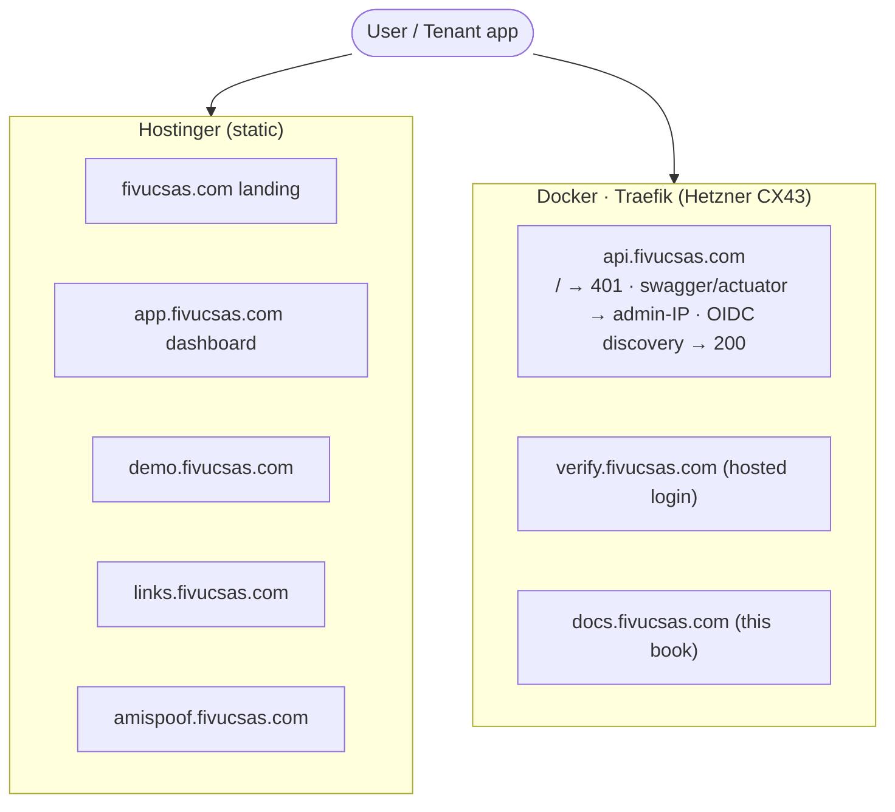

# Architecture

FIVUCSAS is a multi-tenant biometric authentication platform. Clients reach a single
**Traefik** edge; only the **Identity Core API** is public; the **Biometric Processor** is
internal-only (Docker network + `X-API-Key`); the two external comms providers (Twilio,
Hostinger SMTP) are called solely by the Spring API.

## C4 — container diagram (real deployment)

## Services

| Service | Stack | Role |
| --- | --- | --- |
| **Identity Core API** | Spring Boot 3.4.7 · Java 21 · `:8080` | Auth, OAuth2/OIDC, MFA, RBAC, multi-tenancy (Hibernate `@Filter`), ~29 controllers, hexagonal |
| **Biometric Processor** | FastAPI · Python 3.12 · `:8001` (internal only) | Face/voice embeddings, liveness, anti-spoof, NFC eMRTD passive-auth — CPU-only (`ALLOW_HEAVY_ML=false`) |
| **Web Dashboard** | React 18 · TypeScript · Vite | `app.fivucsas.com` — admin & self-service (Hostinger static) |
| **Hosted Login + Widget** | React build + nginx | `verify.fivucsas.com` — OIDC universal login + step-up MFA |
| **Mobile** | Kotlin Multiplatform · Compose | Android · iOS · Desktop (AppAuth OIDC) |

**Data stores (Docker volumes):** PostgreSQL 17 + pgvector (identity/tenant/audit +
IVFFlat/HNSW vector store), Redis 7.4 (OTP, MFA sessions, rate-limit, TOTP-replay markers,
ShedLock), and a local `biometric_uploads` volume (`LocalFileStorage` — not MinIO).

## Hexagonal everywhere

Both services follow ports & adapters: `domain → application → infrastructure`. Algorithms
live in the `spoof-detector` submodule; the Biometric Processor only imports and wires them.

## Deployment split

Static sites live on Hostinger; the API, hosted login and these docs run in Docker behind
Traefik. `api.fivucsas.com` has path-specific behavior by design.

> Tenant isolation is application-layer: a Hibernate `@Filter(tenantFilter)` on the
> tenant-scoped entities. Postgres Row-Level Security DDL exists (`V25`) but is **inert**
> (no session GUC is set) — `@Filter` is the live mechanism.

See the [Diagram Gallery](/diagrams.html) for the hexagonal, tech-stack and domain-map diagrams.
