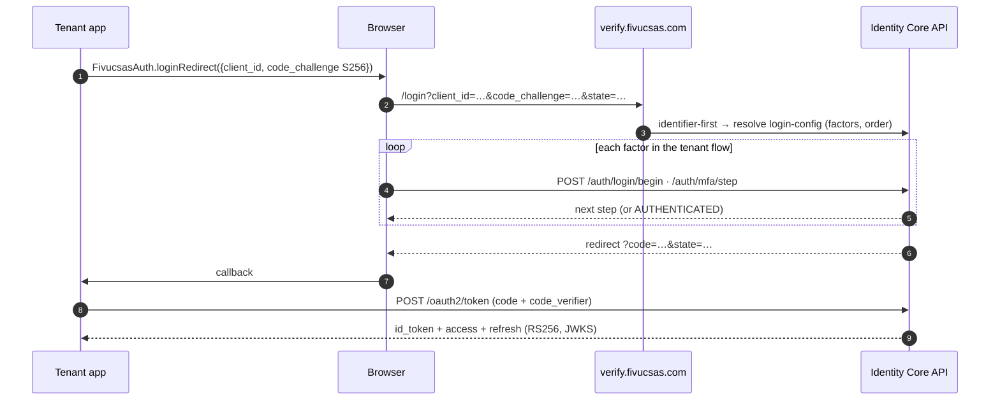
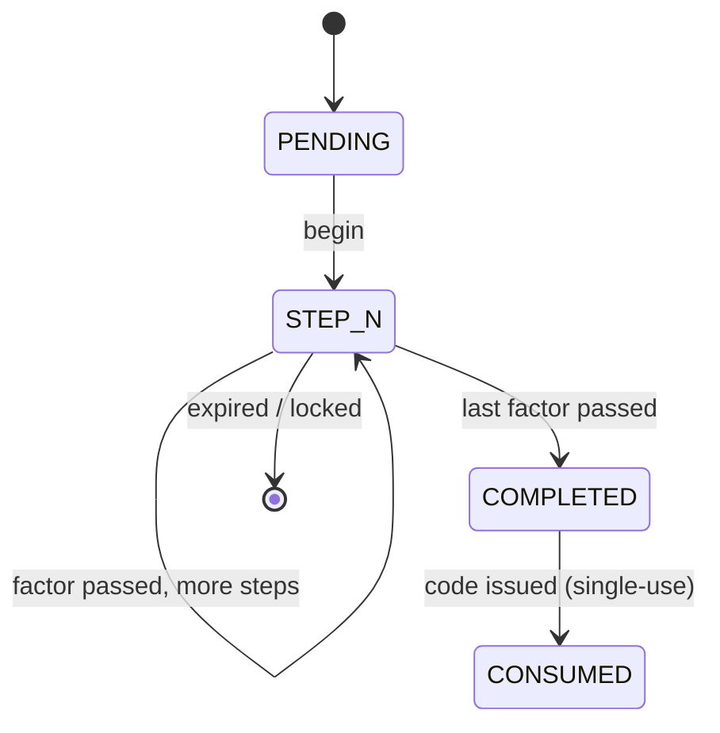

# Authentication & OIDC

FIVUCSAS is **hosted-first**: the primary integration is redirective OAuth2 / OIDC with
PKCE — the same pattern as Auth0 Universal Login, Okta, Microsoft Entra, Google, Apple,
Keycloak, AWS Cognito, and e-Devlet. An embeddable widget remains for **inline step-up MFA**.

## The login round-trip

## The N-step MFA engine

A tenant flow is an ordered list of steps; `VerifyMfaStepService` drives them and tracks an
`mfa_sessions` row (anti-replay via `consumed_at`, cross-client guard via `client_id`).

## The ten composable factors

`PASSWORD` (BCrypt cost 12) · `EMAIL_OTP` · `SMS_OTP` (Twilio Verify) · `TOTP` (RFC 6238 +
replay marker) · `QR_CODE` (cross-device) · `FACE` (FaceNet-512 + Puzzle) · `VOICE`
(Resemblyzer 256-D) · `FINGERPRINT`/`HARDWARE_KEY` (WebAuthn / FIDO2) · `NFC_DOCUMENT`
(ICAO 9303) — plus **passkey** (discoverable WebAuthn, no app needed) and **approve-login**
(no-Firebase number matching).

## Hardening

- **Tokens:** short-lived RS256 access JWT + JWKS discovery; refresh-token **rotation with
  reuse detection** → a stolen token revokes its whole family.
- **OTP/TOTP:** single-use OTP (NIST 5-strike), TOTP used-code replay markers (S13),
  auth-code single-use with a 10-minute TTL.
- **Lockout:** 5 strikes → `423`, 15-minute window; plus edge rate-limiting.

See the <a href="/diagrams.html" target="_blank" rel="noreferrer">Diagram Gallery</a> for the full OIDC, OTP, QR/approve-login,
WebAuthn and refresh-rotation sequences.
