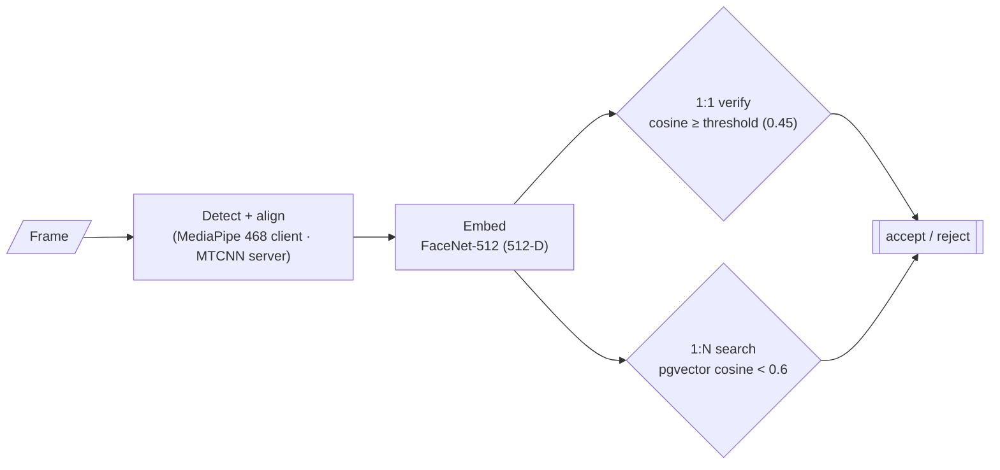
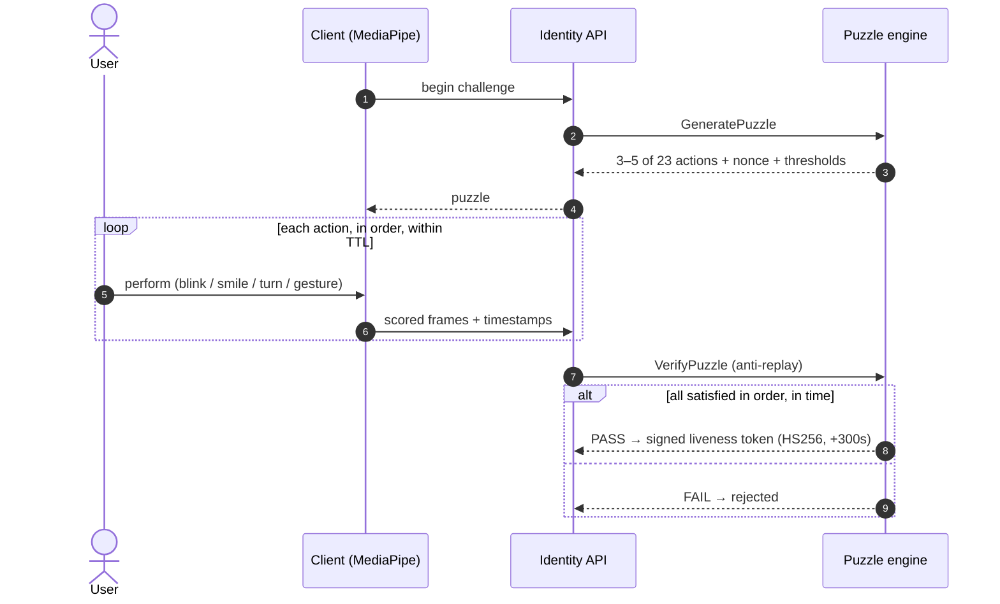

# Biometrics & Liveness

The biometric decision is made **on the server** — the browser is untrusted. The full face
pipeline runs **CPU-only** on one commodity host, sub-second end-to-end.

## Face pipeline

- Model/dimension must match: `Facenet512 → EMBEDDING_DIMENSION=512`. Changing the model
  invalidates all embeddings (re-enrollment required).
- Adaptive threshold for embeddings older than ~2 years (`VERIFICATION_THRESHOLD_AGED_*`).

## Voice

Resemblyzer 256-D centroid per user; verify by cosine **similarity ≥ 0.65**, search by
pgvector cosine **distance < 0.6** (these are two different operators — not a typo).

## NFC document (ICAO 9303)

The Android client (Kotlin Multiplatform, BouncyCastle) runs a custom reader: **BAC**, reads
**DG1 / DG2** (MRZ + chip photo), and verifies the signed document hash (**passive
authentication**). The chain is **fail-closed** — any check failing rejects.

## Hybrid liveness

Two mechanisms. **Passive** = single-frame MiniFASNet on `/verify` and `/liveness`.
**Active** = challenge/response that issues a short-lived signed liveness token on success.

### The Biometric Puzzle (active liveness)

At each verification the server draws **3–5 random actions from a 23-action library**
(14 face + 9 hand) with a per-attempt nonce; the client performs them while landmarks are
scored frame-by-frame under a strict temporal contract.

Pre-recorded video, deepfake injection and replay all fail because the action set is
unpredictable and timestamped per attempt.

## Spoof-detector

A standalone session-based passive PAD (13 analyzers — texture, Moiré, screen-replay,
micro-tremor, rPPG, temporal, landmark-variance, and more) fuses per-frame scores into a
**peak-sensitive** session verdict (blends mean P(real) with the worst sliding window), so a
brief spoof flash can't be averaged away. Live demo: **amispoof.fivucsas.com**.

See the <a href="/diagrams.html" target="_blank" rel="noreferrer">Diagram Gallery</a> for enrollment, voice, NFC and spoof-verdict diagrams.
