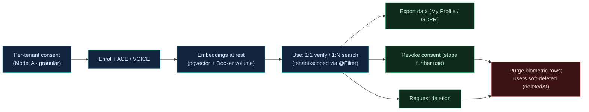

# Data Model & Compliance

## Schema at a glance

Identity is a Spring/JPA model on PostgreSQL 17, evolved through **82 Flyway migrations**
(V1→V82). Vector data (face embeddings, `voice_enrollments` 256-D) lives in pgvector and is
referenced by `user_id` logically (not a hard JPA FK), so it is intentionally outside the
relational ER lines.

Core tables: `users`, `tenants`, `identities` (person layer), `memberships`, `roles` /
`permissions`, `auth_methods`, `tenant_auth_methods`, `auth_flows`, `auth_flow_steps`,
`user_enrollments`, `nfc_cards`, `user_devices`, `webauthn_credentials`, `refresh_tokens`
(rotation families), `mfa_sessions`, `oauth2_clients`, and a **pg_partman-partitioned**
`audit_logs`.

The <a href="/diagrams.html" target="_blank" rel="noreferrer">Diagram Gallery</a> has the full ER set, now split for readability into
**identity/tenancy/RBAC**, **auth methods & flows**, **enrollments/devices/credentials**,
and **sessions/tokens/clients/audit**.

## KVKK / GDPR — data lifecycle

Consent-gated capture, scoped use, and full data-subject rights.

## Principles

- **Consent first** — per-tenant biometric consent (Model A) gates capture and use.
- **Siloed identity** — pairwise OIDC `sub` per tenant; `@Filter` tenant isolation.
- **Right to erasure** — never hard-delete `users` (FK-cascaded by ~13 tables incl. WebAuthn/
  NFC/devices/TOTP); `findByEmail` honours `deletedAt IS NULL`. Biometric rows are purged.
- **Auditability** — every security-relevant action lands in the partitioned `audit_logs`
  (`tenant_id NOT NULL`, anon sentinel for unauthenticated events).
