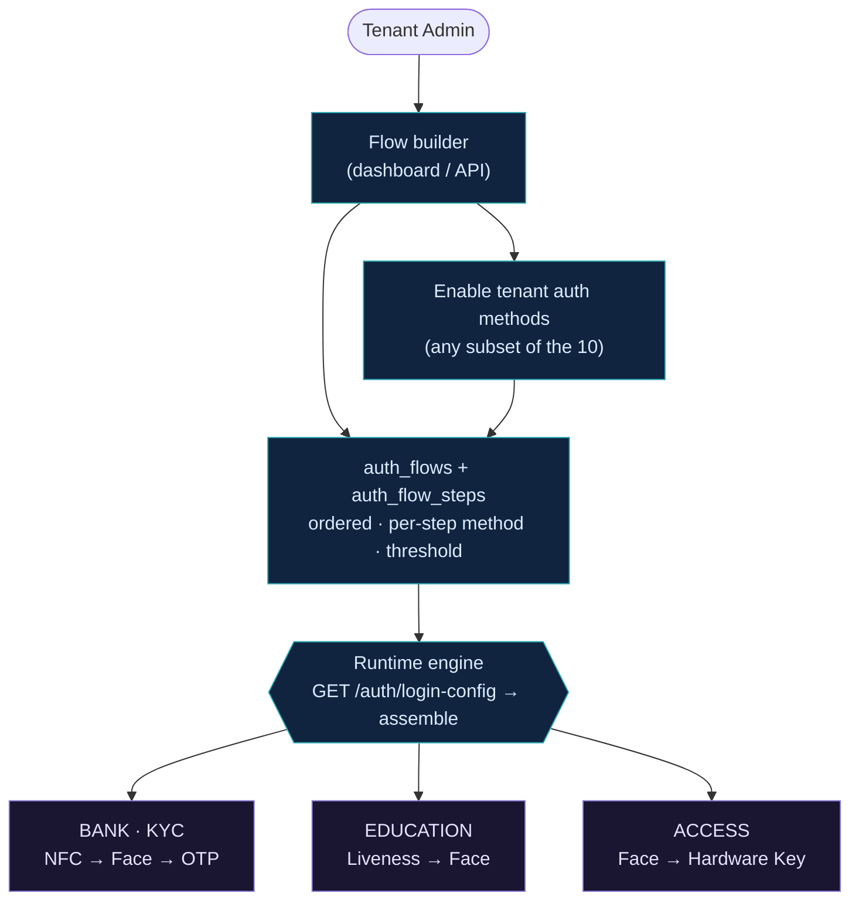

# Multi-Tenancy & Flows

One platform, **infinite verification flows**. Each tenant assembles its own login/
verification flow from the methods it enables — which steps, in what order, with which
thresholds — persisted as `auth_flows` + ordered `auth_flow_steps` and assembled at runtime
via `GET /auth/login-config`. **No code change, no redeploy.**

## Tenant isolation

Isolation is enforced by a Hibernate `@Filter(tenantFilter)` applied to the tenant-scoped
entities (User, AuthFlow, AuditLog, MfaSession, UserEnrollment, OAuth2Client, UserDevice,
Role, VerificationSession, AuthSession). Postgres RLS DDL exists (`V25`) but is **inert** —
the app never sets `app.current_tenant_id`, so `@Filter` is the live mechanism.

> User-centric `/my/*` endpoints that legitimately cross a foreign-tenant scope use an
> explicit `TenantFilterBypass`.

## Identity, person & membership

A platform-level **person** (`identities`) can have memberships across tenants. OIDC
subjects are **pairwise** — the same person presents a different `sub` to each tenant, so
identities stay siloed. Per-tenant **biometric consent** (Model A) gates capture and use.

## Templates

Five industry flows ship seeded as starting points: **Fintech KYC**, **Healthcare Basic**,
**Education Age**, **Telecom Onboarding**, **Simple Document**.

See [Multi-tenancy & flows in the gallery](/diagrams.html) and the
[Data Model](./data-compliance) for the tenancy/RBAC ER diagrams.
