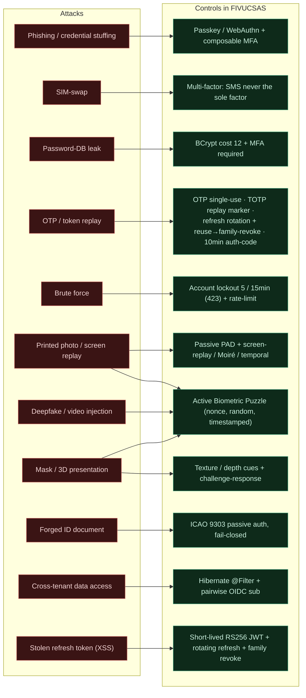
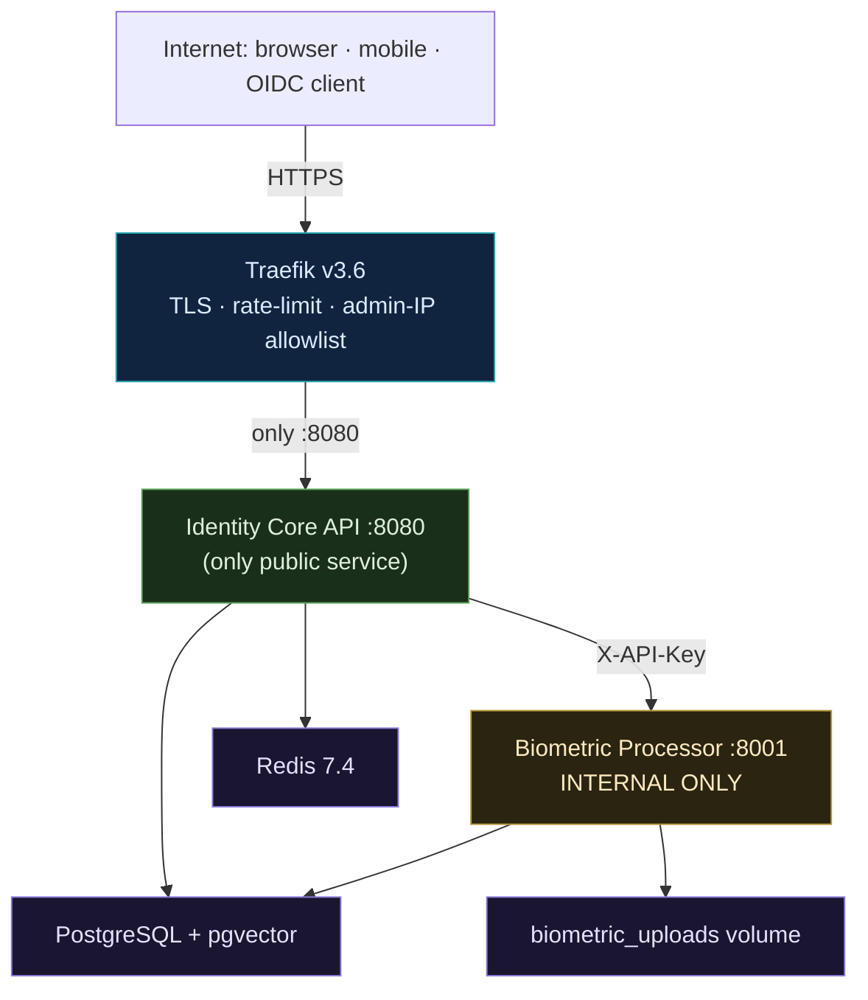

# Security & Threat Model

How each common identity attack is countered. Phishing-resistant factors, hybrid liveness
(passive PAD + the active Biometric Puzzle), single-use / rotating secrets, and fail-closed
document authentication are the load-bearing controls.

## Trust boundary

One public edge, exactly one public app, an internal-only ML service, a private data zone.

## Transport & API posture

`api.fivucsas.com/` returns `401` by design (it is an API origin, not a page);
Swagger / `/v3/api-docs` / `/actuator` are admin-IP gated (`403` for the public); OIDC
discovery is public (`200`). Tokens are RS256 with a pinned audience.

See the full <a href="/diagrams.html" target="_blank" rel="noreferrer">threat model and trust-boundary diagrams</a> in the gallery.
